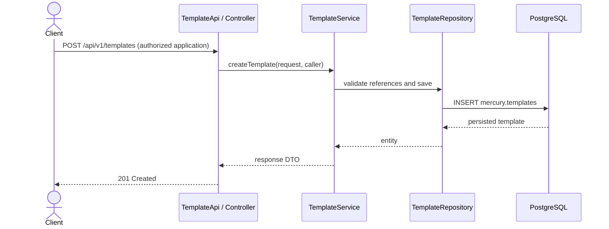
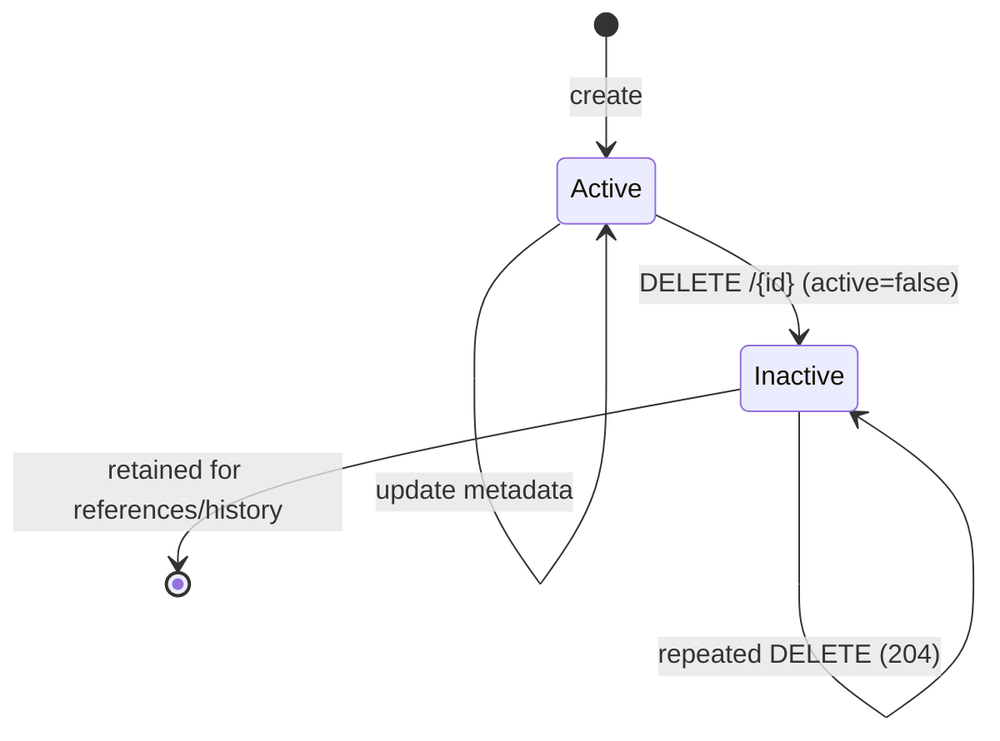

# 🧩 Template Management API

> **Task type:** Feature · **Area:** REST API / persistence · **Status:** Ready for refinement

## 🎯 Goal

Implement authenticated CRUD and search operations for reusable templates in `mercury.templates`: create, update, deactivate, retrieve one, and search multiple templates within an application the caller may access.

This task manages the reusable **base template** (`TemplateEntity`), not `TemplateDefinedEntity`. Template-defined records represent application/user-specific usage and are referenced by campaigns and message records.

## 💼 Business value

- Manage template metadata used to select and process messaging content.
- Discover templates by application and classification.
- Preserve history and operational references when templates leave active use.

## 🧭 Project context and constraints

| Concern | Current project state | Task implication |
|---|---|---|
| Persistence | `TemplateEntity` maps `mercury.templates`: description, location, file format, type, application, severity, timestamps, and `active`. | Reuse this model and UUID key. |
| Relationships | `TemplateDefinedEntity` references `TemplateEntity`; campaigns/messages reference template-defined records. | Never hard-delete or cascade-delete usage/history. |
| Repository | `TemplateRepository` extends `JpaRepository` and `JpaSpecificationExecutor`. | Reuse it for ID lookup and filtered, paginated search. |
| Mapping | `TemplateTO` / `TemplateMapper` exist. The mapper currently hardcodes active state and does not expose severity. | Correct mapping; return persisted values, not fabricated ones. |
| API | Controllers implement `*Api`; OpenAPI annotations live on the interface. | Add `TemplateApi` and a thin `TemplateController`. |
| Errors | `GlobalExceptionHandler`: validation/`IllegalArgumentException` → 400; `ForbiddenException` → 403; unhandled → 500. There is no template-specific 404. | Add a template-not-found exception/404 mapping; don't represent missing IDs as 400. |
| Schema | Hibernate DDL is disabled; `active` already exists. | No migration expected. Any new column requires SQL under `src/main/resources/db/migration/`. |

## 🔌 Proposed API contract

Base path: `/api/v1/templates`; IDs are UUIDs. Require configured authentication and application-level authorization on every operation. Use `session-token` for user-scoped access, consistent with Mercury APIs. Document **401** when the configured security chain returns it for missing/invalid credentials, and **403** when an authenticated caller lacks application access.

| Operation | Method and path | Success | Expected errors |
|---|---|---:|---|
| Create | `POST /api/v1/templates` | `201 Created`, representation and `Location` | `400`, `401`, `403`, `500` |
| Update | `PUT /api/v1/templates/{id}` | `200 OK`, updated representation | `400`, `401`, `403`, `404`, `500` |
| Deactivate | `DELETE /api/v1/templates/{id}` | `204 No Content` | `400`, `401`, `403`, `404`, `500` |
| Get one | `GET /api/v1/templates/{id}` | `200 OK`, representation | `400`, `401`, `403`, `404`, `500` |
| Search one or more | `GET /api/v1/templates` | `200 OK`, paginated result | `400`, `401`, `403`, `500` |

Declare every operation on `TemplateApi` with `@Operation(summary, description, operationId)` and applicable `@ApiResponses`. Use unique IDs: `createTemplate`, `updateTemplate`, `deleteTemplate`, `getTemplateById`, `searchTemplates`.

### Request, response, and search

- Add immutable Java record DTOs in `api/v1/to/` (e.g. `CreateTemplateRequest`, `UpdateTemplateRequest`, `TemplateDetailResponse`, `TemplateSearchResponse`). Apply Bean Validation to inputs and `@Valid` at the controller boundary.
- Inputs cover `description`, `location`, `fileFormat`, `templateTypeId`, `applicationId`, and `severityTypeId`. Validate lengths/required values and that references exist and are active; caller must be allowed to manage the application.
- Responses include UUID, metadata, classification/application identifiers or details, actual `active`, `createdAt`, and `updatedAt`. Never expose JPA entities.
- `location` is metadata only. Upload/download/edit of template content is out of scope.
- Search requires `applicationId` as a security scope and supports optional `q` (description/location), `templateTypeId`, `severityTypeId`, and `active`, plus validated `page`, `size` (with a safe maximum), and deterministic `sort`. Default results contain active templates only. Inactive results require application-management authorization.
- Return a stable paginated envelope with items and page metadata; do not return an unbounded list.

## ⚙️ Required behavior

1. **Create:** validate all inputs and references; persist as active; set UUID/timestamps according to established conventions; return persisted values.
2. **Update:** find by UUID and authorize against its application. Update supported mutable metadata, preserve ID and `createdAt`, update `updatedAt`. Keep `applicationId` immutable unless a product decision explicitly permits moving a template across applications; reject unauthorized classification/application changes.
3. **Delete:** soft-delete by setting `active=false` and updating `updatedAt`. Retain the row and all dependent records; do not cascade or rewrite campaign/message history. Repeated DELETE for an existing inactive template returns 204; unknown UUID returns 404.
4. **Get by ID:** return active templates only; inactive and unknown templates return the same 404 unless an authorized inactive-read contract is explicitly agreed.
5. **Search:** always enforce authorized application scope in the service, not only through a client filter. Apply filters/pagination in the database and add a stable tie-breaker to sorting.
6. **Errors:** malformed UUIDs/invalid parameters return 400, unknown template IDs return 404, forbidden application access returns 403, unexpected failures remain 500. Map and document actual reachable statuses.
7. **Async convention:** write service methods follow the project's `CompletableFuture<T>` convention where applicable; reads return concrete DTOs/lists. HTTP outcomes remain deterministic when async results are joined by controllers.

## 🧱 Implementation scope

- Add `TemplateApi` / `TemplateController` in `api/v1/controller/`.
- Add `TemplateService` / `TemplateServiceImpl` for authorization, reference validation, CRUD, soft-delete, and search.
- Reuse `TemplateRepository`, `TemplateMapper`, and `TemplateTO` as appropriate; map actual severity and active state.
- Add repository specifications/query support for composed filters and pagination. Add a template-specific 404 exception/handler or an existing equivalent.
- Add SQL migration only if schema changes are needed; do not enable Hibernate DDL.
- Do not change `TemplateDefined` lifecycle, message content processing, or campaign APIs, except a narrowly required compatibility change agreed during refinement.

## ✅ Acceptance criteria

- [ ] All five operations exist at the contract paths/statuses; OpenAPI is on `TemplateApi` only and documents each operation ID plus reachable responses.
- [ ] Request DTOs validate required values, lengths, UUIDs, and paging bounds. Invalid requests return 400 and cause no persistence side effects.
- [ ] Creation persists all required fields, including application/type/severity, and returns generated/persisted values.
- [ ] Update preserves immutable/server-managed fields, updates `updatedAt`, and enforces application authorization.
- [ ] Delete is soft, idempotent for an existing resource, and retains rows and all dependent references.
- [ ] Get/search are application-scoped; search filters correctly, defaults to active-only, is bounded and stable, and never leaks another application's records.
- [ ] Unknown IDs return 404; forbidden access returns 403; errors use the existing `ApiError` conventions.
- [ ] Existing campaign/message flows remain compatible; this task does not cascade-delete or mutate template-defined/history records.
- [ ] No secrets, external template contents, or persistence entities are returned or logged.

## 🧪 Unit and API test plan

Use the existing JUnit 5, Mockito, and AssertJ conventions. Mock persistence/security boundaries and test business behavior at service level.

### Service tests

- Create success maps every field, generated ID, severity, active state, and timestamps; invalid fields or missing/inactive references fail without saving.
- Update success changes allowed fields and timestamp while preserving ID/application/`createdAt`; cover unknown ID and forbidden application.
- Delete sets inactive and timestamp, never calls physical delete, and succeeds when repeated; unknown ID follows the 404 path.
- Get returns an active template and rejects unknown/inactive ones.
- Search tests each filter and combinations, default active-only, application isolation, empty results, paging/size/sort, and stable ordering.
- Verify repository failures propagate rather than returning success-shaped fallbacks.

### Mapper, DTO, and controller/API tests

- Verify request/entity/response mappings for every field, especially severity ID and real active state.
- Verify Bean Validation for required/blank/oversized input and query bounds.
- Verify each endpoint's status, body/headers, UUID parsing, service delegation, and request mapping.
- Verify 400/403/404/500 error mapping and OpenAPI paths, operation IDs, and responses using existing test approaches.
- Add focused persistence/integration coverage only where repository filters, soft-delete, or relational behavior cannot be reliably covered by unit tests.

## 📊 Coverage and quality gates

- Cover new service branches, search filters, validation/error paths, soft-delete/idempotency, and mapper behavior; controller-only tests are insufficient.
- Meet the repository JaCoCo gates: **at least 70% line coverage and 50% branch coverage**, without lowering thresholds. Aim for full branch coverage of new service logic and validation paths.
- Run focused tests during development and the repository's full test/quality gate before merge. PMD must report zero violations.
- Do not change coverage exclusions just to pass the gate; cover meaningful behavior through service/API tests even if a mapper or exception is excluded.

## 📚 Technical documentation

Add/update English Markdown under `docs/` in the repository's modern style: scannable headings, icons, tables, examples, and Mermaid diagrams. Document the endpoints/auth/application scope, request/query fields, examples, pagination, and error statuses; clarify `TemplateEntity` versus `TemplateDefinedEntity`, soft-delete/reference retention, and `location` as metadata; document migrations/deployment steps if needed and OpenAPI generation expectations.

Include request-to-database and lifecycle diagrams. The following diagrams are a baseline; update them to match implementation:

## 🏁 Definition of Done

- [ ] API, DTO, controller, service, mapper, repository, and exception handling follow existing layers/conventions.
- [ ] Authentication and application authorization are enforced and covered by tests.
- [ ] Acceptance criteria pass, including search isolation, soft-delete idempotency, and history preservation.
- [ ] Unit/API tests pass; JaCoCo and PMD gates pass without weakened thresholds/exclusions.
- [ ] Any required SQL migration is included/reviewed; otherwise the existing schema is reused.
- [ ] English technical/API docs and Mermaid diagrams match the implementation.
- [ ] OpenAPI output reflects the contract; no generated or unrelated files are included.

## 🚫 Out of scope

- Uploading or storing template file content in Mercury.
- Managing template-type/severity catalogs or `TemplateDefinedEntity` records.
- Restore/reactivation, hard deletion, cascading cleanup, campaign/message behavior changes, or a new rendering engine.
