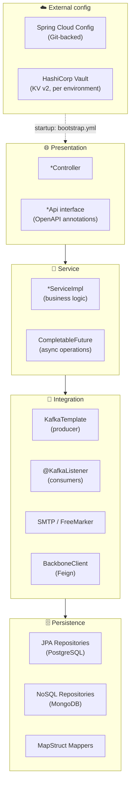
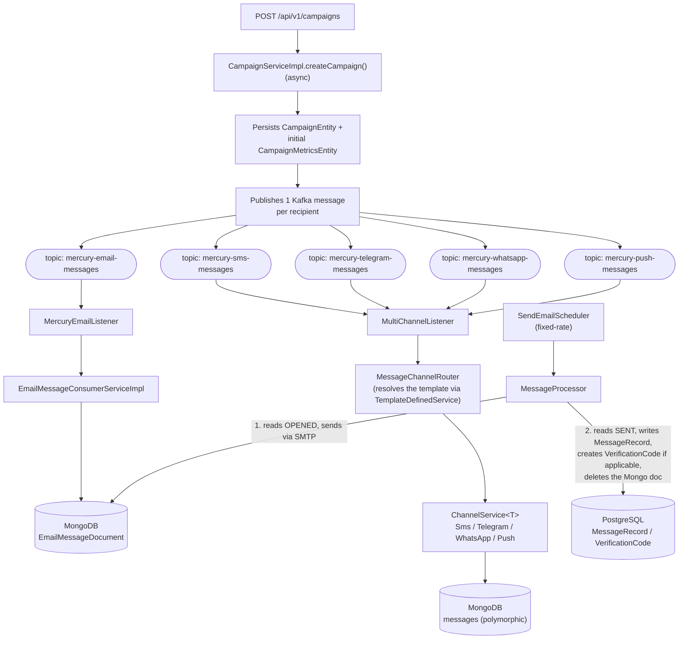
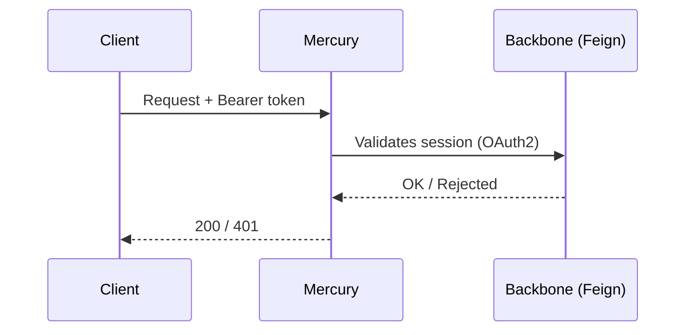

# 🏛️ 02 · Architecture

🌐 [Leer esto en Español](../es/02-arquitectura.md) · ⬅️ [Back to index](README.md)

> Mercury is a **multi-channel messaging microservice**: it exposes a REST API, queues per-channel messages via Kafka, delivers emails over SMTP with FreeMarker templates, and persists data across PostgreSQL (durable) and MongoDB (transient).

---

## 🧭 Layer view

| Layer | Responsibility | Real examples |
|---|---|---|
| 🌐 Presentation | Thin endpoints; OpenAPI annotations live on the `*Api` interface, not the controller | `CampaignController` implements `CampaignApi` |
| 🧠 Service | Business rules; async operations return `CompletableFuture` | `CampaignServiceImpl.createCampaign()` |
| 🔄 Integration | Kafka publish/consume, SMTP, external HTTP clients | `MessageChannelRouter`, `EmailMessageConsumerServiceImpl` |
| 🗄️ Persistence | Data access, Entity↔TO mapping | `CampaignRepository`, `CampaignMapper` |
| ☁️ External config | Everything arriving from Vault/Config Server before the main context starts | See [06 · Environment Configuration](06-environment-configuration.md) |

---

## 🔀 Message flow (the heart of Mercury)

> [!IMPORTANT]
> Only **Email** has a complete lifecycle (Kafka → Mongo → SMTP → PostgreSQL → Mongo deletion). The other channels (SMS/Telegram/WhatsApp/Push) persist the message into Mongo's `messages` collection — via `ChannelService.send()` — but nothing today drives it to a terminal delivery status or migrates it to PostgreSQL. See [04 · Components § Known Gaps](04-components.md#-known-gaps).

---

## 🧩 The two persistence models

See the full detail (every table, every document, and why they're split this way) in [03 · Data Model](03-data-model.md).

- **PostgreSQL** — durable, relational: campaigns, campaign metrics, channel types, templates, message records, verification codes, users, applications.
- **MongoDB** — transient, document-based: in-flight messages. Two independent document families:
  - `EmailMessageDocument` — its own collection, full lifecycle with `MessageProcessor`.
  - `MessageDocument` (polymorphic base) with subtypes `Sms/Telegram/WhatsApp/PushNotificationMessageDocument` — all mapped to the **same** `messages` collection, written by the `ChannelService` implementations but not yet reconciled/purged.

---

## 🔐 API security

- Client authentication over OAuth2 (`mercury-backend-client` registration, `authorization-grant-type: password`) against the `external` provider (Keycloak-style, `${AUTH_URI}`).
- `BackboneClient` (Feign) validates session tokens against the Backbone service.
- Custom JWT (`SessionJwtServiceImpl`) for application session tokens — configurable secret and expiration (`APP_TOKEN_SECRET`, `APP_TOKEN_EXPIRATION`).
- `spring.autoconfigure.exclude: ServletWebSecurityAutoConfiguration` — Spring Boot's standard HTTP security is excluded; Mercury implements its own scheme.

---

## 🌱 The two messaging designs that coexist

Mercury has **two** message-ingestion paths in the codebase, at different levels of maturity:

1. **The production path** (documented above): one topic per channel, one `ChannelService` per channel, `MessageChannelRouter` as dispatcher.
2. **"Nexus" (experimental)**: `NotificationEventListener` consumes a unified topic (`${umdc.consumer.topics.notification}`) via `NotificationEventConsumerServiceImpl` — but **nothing** in the campaign-creation flow publishes to it yet, and its per-channel handlers only `log`, with no persistence or real sending.

> [!NOTE]
> Treat "Nexus" as experimental/unwired until an explicit decision is made to migrate the producer side to that design.

---

*Generated from an exhaustive read of the real source code (`kafka/`, `api/v1/service/`, `bootstrap.yml`) — not from prior documentation or assumptions.*
