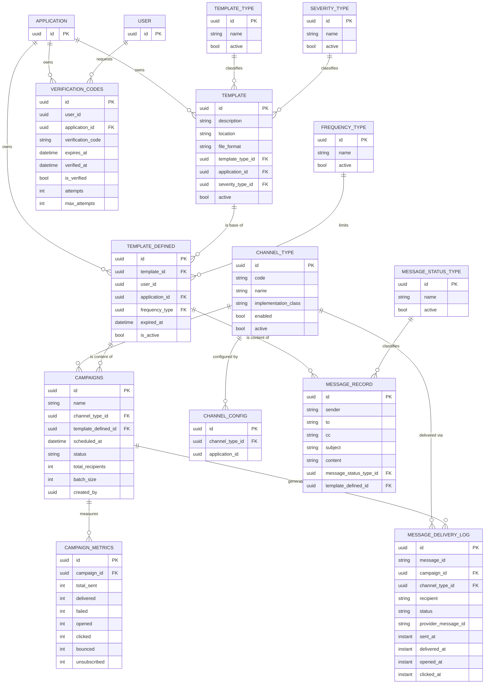
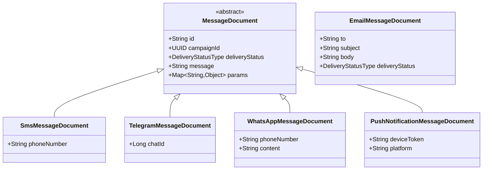

# 🗄️ 03 · Data Model

🌐 [Leer esto en Español](../es/03-modelo-datos.md) · ⬅️ [Back to index](README.md)

> Mercury persists across **two** engines with distinct purposes: PostgreSQL for everything durable/relational, MongoDB for transient in-flight messages. `hibernate.ddl-auto: none` — the PostgreSQL schema is managed outside the application; Mercury never migrates it on its own.

---

## 🐘 PostgreSQL — 14 tables, 2 schemas



| Schema | Tables | Purpose |
|---|---|---|
| `mercury` | `campaigns`, `campaign_metrics`, `channel_type`, `channel_config`, `message_delivery_log`, `message_record`, `message_status_type`, `templates`, `template_defined`, `template_types`, `frequency_type`, `severity_type`, `verification_codes` | Everything specific to the messaging domain |
| `general` | `application`, `user` | Entities shared with other services in the PRX/UMDC platform — Mercury only **references** them, it doesn't own them |

> [!TIP]
> `CampaignEntity` and `MessageRecordEntity` point at `TemplateDefinedEntity` — not `TemplateEntity` directly. `TemplateDefinedEntity` is the "instance" of a template for a specific application (with its own frequency and expiration); `TemplateEntity` is the reusable generic template.

---

## 🍃 MongoDB — two document families



| Collection | Document(s) | Repository | Lifecycle |
|---|---|---|---|
| `messages` | `MessageDocument` (polymorphic base) + `Sms/Telegram/WhatsApp/PushNotificationMessageDocument` | `MessageNSRepository` | Written by `ChannelService.send()` when consuming from the matching topic. **No reconciliation or purge yet** — see [04 · Components](04-components.md#-known-gaps). |
| own (email) | `EmailMessageDocument` | `EmailMessageNSRepository` | Written when consuming `mercury-email-messages`; `MessageProcessor` reads it (`OPENED`), sends it over SMTP, and **deletes it** after persisting the `MessageRecord` to PostgreSQL. The only document with a complete lifecycle. |

`EmailMessageDocument` is deliberately **independent** from the `MessageDocument` hierarchy — it shares neither base type nor collection with the other channels.

### Delivery states (`DeliveryStatusType`)

```
OPENED → PENDING → IN_PROGRESS → SENT → DELIVERED
                                      ↘ REJECTED / CANCELED / ABORTED / FAILED
```

---

## 🔑 Conventions

- **Every primary key is a `UUID`** — generated by the application or the database, never `SERIAL`/autoincrement.
- Timestamps: a mix of `LocalDateTime` (most of `mercury`) and `Instant` (`MessageDeliveryLogEntity`, `FrequencyTypeEntity`, `SeverityTypeEntity`) — not yet unified.
- `active`/`enabled` as `Boolean` (not the primitive `boolean`) on catalog tables (`channel_type`, `template_types`, `frequency_type`, `severity_type`, `message_status_type`) — allows `NULL` to mean "undefined" instead of forcing `false`.

---

*Generated from an exhaustive read of `jpa/sql/entity/` and `jpa/nosql/document/` — not from prior documentation or assumptions.*
