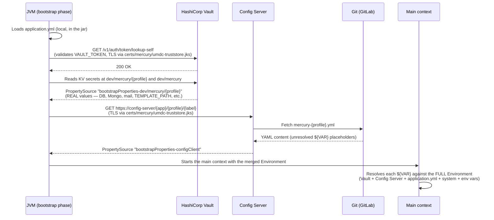
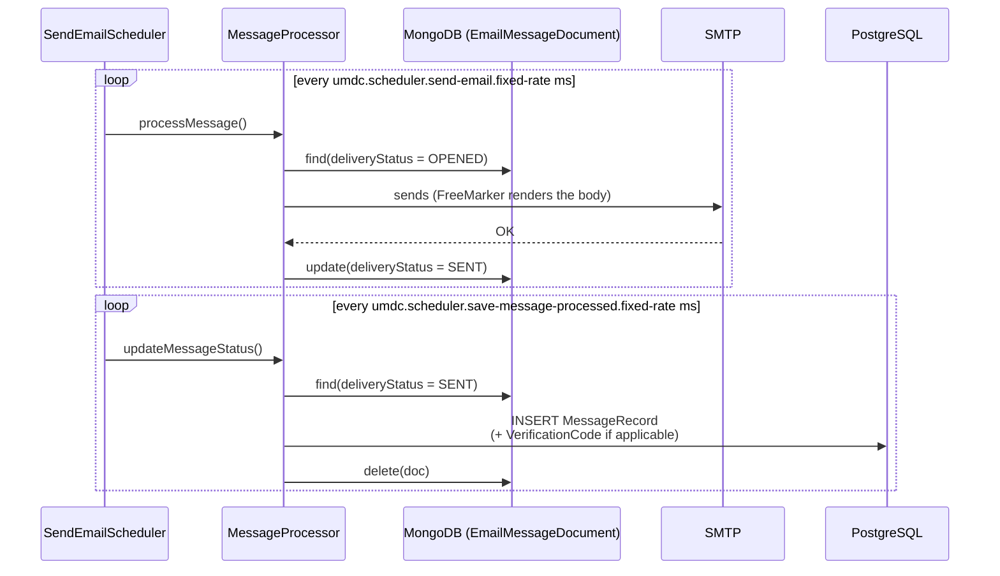
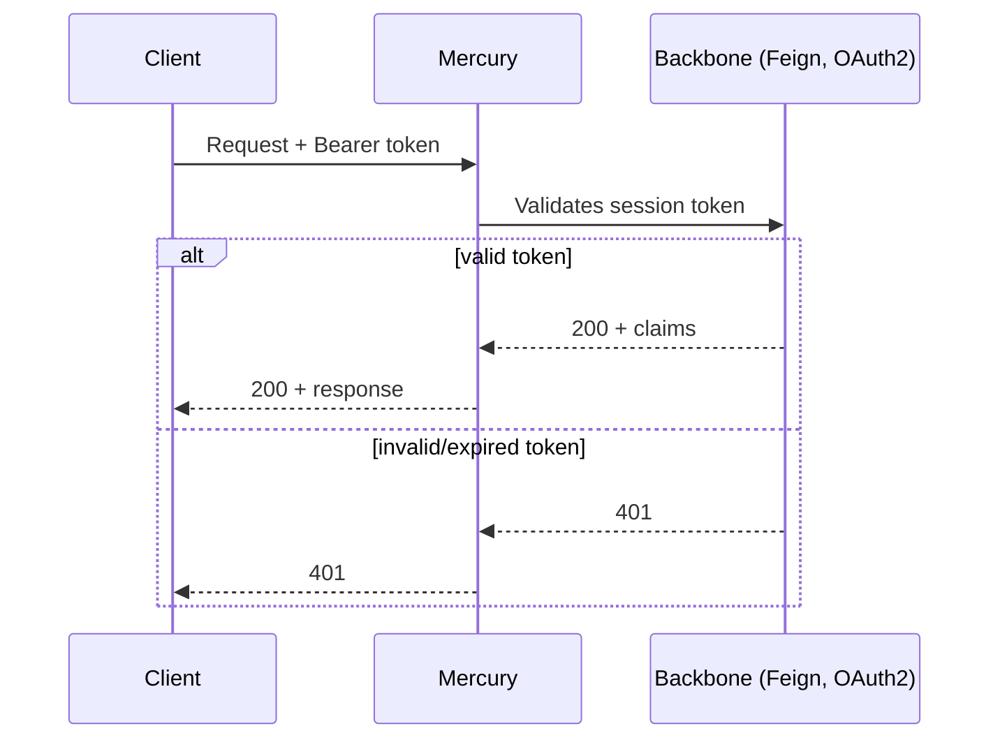

# 🔁 05 · Sequence Diagrams

🌐 [Leer esto en Español](../es/05-diagramas-secuencia.md) · ⬅️ [Back to index](README.md)

> The most representative flows in Mercury, verified against the code and — for startup — against real runs.

---

## 1️⃣ Application startup (bootstrap: Vault → Config Server)

> [!WARNING]
> **Needs re-verification after MER-5.** This diagram documents the legacy `spring.cloud.bootstrap.enabled` mechanism (`PropertySourceBootstrapConfiguration`, a separate bootstrap-phase context), which MER-5 removed — it was incompatible with GraalVM Native Image AOT processing (see `docs/architecture/graalvm-native-image.md`). Config now comes in via `spring.config.import=optional:vault://,optional:configserver:` (modern `ConfigDataLoader` mechanism) declared directly in `application.yml`, using the same `spring.cloud.vault.*`/`spring.cloud.config.*` properties as before. The precedence order below (Vault → Config Server → local) is expected to still hold — Spring's ConfigData imports are inserted ahead of the importing file's own properties — but this has only been verified with Vault/Config Server *disabled* (local dev, native builds); it has not been re-verified against a live Vault/Config Server run, and the exact property-source names in this diagram (`bootstrapProperties-*`) are specific to the removed mechanism and no longer accurate.

This is the flow that has caused the most real incidents — documented in detail because the order matters.



> [!IMPORTANT]
> **Precedence order (highest to lowest), as implemented by `PropertySourceBootstrapConfiguration` in this Spring Cloud version (2025.1.2 / spring-cloud-context 5.0.2):**
> 1. Vault (`spring.cloud.vault.*` — KV secrets)
> 2. Config Server (Git-backed)
> 3. Local environment variables / system properties (`default.env`, `-D`)
> 4. Local `application.yml` (this app)
>
> This is **counter-intuitive**: Vault and the Config Server win over any local variable, by design — so a centrally-managed value can't be accidentally shadowed by whatever's on a given box. A value defined in Vault (e.g. `TEMPLATE_PATH`) **cannot be overridden** by `default.env` or `-D`, regardless of the variable name used. See [06 · Environment Configuration § Real Troubleshooting](06-environment-configuration.md#-real-troubleshooting) for the actual case that prompted this note.

---

## 2️⃣ Campaign creation → per-channel dispatch

```mermaid
sequenceDiagram
    participant Client
    participant Controller as CampaignController
    participant Service as CampaignServiceImpl
    participant PG as PostgreSQL
    participant Kafka
    participant Listener as MultiChannelListener
    participant Router as MessageChannelRouter
    participant ChSvc as ChannelService&lt;T&gt;
    participant Mongo as MongoDB

    Client->>Controller: POST /api/v1/campaigns
    Controller->>Service: createCampaign() [async]
    Service->>PG: INSERT CampaignEntity + CampaignMetricsEntity
    loop for each recipient
        Service->>Kafka: publish(channel-topic, message)
    end
    Service-->>Client: 202 / CampaignResponse

    Kafka->>Listener: @KafkaListener consumes
    Listener->>Router: route(message)
    Router->>Router: resolves the template via TemplateDefinedService
    Router->>ChSvc: send(message, template)
    ChSvc->>Mongo: save(MessageDocument)
```

---

## 3️⃣ Email lifecycle (the only complete one)



---

## 4️⃣ Session validation (Backbone)



---

*Generated from an exhaustive read of the source code and real runs verified against a live Vault/Config Server/PostgreSQL — not from prior documentation or assumptions.*
