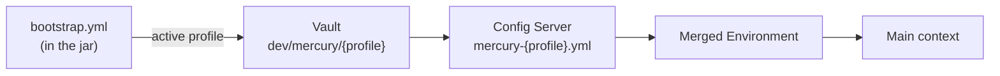
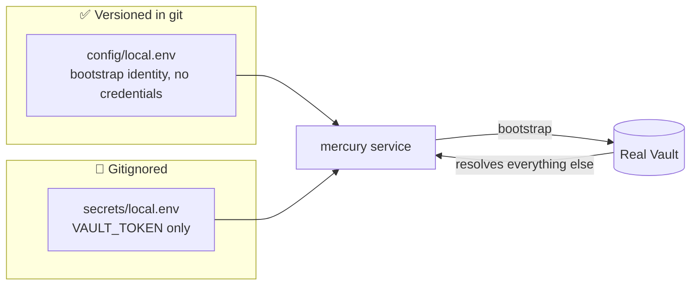
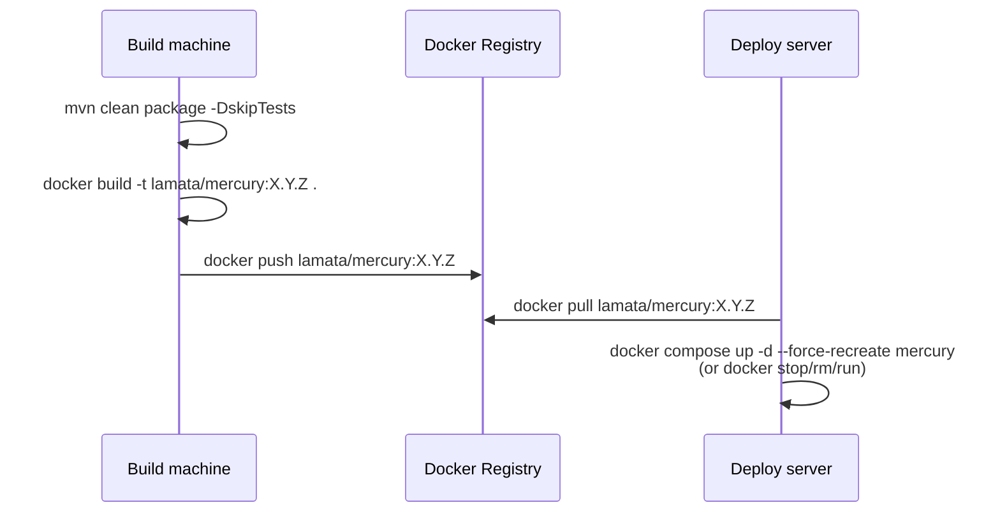

# ☁️ 06 · Environment Configuration

🌐 [Leer esto en Español](../es/06-configuracion-entornos.md) · ⬅️ [Back to index](README.md)

> Mercury has three clearly separated configuration levels: **local development** (IDE, no container), **test/QA** (Docker + `docker-compose`, against real QA services), and **production** (built and deployed image, secrets managed centrally in Vault). This document covers all three, and the precedence mechanism that connects them.

---

## 🧭 Overview

| Level | How it runs | Config Server / Vault | Certificates |
|---|---|---|---|
| 🧑‍💻 Local development | `java -jar` or Run from the IDE | Real (QA), over the Internet | `certs/mercury/` on the local filesystem |
| 🧪 Test / QA | Docker container (`docker-compose`) | Real (QA) or a local `config-server`/`vault-server` instance | Baked into the image (`Dockerfile`) |
| 🚀 Production | Deployed Docker container | Real (prod), Vault populated by the platform team | Baked into the image, rotated via rebuild |

---

## 🔐 The mechanism that ties it all together: the *bootstrap* phase

Before Spring's main context exists, there's a **bootstrap context** (enabled by `spring-cloud-starter-bootstrap`) that:

1. Reads `src/main/resources/bootstrap.yml` (the only local config file that exists — there's no `application.yml`).
2. Connects to **Vault** (`spring.cloud.vault.*`) and fetches secrets from `dev/mercury/{profile}` and `dev/mercury`.
3. Connects to the **Config Server** (`spring.cloud.config.uri`) and fetches `mercury-{profile}.yml` from a Git repository.
4. Merges everything into the `Environment` the main context will use.



> [!IMPORTANT]
> **Real precedence (highest to lowest): Vault → Config Server → local environment variables → local `bootstrap.yml`.**
> This means **no local value can override a value Vault or the Config Server already defines** — not `default.env`, not `-D`, not editing `bootstrap.yml`. See [05 · Sequence Diagrams § 1](05-sequence-diagrams.md#1️⃣-application-startup-bootstrap-vault--config-server) and the Troubleshooting section below — this behavior caused real hours of debugging on this branch.

---

## 🧑‍💻 Local development (IDE / no container)

### Requirements

- Java 21 (JDK, not just JRE)
- Maven (or the IDE's wrapper)
- Network access to `vault.umdc-qa.tst` and `config-server.umdc-qa.tst` (VPN/internal DNS depending on the team)
- Credentials in `~/.m2/settings.xml` for `https://repo.repsy.io/mvn/lmata/prx` (private PRX dependencies)

### 1. Certificates — `certs/mercury/`

Mercury does **not** load certificates/keystores from the classpath (that pattern is how secrets ended up committed to git — see this repo's own history). Instead, `bootstrap.yml` references them with `file:certs/mercury/<file>` paths, **relative to the process's *working directory*** — which is the project root for an IDE run, and (inside the container) Docker's `WORKDIR`.

```
certs/mercury/
├── mercury.jks               # the app's own keystore (JWT, mercury-security SSL bundle)
├── umdc-truststore.jks       # trust store — includes the internal "PRX Internal CA"
├── aiven-kafka.p12           # Kafka keystore (PKCS12, non-PEM fallback)
├── aiven-kafka-7e59598.cert  # Kafka certificate (PEM, default mode)
├── aiven-kafka-7e59598.key   # Kafka private key (PEM)
├── aiven-kafka-7e59598.pem   # Kafka CA (PEM)
└── prx-internal-ca.crt       # internal CA in plain PEM — imported by docker-entrypoint.sh
```

> [!WARNING]
> **This directory is gitignored (`*.jks`, `*.pem`, `*.p12`, `*.cert`, `*.key`, `*.crt`) — it must never reach git.** Get these files from another team member or extract them from Vault; don't recreate them by hand without verifying they match what the environment actually expects.

These paths are **hardcoded in `bootstrap.yml`** (`file:certs/mercury/mercury.jks` / `file:certs/mercury/umdc-truststore.jks`, with their real, keytool-verified type/password) — no environment variable (`SSL_KEYSTORE_LOCATION`, `SSL_TRUSTSTORE_LOCATION`, etc.) can override them. This was a deliberate choice: the env-var indirection broke twice in real deployments because a local/stale `default.env` on a different machine carried the value without the `file:` prefix (an unprefixed path resolves as `classpath:`, which no longer exists post-purge) — and since `certs/mercury/` is always at this fixed path (baked into the image, present in every local checkout), there was never a real reason for it to vary by environment.

| Spring property | Fixed value | Verified with `keytool` |
|---|---|---|
| `umdc.security.keystore.*` (+ `management-authenticator`) | `file:certs/mercury/mercury.jks` / `JKS` / `changeit` | ✅ |
| `umdc.security.truststore.*` (+ `management-authenticator`) | `file:certs/mercury/umdc-truststore.jks` / `PKCS12` / `changeit` | ✅ |
| `spring.ssl.bundle.jks.mercury-security.*` | same `mercury.jks` / `umdc-truststore.jks` | ✅ |
| `spring.cloud.vault.ssl.trust-store` | same `umdc-truststore.jks` | ✅ (real handshake confirmed against `vault.umdc-qa.tst`) |
| `spring.cloud.config.tls.trust-store` | same `umdc-truststore.jks` | ✅ (real handshake confirmed against `config-server.umdc-qa.tst`) |

> [!NOTE]
> Kafka's own variables (`KAFKA_SSL_*`) are still configurable per environment — they weren't implicated in this issue and may legitimately need to point at a different broker depending on the environment.

### 2. `default.env` — local variables (never in git)

`default.env` (gitignored) is where local bootstrap variables live: active profile, `VAULT_TOKEN`, Vault/Config Server URLs. Load it in the IDE run (via the EnvFile plugin or equivalent), or manually:

```bash
set -a; source default.env; set +a
mvn -o spring-boot:run
# — or —
java -jar target/mercury.jar
```

> [!CAUTION]
> `default.env` contains **real secrets** (`VAULT_TOKEN`, database passwords if overridden locally). Never commit it, never paste it into a chat, never copy it off your machine. If a token gets accidentally exposed, **rotate it in Vault immediately**.

### 3. A real case of configuration that "can't be overridden"

If a value (a file path, a timeout) seems "cached" and won't change no matter what you put in `default.env` — it's probably **not** caching, it's that Vault or the Config Server already define it, and they win by precedence (see above). Verify by querying Vault directly before you keep guessing:

```bash
curl -s --cacert certs/mercury/prx-internal-ca.crt \
  -H "X-Vault-Token: $VAULT_TOKEN" \
  https://vault.umdc-qa.tst/v1/dev/data/mercury/{profile} \
  | python3 -m json.tool
```

---

## 🧪 Test environment (Docker / `docker-compose`)

### Building the image

```bash
mvn -o clean package -DskipTests          # jar at target/mercury.jar
docker build -t lamata/mercury:0.0.2 .    # the Dockerfile copies certs/mercury/ into it
```

The `Dockerfile` copies `certs/mercury/` **into the image** (a deliberate choice — see [01 · Technology Stack](01-technology-stack.md) and the `fix/docker-image-and-compose` commit history): it removes the need to mount a certificate volume on every deploy machine, in exchange for the certificates being extractable from the image's layers by anyone with registry access. `docker-entrypoint.sh` imports any `*.crt` in `certs/mercury/` into the JVM's trust store (`/usr/local/runme/cacerts`) at container start.

### `docker-compose.yml` — config vs. secrets split



| File | Content | Versioned |
|---|---|---|
| `config/local.env` | `SPRING_BOOT_PROFILE_ACTIVE`, `CNFS_URI`, `VAULT_URI`, `VAULT_KV_BACKEND`, `APP_PORT`, flags — **zero credentials** | ✅ Yes (explicit `.gitignore` exception: `!config/*.env`) |
| `secrets/local.env` | Only `VAULT_TOKEN` — the one secret needed *before* Vault can be reached at all | ❌ No (`secrets/local.env.example` is the versioned template) |

> [!TIP]
> Everything else — database, Mongo, mail, OAuth, Kafka SASL credentials — should **never** pass through these files or Docker Compose. They already come from Vault at runtime; duplicating them here creates two sources of truth that drift apart over time.

```bash
cp secrets/local.env.example secrets/local.env   # fill in a real VAULT_TOKEN
docker compose build mercury
docker compose up -d mercury
```

### Full local stack (optional)

`docker-compose.yml` can also bring up local `config-server` and `vault-server` instances (PRX's own images) for fully isolated testing, without depending on the QA network. Points already resolved and verified in this repo:

- `config-server` needs the **`remotedev,ssl`** profile — not `remote-supabase` (that string doesn't match any file bundled in the `lamata/config-server` image, and activating it means the SSL block never loads).
- `vault-server` needs its own `healthcheck`, and `mercury` must depend on `condition: service_healthy` — otherwise the startup race makes `mercury` try to connect before `config-server`'s Tomcat is listening.
- `vault-server`'s config volume must be a repo-relative path (`./vault/config`), never a host-specific absolute path.

---

## 🚀 Production

### Current deployment flow



> [!WARNING]
> A `docker pull` with the **same tag** only fetches the new image if the digest changed on the registry — but if the local container already has that image cached and no explicit `pull` happened before `up`/`run`, it can keep running the old version with no visible error. Always `pull` explicitly before recreating the container.

### Secret management in production

The current design assumes:

- **Vault is the only source of application secrets** (DB, Mongo, mail, OAuth, Kafka SASL, third-party tokens) — populated per environment under `secret/mercury/{profile}` (or `dev/mercury/{profile}` depending on the configured KV backend).
- The **only secret the deploy process needs to inject directly** is `VAULT_TOKEN` — everything else is resolved by Vault at runtime.

### 🎯 Toward Kubernetes / Helm

The repository already anticipates a Helm chart (`Dockerfile`/`docker-compose.yml` reference `see k8s/`, not yet created as of this document). Recommendation for when it's built:

| Bucket | Where it lives | Example |
|---|---|---|
| Non-sensitive per-environment config | `values-{env}.yaml` (Helm) or ConfigMap | `SPRING_BOOT_PROFILE_ACTIVE`, `CNFS_URI`, `VAULT_URI` |
| The one bootstrap secret | Kubernetes `Secret`, injected via `secretKeyRef` | `VAULT_TOKEN` |
| Application secrets | **Vault, never Helm** | DB, Mongo, mail, OAuth, Kafka SASL |

> [!TIP]
> The recommended alternative to a static `VAULT_TOKEN` `Secret` is [Vault's Kubernetes auth method](https://developer.hashicorp.com/vault/docs/auth/kubernetes): the pod's `ServiceAccount` authenticates to Vault directly — zero static token to provision, rotate, or leak.

---

## 🔑 Environment variable reference (by category)

| Category | Variables | Expected source |
|---|---|---|
| Bootstrap identity | `SPRING_BOOT_PROFILE_ACTIVE`, `SPRING_CLOUD_CONFIG_LABEL`, `SPRING_BOOT_CLOUD_BOOTSTRAP_ENABLED` | `config/local.env` / Helm values |
| Vault | `VAULT_ENABLED`, `VAULT_URI`, `VAULT_TOKEN`, `VAULT_KV_BACKEND` | `secrets/local.env` (token only) / K8s Secret or Vault K8s auth |
| Config Server | `CNFS_URI`, `CNFS_PORT` (⚠️ `CNFS_PORT` has no effect on the client — see [04 · Components](04-components.md)) | `config/local.env` |
| Certificates | *(none — hardcoded)* | Fixed paths in `bootstrap.yml` (`certs/mercury/`) — not configurable via env var, on purpose |
| Kafka | `KAFKA_SECURITY_PROTOCOL`, `KAFKA_SASL_MECHANISM`, `KAFKA_SASL_JAAS_CONFIG`, `KAFKA_SSL_*`, `BOOTSTRAP_SERVER_URI/PORT` | Vault (production) |
| Database / Mongo / Mail / OAuth / Telegram | `MERCURY_DB_*`, `MONGO_*`, `MAIL_*`, `AUTH_*`, `BACKBONE_*`, `TELEGRAM_*` | **Vault only** — never duplicate into versioned local files |
| App | `APP_PORT`, `APP_TOKEN_SECRET`, `APP_TOKEN_EXPIRATION`, `TEMPLATE_PATH`, `TEMPLATE_SUFFIX` | Mixed — see the `TEMPLATE_PATH` case below |

---

## 🧯 Real troubleshooting

Real cases hit and resolved in this repository — documented because **they will happen again**.

### ❌ `KeyStoreException`/`IllegalArgumentException: Resource class path resource [X.jks] does not exist`

**Cause:** a keystore/truststore property still points at `classpath:X.jks` (or a bare filename with no prefix, which Spring resolves as `classpath:` by default) — left over from when these files lived in `src/main/resources`. They no longer do. This happened **twice** in real deployments for the same reason: an external environment variable (`SSL_KEYSTORE_LOCATION`/`SSL_TRUSTSTORE_LOCATION` in a local `default.env`, different on each machine) overrode `bootstrap.yml`'s correct default with a stale value missing the `file:` prefix.

**Fix applied:** these paths are **no longer configurable via environment variable** — they're hardcoded directly in `bootstrap.yml` (`file:certs/mercury/mercury.jks` / `file:certs/mercury/umdc-truststore.jks`), specifically to remove this class of bug at the root. If you see this error again, it means you're running a jar/image build from **before** this fix — rebuild from the current code.

### ❌ `PKIX path building failed: unable to find valid certification path to requested target`

**Cause:** the HTTP client (Vault, Config Server) doesn't trust the internal CA. Either: (a) that client's `trust-store` property isn't explicitly configured and it depends on `-Djavax.net.ssl.trustStore` (only set in Docker's `CMD` — a local IDE run doesn't have it), or (b) the correct `.crt`/`.jks` file isn't present in `certs/mercury/`.

**Fix:** each client (`spring.cloud.vault.ssl.*`, `spring.cloud.config.tls.*`) has its **own** explicit `trust-store` in `bootstrap.yml` — they don't depend on the system property. Verify `certs/mercury/umdc-truststore.jks` contains the right CA:

```bash
keytool -list -v -keystore certs/mercury/umdc-truststore.jks -storepass changeit | grep -A2 "Owner:"
```

### ❌ A value "won't override" no matter what's in `default.env`

**Cause:** almost certainly Vault or the Config Server already define that value, and they **win by precedence** over any local variable (see the bootstrap section above). It's not a bug or a caching issue.

**Fix:** query Vault directly (see the `curl` snippet in the local-development section) to confirm where the value actually comes from before continuing to try to override it locally. If the value genuinely needs to differ per environment, the fix is to change it in Vault (affects every environment — coordinate with the team), or, if it's purely a local-vs-container path difference, replicate the exact path on the local machine (e.g. create `/usr/local/runme/templates` if that's the value Vault provides).

### ❌ `docker exec mercury keytool -list` fails with `Keystore file does not exist: /home/jvapps/.keystore`

**Cause:** not a real error — `keytool -list` without `-keystore` uses the `~/.keystore` default, which never exists. The `-keystore /usr/local/runme/cacerts -storepass changeit` flags were missing.

---

*Generated from an exhaustive read of `bootstrap.yml`, `Dockerfile`, `docker-compose.yml`, `docker-entrypoint.sh`, and real incidents debugged and verified in this repository — not from prior documentation or assumptions.*
