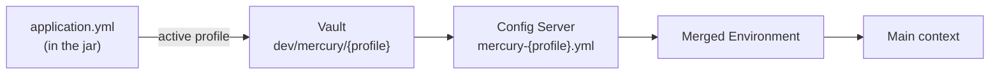
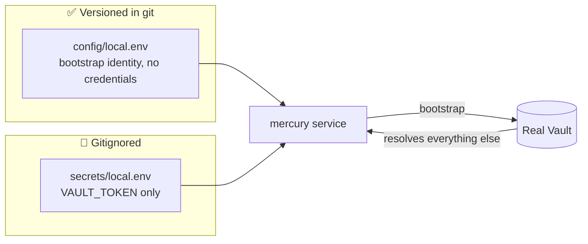
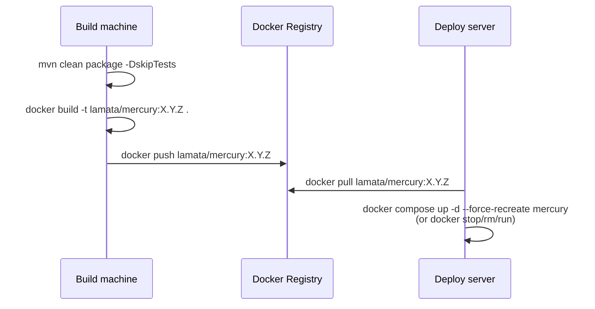

# ☁️ 06 · Environment Configuration

🌐 [Leer esto en Español](../es/06-configuracion-entornos.md) · ⬅️ [Back to index](README.md)

> Mercury has three clearly separated configuration levels: **local development** (IDE, no container), **test/QA** (Docker + `docker-compose`, against real QA services), and **production** (built and deployed image, secrets managed centrally in Vault). This document covers all three, and the precedence mechanism that connects them.

---

## 🧭 Overview

| Level | How it runs | Config Server / Vault | Certificates |
|---|---|---|---|
| 🧑‍💻 Local development | `java -jar` or Run from the IDE | Real (QA), over the Internet | `certs/mercury/` on the local filesystem |
| 🧪 Test / QA | Docker container (`docker-compose`) | Real (QA) or a local `config-server`/`vault-server` instance | Baked into the image (`Dockerfile`) |
| 🚀 Production | Deployed Docker container | Real (prod), Vault populated by the platform team | Baked into the image, rotated via rebuild |

---

## 🔐 The mechanism that ties it all together: the *bootstrap* phase

Before Spring's main context exists, there's a **bootstrap context** (enabled by `spring-cloud-starter-bootstrap`) that:

1. Reads `src/main/resources/application.yml` (the only local config file — `bootstrap.yml` was retired in MER-5's migration off the legacy Spring Cloud Bootstrap Context, which was incompatible with AOT/native-image processing; see `docs/architecture/graalvm-native-image.md`).
2. Connects to **Vault** (`spring.cloud.vault.*`) and fetches secrets from `dev/mercury/{profile}` and `dev/mercury`.
3. Connects to the **Config Server** (`spring.cloud.config.uri`) and fetches `mercury-{profile}.yml` from a Git repository.
4. Merges everything into the `Environment` the main context will use.


```mermaid
flowchart LR
    BY["application.yml<br/>(in the jar)"] -->|active profile| Vault["Vault<br/>dev/mercury/{profile}"]
    Vault --> CS["Config Server<br/>mercury-{profile}.yml"]
    CS --> ENV["Merged Environment"]
    ENV --> APP["Main context"]
```

> [!IMPORTANT]
> **Real precedence (highest to lowest): Vault → Config Server → local environment variables → local `application.yml`.**
> This means **no local value can override a value Vault or the Config Server already defines** — not `default.env`, not `-D`, not editing `application.yml`. See [05 · Sequence Diagrams § 1](05-sequence-diagrams.md#1️⃣-application-startup-bootstrap-vault--config-server) and the Troubleshooting section below — this behavior caused real hours of debugging on this branch.

---

## 🧑‍💻 Local development (IDE / no container)

### Requirements

- Java 25 LTS (JDK, not just JRE)
- Maven (or the IDE's wrapper)
- Network access to `vault.umdc-qa.tst` and `config-server.umdc-qa.tst` (VPN/internal DNS depending on the team)
- Credentials in `~/.m2/settings.xml` for `https://repo.repsy.io/mvn/lmata/prx` (private PRX dependencies)

### 1. Certificates — `certs/mercury/`

Mercury does **not** load certificates/keystores from the classpath (that pattern is how secrets ended up committed to git — see this repo's own history). Instead, `application.yml` references them with `file:certs/mercury/<file>` paths, **relative to the process's *working directory*** — which is the project root for an IDE run, and (inside the container) Docker's `WORKDIR`.

```
certs/mercury/
├── mercury.jks               # the app's own keystore (JWT, mercury-security SSL bundle)
├── umdc-truststore.jks       # trust store — includes the internal "PRX Internal CA"
├── aiven-kafka.p12           # Kafka keystore (PKCS12, non-PEM fallback)
├── aiven-kafka-7e59598.cert  # Kafka certificate (PEM, default mode)
├── aiven-kafka-7e59598.key   # Kafka private key (PEM)
├── aiven-kafka-7e59598.pem   # Kafka CA (PEM)
└── prx-internal-ca.crt       # internal CA in plain PEM — imported by docker-entrypoint.sh
```

> [!WARNING]
> **This directory is gitignored (`*.jks`, `*.pem`, `*.p12`, `*.cert`, `*.key`, `*.crt`) — it must never reach git.** Get these files from another team member or extract them from Vault; don't recreate them by hand without verifying they match what the environment actually expects.

These paths are **hardcoded in `application.yml`** (`file:certs/mercury/mercury.jks` / `file:certs/mercury/umdc-truststore.jks`, with their real, keytool-verified type/password) — no environment variable (`SSL_KEYSTORE_LOCATION`, `SSL_TRUSTSTORE_LOCATION`, etc.) can override them. This was a deliberate choice: the env-var indirection broke twice in real deployments because a local/stale `default.env` on a different machine carried the value without the `file:` prefix (an unprefixed path resolves as `classpath:`, which no longer exists post-purge) — and since `certs/mercury/` is always at this fixed path (baked into the image, present in every local checkout), there was never a real reason for it to vary by environment.

| Spring property | Fixed value | Verified with `keytool` |
|---|---|---|
| `umdc.security.keystore.*` (+ `management-authenticator`) | `file:certs/mercury/mercury.jks` / `JKS` / `changeit` | ✅ |
| `umdc.security.truststore.*` (+ `management-authenticator`) | `file:certs/mercury/umdc-truststore.jks` / `PKCS12` / `changeit` | ✅ |
| `spring.ssl.bundle.jks.mercury-security.*` | same `mercury.jks` / `umdc-truststore.jks` | ✅ |
| `spring.cloud.vault.ssl.trust-store` | same `umdc-truststore.jks` | ✅ (real handshake confirmed against `vault.umdc-qa.tst`) |
| `spring.cloud.config.tls.trust-store` | same `umdc-truststore.jks` | ✅ (real handshake confirmed against `config-server.umdc-qa.tst`) |

> [!NOTE]
> Kafka's own variables (`KAFKA_SSL_*`) are still configurable per environment — they weren't implicated in this issue and may legitimately need to point at a different broker depending on the environment.

### 2. `default.env` — local variables (never in git)

`default.env` (gitignored) is where local bootstrap variables live: active profile, `VAULT_TOKEN`, Vault/Config Server URLs. Load it in the IDE run (via the EnvFile plugin or equivalent), or manually:

```bash
set -a; source default.env; set +a
mvn -o spring-boot:run
# — or —
java -jar target/mercury.jar
```

> [!CAUTION]
> `default.env` contains **real secrets** (`VAULT_TOKEN`, database passwords if overridden locally). Never commit it, never paste it into a chat, never copy it off your machine. If a token gets accidentally exposed, **rotate it in Vault immediately**.

### 3. A real case of configuration that "can't be overridden"

If a value (a file path, a timeout) seems "cached" and won't change no matter what you put in `default.env` — it's probably **not** caching, it's that Vault or the Config Server already define it, and they win by precedence (see above). Verify by querying Vault directly before you keep guessing:

```bash
curl -s --cacert certs/mercury/prx-internal-ca.crt \
  -H "X-Vault-Token: $VAULT_TOKEN" \
  https://vault.umdc-qa.tst/v1/dev/data/mercury/{profile} \
  | python3 -m json.tool
```

---

## 🧪 Test environment (Docker / `docker-compose`)

### Building the image

```bash
mvn -o clean package -DskipTests          # jar at target/mercury.jar
docker build -t lamata/mercury:0.0.2 .    # the Dockerfile copies certs/mercury/ into it
```

The `Dockerfile` copies `certs/mercury/` **into the image** (a deliberate choice — see [01 · Technology Stack](01-technology-stack.md) and the `fix/docker-image-and-compose` commit history): it removes the need to mount a certificate volume on every deploy machine, in exchange for the certificates being extractable from the image's layers by anyone with registry access. `docker-entrypoint.sh` imports any `*.crt` in `certs/mercury/` into the JVM's trust store (`/usr/local/runme/cacerts`) at container start.

### `docker-compose.yml` — config vs. secrets split


```mermaid
flowchart LR
    subgraph versioned["✅ Versioned in git"]
        CL["config/local.env<br/>bootstrap identity, no credentials"]
    end
    subgraph ignored["🚫 Gitignored"]
        SL["secrets/local.env<br/>VAULT_TOKEN only"]
    end
    CL --> MC["mercury service"]
    SL --> MC
    MC -->|bootstrap| Vault[(Real Vault)]
    Vault -->|resolves everything else| MC
```

| File | Content | Versioned |
|---|---|---|
| `config/local.env` | `SPRING_BOOT_PROFILE_ACTIVE`, `CNFS_URI`, `VAULT_URI`, `VAULT_KV_BACKEND`, `APP_PORT`, flags — **zero credentials** | ✅ Yes (explicit `.gitignore` exception: `!config/*.env`) |
| `secrets/local.env` | Only `VAULT_TOKEN` — the one secret needed *before* Vault can be reached at all | ❌ No (`secrets/local.env.example` is the versioned template) |

> [!TIP]
> Everything else — database, Mongo, mail, OAuth, Kafka SASL credentials — should **never** pass through these files or Docker Compose. They already come from Vault at runtime; duplicating them here creates two sources of truth that drift apart over time.

```bash
cp secrets/local.env.example secrets/local.env   # fill in a real VAULT_TOKEN
docker compose --env-file config/local.env build mercury
docker compose --env-file config/local.env up -d mercury
```

> [!NOTE]
> `--env-file config/local.env` is required for `docker-compose.yml` to resolve `${MERCURY_TEMPLATES_HOST_PATH}` (the host directory mounted over `/usr/local/runme/templates`) from that file — Compose only reads `env_file:` entries to inject variables **inside** the container, never for its own `${...}` substitution in the YAML. Without the flag, Compose falls back to the default baked into `docker-compose.yml` itself.

### Full local stack (optional)

`docker-compose.yml` can also bring up local `config-server` and `vault-server` instances (PRX's own images) for fully isolated testing, without depending on the QA network. Points already resolved and verified in this repo:

- `config-server` needs the **`remotedev,ssl`** profile — not `remote-supabase` (that string doesn't match any file bundled in the `lamata/config-server` image, and activating it means the SSL block never loads).
- `vault-server` needs its own `healthcheck`, and `mercury` must depend on `condition: service_healthy` — otherwise the startup race makes `mercury` try to connect before `config-server`'s Tomcat is listening.
- `vault-server`'s config volume must be a repo-relative path (`./vault/config`), never a host-specific absolute path.

---

## 🚀 Production

### Current deployment flow


```mermaid
sequenceDiagram
    participant Dev as Build machine
    participant Registry as Docker Registry
    participant Prod as Deploy server

    Dev->>Dev: mvn clean package -DskipTests
    Dev->>Dev: docker build -t lamata/mercury:X.Y.Z .
    Dev->>Registry: docker push lamata/mercury:X.Y.Z
    Prod->>Registry: docker pull lamata/mercury:X.Y.Z
    Prod->>Prod: docker compose up -d --force-recreate mercury<br/>(or docker stop/rm/run)
```

> [!WARNING]
> A `docker pull` with the **same tag** only fetches the new image if the digest changed on the registry — but if the local container already has that image cached and no explicit `pull` happened before `up`/`run`, it can keep running the old version with no visible error. Always `pull` explicitly before recreating the container.

### Secret management in production

The current design assumes:

- **Vault is the only source of application secrets** (DB, Mongo, mail, OAuth, Kafka SASL, third-party tokens) — populated per environment under `secret/mercury/{profile}` (or `dev/mercury/{profile}` depending on the configured KV backend).
- The **only secret the deploy process needs to inject directly** is `VAULT_TOKEN` — everything else is resolved by Vault at runtime.

### 🎯 Toward Kubernetes / Helm

The repository already anticipates a Helm chart (`Dockerfile`/`docker-compose.yml` reference `see k8s/`, not yet created as of this document). Recommendation for when it's built:

| Bucket | Where it lives | Example |
|---|---|---|
| Non-sensitive per-environment config | `values-{env}.yaml` (Helm) or ConfigMap | `SPRING_BOOT_PROFILE_ACTIVE`, `CNFS_URI`, `VAULT_URI` |
| The one bootstrap secret | Kubernetes `Secret`, injected via `secretKeyRef` | `VAULT_TOKEN` |
| Application secrets | **Vault, never Helm** | DB, Mongo, mail, OAuth, Kafka SASL |

> [!TIP]
> The recommended alternative to a static `VAULT_TOKEN` `Secret` is [Vault's Kubernetes auth method](https://developer.hashicorp.com/vault/docs/auth/kubernetes): the pod's `ServiceAccount` authenticates to Vault directly — zero static token to provision, rotate, or leak.

---

## 🔑 Environment variable reference (by category)

| Category | Variables | Expected source |
|---|---|---|
| Bootstrap identity | `SPRING_BOOT_PROFILE_ACTIVE`, `SPRING_CLOUD_CONFIG_LABEL`, `SPRING_BOOT_CLOUD_BOOTSTRAP_ENABLED` | `config/local.env` / Helm values |
| Vault | `VAULT_ENABLED`, `VAULT_URI`, `VAULT_TOKEN`, `VAULT_KV_BACKEND` | `secrets/local.env` (token only) / K8s Secret or Vault K8s auth |
| Config Server | `CNFS_URI`, `CNFS_PORT` (⚠️ `CNFS_PORT` has no effect on the client — see [04 · Components](04-components.md)) | `config/local.env` |
| Certificates | *(none — hardcoded)* | Fixed paths in `application.yml` (`certs/mercury/`) — not configurable via env var, on purpose |
| Kafka | `KAFKA_SECURITY_PROTOCOL`, `KAFKA_SASL_MECHANISM`, `KAFKA_SASL_JAAS_CONFIG`, `KAFKA_SSL_*`, `BOOTSTRAP_SERVER_URI/PORT` | Vault (production) |
| Database / Mongo / Mail / OAuth / Telegram | `MERCURY_DB_*`, `MONGO_*`, `MAIL_*`, `AUTH_*`, `BACKBONE_*`, `TELEGRAM_*` | **Vault only** — never duplicate into versioned local files |
| App | `APP_PORT`, `TEMPLATE_PATH`, `TEMPLATE_SUFFIX` | Mixed — see the `TEMPLATE_PATH` case below |
| Authentication / session tokens | `APP_TOKEN_SECRET` (**required, no default**), `APP_TOKEN_EXPIRATION`, `APP_TOKEN_ISSUER`, `APP_TOKEN_AUDIENCE`, `APP_TOKEN_TRUSTED_ISSUERS`, `APP_TOKEN_TRUSTED_AUDIENCES`, `APP_TOKEN_ALLOW_MISSING_CLAIMS`, `APP_TOKEN_VALIDATE_WITH_BACKBONE`, `APP_TOKEN_BACKBONE_VALIDATION_CACHE_TTL`, `LOGIN_THROTTLE_*`, `DIRECTORY_BACKEND_LOGIN_ALIAS/PASSWORD` | Vault (production) — see [Authentication & token configuration](#-authentication--token-configuration-essential) |

---

## 🔐 Authentication & token configuration (essential)

Mercury authenticates **two different kinds of caller**, with two different credentials. Getting either
one wrong shows up as `401`/`403`, or as the app refusing to start.

| Who is calling | Credential | Header | Verified by |
|---|---|---|---|
| A **client application** (a service, e.g. directory-backend) | Backbone opaque access token (scopes `mercury:message:read` / `:write`) | `Authorization: Bearer <token>` | `ManagedClientSecurityConfig`, via Backbone's introspection — paths `/api/v1/campaigns/**`, `/api/v1/channel-types/**`, `/api/v1/templates/**` |
| An **end user** | The session JWT backbone-rest issued at login | `session-token` | `SessionJwtInterceptor` / `SessionJwtServiceImpl` — locally (HS256), plus backbone-rest's deny-list |
| A **backend caller** of the M2M endpoints (`/api/v1/mail`, `/api/v1/verification-code`) | A Mercury-issued token, obtained with a registered alias/password at `POST /api/v1/auth/token` | `session-token` | `SessionJwtInterceptor` |

User-scoped operations (campaigns by application, update/toggle/delete, `getById`, `getProgress`,
`createCampaign`, all of Template Management) need **both** the Bearer (which service) and the
`session-token` (which user). `session-token-bkd` is no longer used anywhere.

### Required for the app to start

`APP_TOKEN_SECRET` has **no default** in `application.yml` — on purpose: a committed default would let
anyone with the repository forge a session-token in any environment where the variable is unset. Without
it the context fails with `Could not resolve placeholder 'APP_TOKEN_SECRET'`.

- Must be **base64**, **≥ 256 bits**, and **exactly the value backbone-rest signs with**.
- Production/test: from Vault, like every other secret.
- Local without Vault: put it in `secrets/local.env` (see `secrets/local.env.example`). Generate one with
  `openssl rand -base64 48`.

### Settings (`umdc.security.jwt.*`, `umdc.security.login-throttle.*`)

| Env variable | Default | What it does |
|---|---|---|
| `APP_TOKEN_SECRET` | **none (required)** | HS256 key to sign and verify session tokens. |
| `APP_TOKEN_EXPIRATION` | `3600000` | TTL (ms) of tokens Mercury itself issues (`/auth/token`). |
| `APP_TOKEN_ISSUER` / `APP_TOKEN_AUDIENCE` | `mercury` / `mercury` | `iss` / `aud` Mercury stamps on its own tokens; always accepted. |
| `APP_TOKEN_TRUSTED_ISSUERS` / `APP_TOKEN_TRUSTED_AUDIENCES` | `backbone-rest` / `backbone-rest-client` | Extra `iss` / `aud` accepted (comma-separated) — backbone-rest's, since it issues the end user's token. |
| `APP_TOKEN_ALLOW_MISSING_CLAIMS` | `false` | `iss` and `aud` are **mandatory**. Set `true` only in an environment whose backbone-rest does not stamp them; a present-but-wrong claim is rejected either way. |
| `APP_TOKEN_VALIDATE_WITH_BACKBONE` | `true` | Also ask backbone-rest whether a token it issued is still active (honours its logout / deny-list). |
| `APP_TOKEN_BACKBONE_VALIDATION_CACHE_TTL` | `30s` | Positive answers are cached this long. It is the **worst-case delay** before a logout at backbone-rest is reflected here. |
| `LOGIN_THROTTLE_MAX_ATTEMPTS` / `LOGIN_THROTTLE_WINDOW` | `5` / `15m` | Failed `POST /api/v1/auth/token` attempts per alias + caller address before `429` + `Retry-After`. Per instance. |
| `DIRECTORY_BACKEND_LOGIN_ALIAS` / `_PASSWORD` | *(empty)* | A registered backend caller (`umdc.mercury.login-clients`) allowed to obtain an M2M token. Must match what that caller sends. |

### What must match across projects

| Mercury | Other project | Rule |
|---|---|---|
| `APP_TOKEN_SECRET` | backbone-rest `APP_TOKEN_SECRET` | **Identical value.** Different secrets ⇒ every user token is rejected. |
| `APP_TOKEN_TRUSTED_ISSUERS` | backbone-rest `JWT_ISSUER` (default `backbone-rest`) | Must contain it. |
| `APP_TOKEN_TRUSTED_AUDIENCES` | backbone-rest `JWT_AUDIENCE` (default `backbone-rest-client`) | Must contain it. |
| `umdc.backbone.base-url` | backbone-rest | Reachable from Mercury: introspection (`/managed-clients/introspect`) and session validation (`GET /api/v1/session/validate`, public, token in the `Authorization` header). |
| `DIRECTORY_BACKEND_LOGIN_*` | directory-backend's Mercury `AuthRequest` alias/password | Same pair. |

### Other runtime dependencies this adds

- **MongoDB**: the `revoked_tokens` collection (Mercury's denylist). Its TTL index is created because
  `spring.data.mongodb.auto-index-creation` is `true`.
- **backbone-rest must be up** to authenticate end users: if it cannot be reached the token is rejected
  (fail closed), as is a token when MongoDB is unreachable.

See [session-token-authorization](../../architecture/session-token-authorization.md) for the full trust model.

---

## 📋 Complete `.env` file reference

The category table above is a quick index. This section documents **every variable in every
`.env`-style file in the repo**, file by file — what it's for, who actually reads it, and whether
it's a real value or a safe placeholder. Real secret values are never reproduced here, even from a
gitignored file — only variable names, purpose, and clearly-fake examples.

### `config/local.env` — versioned, docker-compose bootstrap identity

Loaded two ways at once, for two different purposes — see the `--env-file` note above:
1. `env_file:` on the `mercury` service → injected as **container environment** (what the JVM
   inside the container sees).
2. `--env-file config/local.env` on the `docker compose` CLI invocation → used for **Compose's own
   `${VAR}` substitution** inside `docker-compose.yml` itself (e.g. `MERCURY_TEMPLATES_HOST_PATH`
   in the `volumes:` line). `env_file:` alone does **not** feed this second mechanism.

| Variable | Purpose | Read by |
|---|---|---|
| `VIRTUAL_HOST` | Hostname an external reverse-proxy sidecar (e.g. `jwilder/nginx-proxy`-style) routes to this container by. | External proxy only — **not** read by Mercury's own JVM. |
| `APP_PORT` | Port Tomcat listens on inside the container. | `docker-entrypoint.sh` / container port mapping. |
| `SPRING_BOOT_PROFILE_ACTIVE` | Active Spring profile (`remote-supabase`, `native`, etc.) — selects which `mercury-{profile}.yml` the Config Server serves. | `spring.profiles.active` in `application.yml`. |
| `SPRING_CLOUD_CONFIG_LABEL` | Git branch/label the Config Server resolves `mercury-{profile}.yml` from. | `spring.cloud.config.label`. |
| `SPRING_BOOT_CLOUD_BOOTSTRAP_ENABLED` | Legacy flag — retired along with the legacy Bootstrap Context in MER-5 (see `docs/architecture/graalvm-native-image.md`). Harmless to set; nothing reads it anymore. | *(unused)* |
| `VAULT_ENABLED` | Whether to attempt the Vault fetch at all. | `spring.cloud.vault.enabled`. |
| `SPRING_CLOUD_VAULT_ENABLED` | Same switch, Spring Cloud's own property name. | `spring.cloud.vault.enabled` (duplicate of the above by convention). |
| `VAULT_URI` ⚠️ | Vault base URL. **Must be spelled `VAULT_URI`, not `VAULT_URL`** — `application.yml` only binds `${VAULT_URI:https://vault.umdc-qa.tst}`; a `VAULT_URL` variable is silently ignored (the app then falls back to the hardcoded default, which happens to be correct for the QA Vault host — masking the typo rather than failing loudly). | `spring.cloud.vault.uri`. |
| `VAULT_KV_BACKEND` | Vault KV mount/backend name (`dev`, `secret`, etc.). | `spring.cloud.vault.kv.backend`. |
| `CNFS_URI` | Config Server base URL. | `spring.cloud.config.uri`. |
| `SD_INSTANCE_HOST_NAME`, `SD_PORT`, `SD_REGISTER_ENABLED`, `SD_URL` | Service-discovery registration metadata. Mercury has no `eureka-client` dependency (verified against `pom.xml`), so its own JVM never reads these — kept only in case an external nginx-proxy/service-monitor sidecar on the shared network consumes them. | External sidecar only. |
| `SSL_JKS_SD_TRUSTSTORE_LOCATION`, `SSL_JKS_SD_TRUSTSTORE_PASSWORD`, `SSL_JKS_SD_TRUSTSTORE_TYPE`, `SSL_JKS_SD_KEYSTORE_ALIAS`, `SSL_JKS_SD_KEYSTORE_LOCATION`, `SSL_JKS_SD_KEYSTORE_PASSWORD`, `SSL_JKS_SD_KEYSTORE_TYPE`, `SSL_JKS_SD_KEY_PASSWORD` | TLS material for that same external service-discovery/monitor sidecar. **Not read by `application.yml` at all** (confirmed: zero matches) — same "external sidecar only" caveat as `SD_*` above. | External sidecar only. |
| `SSL_KEY_ALIAS`, `SSL_TRUSTSTORE_LOCATION`, `SSL_TRUSTSTORE_PASSWORD`, `SSL_TRUSTSTORE_TYPE` | Also **not** read by `application.yml`. Mercury's own keystore/truststore paths are hardcoded, unconfigurable via env var by design — see § 1 above. Safe to leave set (harmless), but don't rely on them to change Mercury's own TLS material. | *(unused by Mercury's own JVM)* |
| `MERCURY_TEMPLATES_HOST_PATH` | Host directory bind-mounted read-only over `/usr/local/runme/templates` by `docker-compose.yml`, letting ops swap FreeMarker `.ftl` templates without rebuilding the image (which already bakes in `src/main/resources/templates` as the default). **Compose-only** — not a `${...}` placeholder anywhere in `application.yml`; resolved purely by `docker-compose.yml`'s own `volumes:` substitution, which is why the `--env-file config/local.env` flag matters. | Docker Compose only, not the JVM. Windows example: `C:\ambientes\mercury\templates`; Linux/macOS: `/opt/mercury/templates`. |

### `secrets/local.env` — gitignored, the one bootstrap secret

Copy `secrets/local.env.example` to `secrets/local.env` and fill it in; never commit the real file.

| Variable | Purpose | Read by |
|---|---|---|
| `APP_TOKEN_SECRET` (optional, commented out in the example) | Only for running **without** Vault supplying it: the HS256 session-token secret, which has no default. See *Authentication & token configuration*. | `umdc.security.jwt.secret`. |
| `VAULT_TOKEN` | The only secret Vault itself can't hand back — needed to authenticate the very first Vault request. Everything else (DB, Mongo, mail, OAuth, Kafka SASL) is resolved from Vault's own KV store once this succeeds. | `spring.cloud.vault.token`. |

### `config/native.env` — versioned, GraalVM native-image build/AOT-only

**Never used for a real deployment** — every value is a syntactically-valid, harmless placeholder
that lets `spring-boot:process-aot` and `native-image` complete a full `ApplicationContext` refresh
without live Vault/Config Server/Postgres/MongoDB/Kafka/Eureka access, which this kind of build
should never depend on. See `docs/architecture/graalvm-native-image.md` for the full rationale.

> [!IMPORTANT]
> Spring's AOT processor evaluates every conditional autoconfiguration decision **once**, using
> whatever is in this file at build time, and bakes the result into the generated native binary.
> Unlike a plain JVM app, no later runtime environment variable — a real deployment profile, Vault,
> the Config Server — can ever re-enable an autoconfiguration excluded here. Removing a variable
> from this file (or getting one wrong) can permanently strip functionality from every native build
> produced from it until fixed and rebuilt — see finding 6 in the native-image doc for a real
> incident this caused (`ServletWebSecurityAutoConfiguration` excluded here by mistake stripped out
> the entire Spring Security filter-chain machinery).

| Variable | Purpose |
|---|---|
| `SPRING_BOOT_PROFILE_ACTIVE` | Pinned to `native` — a profile that resolves no remote config at all. |
| `VAULT_ENABLED`, `SPRING_CLOUD_CONFIG_ENABLED` | Both `false` — `application.yml`'s `spring.config.import=optional:vault://,optional:configserver:` already makes both optional; set explicitly here anyway, for clarity/defense. |
| `SPRING_CLOUD_CONFIG_LABEL` | `native` — cosmetic, since the Config Server is never actually reached. |
| `CNFS_URI` | `http://localhost:9999` — a deliberately unreachable placeholder. |
| `LOGGING_TRACE_ENABLED` | `false` — quiets the AOT/native build log. |
| `AUTH_ROLE_ID` | `none` — placeholder for the decommissioned Keycloak-style role-mapping property. |
| `APP_PORT` | `8118` — same as every other environment. |
| `AUTH_CERT_URI`, `AUTH_CLIENT_ID`, `AUTH_CLIENT_SECRET`, `AUTH_RESOURCE_PRINCIPAL`, `AUTH_TOKEN_URI`, `AUTH_URI` | Placeholders (`dummy`/`http://localhost:9999/...`) for the decommissioned OAuth2/Keycloak property tree — never resolved to real endpoints at build time. |
| `BACKBONE_CLIENT_ID`, `BACKBONE_CLIENT_SECRET`, `BACKBONE_GRANT_TYPE`, `BACKBONE_PASSWORD`, `BACKBONE_SCOPE`, `BACKBONE_USERNAME` | Placeholders for `BackendFeignClientInterceptor`'s M2M client-credentials config — real values only matter at request time (never exercised during an AOT build). |
| `BOOTSTRAP_SERVER_PORT`, `BOOTSTRAP_SERVER_URI` | Placeholders for the (retired) Spring Cloud Bootstrap Context's own server coordinates. |
| `MAIL_HOST`, `MAIL_PASSWORD`, `MAIL_PORT`, `MAIL_PROTOCOL`, `MAIL_USERNAME` | SMTP placeholders — `spring.mail.*`. |
| `MERCURY_CLIENT_ID`, `MERCURY_CLIENT_SECRET`, `MERCURY_GRANT_TYPE`, `MERCURY_PASSWORD`, `MERCURY_SCOPE`, `MERCURY_USERNAME` | Placeholders for Mercury's own outbound OAuth2 client-credentials config. |
| `MERCURY_DB_NAME`, `MERCURY_DB_PASSWORD`, `MERCURY_DB_PORT`, `MERCURY_DB_URI`, `MERCURY_DB_USERNAME` | Postgres datasource placeholders — point at `localhost:5432`, never actually connected to during AOT processing (`SPRING_DATASOURCE_HIKARI_INITIALIZATION_FAIL_TIMEOUT=-1` below prevents HikariCP from failing fast on the missing connection). |
| `MERCURY_EMAIL_TOPIC` | Kafka topic name placeholder. |
| `MONGO_DATABASE`, `MONGO_HOST`, `MONGO_PASSWORD`, `MONGO_PORT`, `MONGO_USERNAME` | MongoDB placeholders — same "never actually connected" rationale as the Postgres block. |
| `PRX_VERIFICATION_CODE_TEMPLATE_ID` | A syntactically-valid nil UUID placeholder. |
| `TEMPLATE_SUFFIX` | `.ftl` — the real value, since it's harmless and syntactically required either way. |
| `VAULT_TOKEN` | `dummy` — never a real token; Vault is never reached in this build path. |
| `EUREKA_CLIENT_ENABLED` | `false` — no live Eureka server available at build time. |
| `SPRING_MAIN_WEB_APPLICATION_TYPE` | `servlet` — pins the app type explicitly for AOT processing. |
| `SPRING_AUTOCONFIGURE_EXCLUDE` | `JerseyAutoConfiguration` only (Jersey/JAX-RS is genuinely unused anywhere in `src/main/java`). **Do not add `ServletWebSecurityAutoConfiguration` here** — see the `[!IMPORTANT]` box above. |
| `SPRING_AOT_REPOSITORIES_ENABLED` | `false` — works around a known upstream Spring Data bug (spring-projects/spring-data-commons#3499) that fails AOT repository generation for any repository method with a Jakarta Validation parameter annotation. Falls back to normal runtime repository proxies (still fully native-image compatible). |
| `SPRING_DATASOURCE_HIKARI_INITIALIZATION_FAIL_TIMEOUT` | `-1` — lets HikariCP initialize without an immediate, blocking connection test against the placeholder (unreachable) datasource. |
| `SPRING_JPA_PROPERTIES_HIBERNATE_BOOT_ALLOW_JDBC_METADATA_ACCESS` | `false` — skips a JDBC metadata round-trip Hibernate would otherwise attempt against the placeholder datasource at boot. |
| `TEMPLATE_PATH` (commented out, set via shell export instead) | Must be an **absolute filesystem path**, not a classpath URI (`FreeMarkerConfig` calls `new File(templateLoaderPath)` directly). Exported separately in the documented build command: `export TEMPLATE_PATH="$(pwd)/src/main/resources/templates"`. |

### `default.env` — gitignored, real local JVM/IDE credentials

**Contains real secrets when filled in for actual use against QA infrastructure — never commit it,
never paste its contents anywhere, never screenshot it.** Unlike the three files above, this one is
not a template with placeholders; a working copy has live values. Only variable **names** and
**purpose** are documented here — values are described generically, never reproduced.

| Variable | Purpose |
|---|---|
| `CNFS_PORT`, `CNFS_URI` | Config Server port/URL. ⚠️ `CNFS_PORT` has no effect on the client (see [04 · Components](04-components.md)) — kept for documentation/consistency only. |
| `SPRING_BOOT_CLOUD_BOOTSTRAP_ENABLED` | Legacy flag, unused post-MER-5 — see `config/local.env`'s own entry above. |
| `SPRING_BOOT_PROFILE_ACTIVE` | Active profile for local runs — typically `remote-supabase`. |
| `SPRING_CLOUD_CONFIG_LABEL` | Config Server branch/label. |
| `VAULT_ENABLED` | Whether to fetch from Vault (`true` for any realistic local run against QA). |
| `VAULT_KV_BACKEND` | Vault KV backend/mount name. |
| `VAULT_URI` | Vault base URL — see the `VAULT_URI` vs. `VAULT_URL` naming pitfall documented under `config/local.env` above; the same typo risk applies here. |
| `VAULT_TOKEN` | **Real Vault token.** Rotate immediately in Vault if this file (or its value) is ever exposed. |
| `TEMPLATE_PATH` (commented out by default) | See the dedicated note already in this file (§ 2 above) — Vault supplies this centrally in most environments; only needed locally if you're not getting it from there. |
| `LOGGING_TRACE_ENABLE`/`LOGGING_TRACE_ENABLED` (commented out) | Verbose request/response logging toggle. |
| `AUTH_ROLE_ID`, `AUTH_URI`, `AUTH_CLIENT_ID`, `AUTH_CLIENT_SECRET`, `AUTH_CERT_URI` (commented out) | Decommissioned Keycloak-style OAuth2 property tree — kept commented as historical reference only; do not re-enable (see `docs/architecture/graalvm-native-image.md` finding 6). |
| `SSL_KEYSTORE_LOCATION`, `SSL_KEYSTORE_PASSWORD`, `SSL_KEYSTORE_TYPE`, `SSL_TRUSTSTORE_LOCATION`, `SSL_TRUSTSTORE_PASSWORD`, `SSL_TRUSTSTORE_TYPE`, `SSL_KEY_ALIAS`, `SSL_KEY_PASSWORD` (commented out) | **Not read by `application.yml`** — these paths are hardcoded on purpose (§ 1 above). Left commented out as a historical warning, not a working override. |
| `BACKBONE_BASE_URL` (commented out) | Backbone service base URL override. |
| `DIRECTORY_BACKEND_LOGIN_ALIAS`, `DIRECTORY_BACKEND_LOGIN_PASSWORD` (commented out) | Credentials for `directory-backend` to authenticate to Mercury's own `POST /api/v1/auth/token` (see `LoginClientProperties`). |
| `APP_PORT` | `8118`. |
| `PRX_VERIFICATION_CODE_TEMPLATE_ID` (commented out) | Real verification-code template UUID override. |
| `MAIL_HOST`, `MAIL_PASSWORD`, `MAIL_PORT`, `MAIL_PROPERTIES_*`, `MAIL_PROTOCOL`, `MAIL_USERNAME` (commented out) | Real SMTP credentials (e.g. a Gmail app password) for local email testing. |
| `APP_TOKEN_EXPIRATION_SECONDS` (commented out) | Session-token TTL override. |
| `BOOTSTRAP_SERVER_URI`, `BOOTSTRAP_SERVER_PORT`, `KAFKA_SECURITY_PROTOCOL`, `UMDC_KAFKA_*` (commented out) | Real Aiven Kafka broker coordinates and SASL/SSL material for local Kafka testing. |
| `SRMN_URI`, `SRMN_PORT`, `SRMN_DEFAULT_ZONE`, `SRMN_HOSTNAME`, `SRMN_REGISTER_ENABLED` (commented out) | Service-monitor/Eureka-style registration overrides — same "not read by Mercury's own JVM" caveat as `SD_*` in `config/local.env`. |
| `MERCURY_DB_NAME`, `MERCURY_DB_PASSWORD`, `MERCURY_DB_PORT`, `MERCURY_DB_URI`, `MERCURY_DB_USERNAME` (commented out) | Real Postgres (Supabase pooler) credentials, for local runs that bypass Vault for the datasource specifically. |
| `MONGO_*` (commented out, ~15 variables) | Real MongoDB Atlas connection parameters and credentials. |
| `PRX_CONSUMER_GROUP_ID` (commented out) | Kafka consumer group id override. |
| `TELEGRAM_TOKEN`, `TELEGRAM_NAME`, `TELEGRAM_USERNAME` (commented out) | Real Telegram Bot API credentials for local Telegram channel testing. |

---

## 🧯 Real troubleshooting

Real cases hit and resolved in this repository — documented because **they will happen again**.

### ❌ `KeyStoreException`/`IllegalArgumentException: Resource class path resource [X.jks] does not exist`

**Cause:** a keystore/truststore property still points at `classpath:X.jks` (or a bare filename with no prefix, which Spring resolves as `classpath:` by default) — left over from when these files lived in `src/main/resources`. They no longer do. This happened **twice** in real deployments for the same reason: an external environment variable (`SSL_KEYSTORE_LOCATION`/`SSL_TRUSTSTORE_LOCATION` in a local `default.env`, different on each machine) overrode `application.yml`'s correct default with a stale value missing the `file:` prefix.

**Fix applied:** these paths are **no longer configurable via environment variable** — they're hardcoded directly in `application.yml` (`file:certs/mercury/mercury.jks` / `file:certs/mercury/umdc-truststore.jks`), specifically to remove this class of bug at the root. If you see this error again, it means you're running a jar/image build from **before** this fix — rebuild from the current code.

### ❌ `PKIX path building failed: unable to find valid certification path to requested target`

**Cause:** the HTTP client (Vault, Config Server) doesn't trust the internal CA. Either: (a) that client's `trust-store` property isn't explicitly configured and it depends on `-Djavax.net.ssl.trustStore` (only set in Docker's `CMD` — a local IDE run doesn't have it), or (b) the correct `.crt`/`.jks` file isn't present in `certs/mercury/`.

**Fix:** each client (`spring.cloud.vault.ssl.*`, `spring.cloud.config.tls.*`) has its **own** explicit `trust-store` in `application.yml` — they don't depend on the system property. Verify `certs/mercury/umdc-truststore.jks` contains the right CA:

```bash
keytool -list -v -keystore certs/mercury/umdc-truststore.jks -storepass changeit | grep -A2 "Owner:"
```

### ❌ Same PKIX error, but from `org.apache.hc.client5.http...` / a `RestTemplate`/Feign call, not Vault or Config Server

**Cause:** a different class of client than the one above — Vault's and the Config Server's clients have their own explicit `trust-store` (see the previous entry), but a manually-constructed `RestTemplate` or Feign's own default transport does **not** automatically inherit the merged trust store `TrustStoreInitializer` installs JVM-wide at startup. Confirmed real-deployment cause: `BackendFeignClientInterceptor.getToken()`'s M2M token fetch, and `BackbonePublicClient`'s opaque-token introspection (used on every `/api/v1/campaigns/**`/`/api/v1/channel-types/**` request) — both previously used an unconfigured client. See `docs/architecture/graalvm-native-image.md` finding 7 for the full root-cause writeup.

**Fix:** any new outbound HTTP client in this codebase must build its trust explicitly from `SSLContext.getDefault()` (read at call time, after `TrustStoreInitializer` has run) rather than relying on a library's own "system default" resolution — see `BackendFeignClientInterceptor.trustedHttpClient()` and `FeignHttpClientConfig.feignClient()` for the pattern to copy. If you add a **new** `@FeignClient`, it already picks up the global `feignClient()` bean automatically — no per-client wiring needed.

### ❌ `JpaSystemException: Generation of HibernateProxy instances at runtime is not allowed when the configured BytecodeProvider is 'none'`

**Cause (JVM mode):** `net.bytebuddy:byte-buddy` was missing from the packaged jar's runtime classpath — present only via `mockito-core`'s test-scope dependency, stripped by `spring-boot:repackage`. **Cause (GraalVM native-image mode):** a true native binary cannot generate proxy classes at runtime at all, regardless of what's on the classpath. See `docs/architecture/graalvm-native-image.md` finding 5 for the full root-cause writeup and why the usual fix (Hibernate's compile-time bytecode-enhancement Maven plugin) isn't available for this Hibernate release.

**Fix:** `pom.xml` now declares `net.bytebuddy:byte-buddy` explicitly (fixes JVM mode). For native-image, every `FetchType.LAZY` `@ManyToOne`/`@OneToOne` entity association was converted to `FetchType.EAGER` instead — if you add a **new** single-valued association to any entity, default it to `EAGER` (or explicitly justify why `LAZY` is safe under native-image before using it).

### ❌ A value "won't override" no matter what's in `default.env`

**Cause:** almost certainly Vault or the Config Server already define that value, and they **win by precedence** over any local variable (see the bootstrap section above). It's not a bug or a caching issue.

**Fix:** query Vault directly (see the `curl` snippet in the local-development section) to confirm where the value actually comes from before continuing to try to override it locally. If the value genuinely needs to differ per environment, the fix is to change it in Vault (affects every environment — coordinate with the team), or, if it's purely a local-vs-container path difference, replicate the exact path on the local machine (e.g. create `/usr/local/runme/templates` if that's the value Vault provides).

### ❌ `Could not resolve placeholder 'APP_TOKEN_SECRET'` at startup

**Cause:** the session-token secret deliberately has no default. **Fix:** provide it (Vault, or `secrets/local.env` locally — base64, ≥ 256 bits, the same value as backbone-rest).

### ❌ `401` on a user-scoped call although the user's token is fresh from backbone-rest

Check, in order: **(1)** the secret differs from backbone-rest's; **(2)** the token's `iss`/`aud` are not in `APP_TOKEN_TRUSTED_ISSUERS` / `_AUDIENCES` (decode the JWT payload and compare), or backbone-rest stamps none and `APP_TOKEN_ALLOW_MISSING_CLAIMS` is `false`; **(3)** it is a **refresh** token (`type=refresh-token`) — only `session-token` is accepted; **(4)** backbone-rest reports it inactive (logged out) or is unreachable — Mercury fails closed; **(5)** it was revoked via `POST /api/v1/auth/logout`. Mercury never says which one in the response; the cause is only in server logs.

### ❌ `401` on `/api/v1/campaigns/**`, `/channel-types/**` or `/templates/**` with a valid `session-token`

These paths also need `Authorization: Bearer <opaque token>` with `mercury:message:read` (GET) or `:write` (everything else). `401` ⇒ missing/inactive Bearer; `403` ⇒ wrong scope.

### ❌ `429` on `POST /api/v1/auth/token`

Too many failed alias/password attempts from that address (`LOGIN_THROTTLE_*`). Wait `Retry-After` seconds. Behind a proxy that hides the caller's address, all clients share one counter.

### ❌ `docker exec mercury keytool -list` fails with `Keystore file does not exist: /home/jvapps/.keystore`

**Cause:** not a real error — `keytool -list` without `-keystore` uses the `~/.keystore` default, which never exists. The `-keystore /usr/local/runme/cacerts -storepass changeit` flags were missing.

---

*Generated from an exhaustive read of `application.yml`, `Dockerfile`, `docker-compose.yml`, `docker-entrypoint.sh`, and real incidents debugged and verified in this repository — not from prior documentation or assumptions.*
