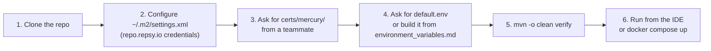
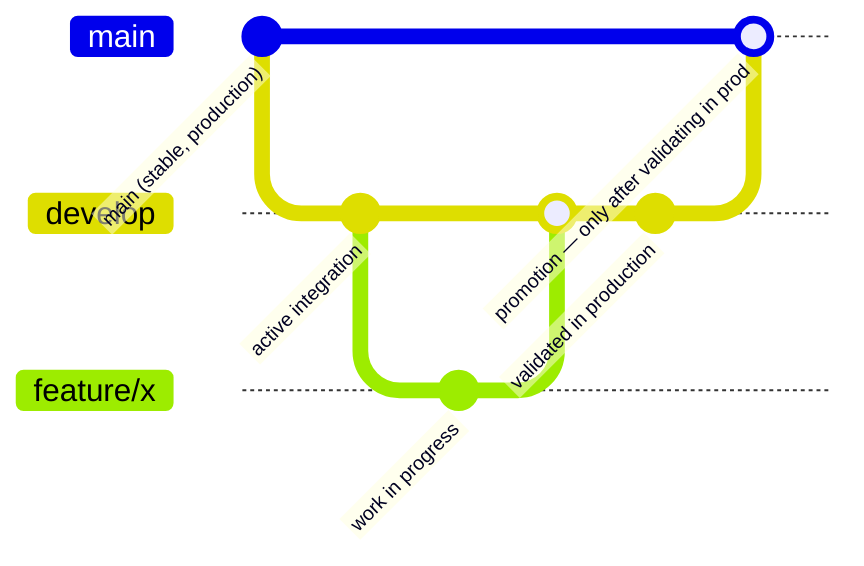

# 🚀 07 · Development Guide

🌐 [Leer esto en Español](../es/07-guia-desarrollo.md) · ⬅️ [Back to index](README.md)

> How to become productive on Mercury: setup, commands, branch conventions, and what to check before opening a PR.

---

## 🏁 Initial setup



1. **Clone the repository** and verify you have Java 25 LTS (`java -version`).
2. **Maven credentials** — `~/.m2/settings.xml` with the `repsy` server for `https://repo.repsy.io/mvn/lmata/prx` (private dependencies `prx-commons`, `commons-services`, `security-oauth`).
3. **Certificates** — ask a teammate for `certs/mercury/` (gitignored), or extract them from Vault. See [06 · Environment Configuration](06-environment-configuration.md#1-certificates--certsmercury).
4. **`default.env`** — same deal, ask for it or build it variable by variable using `environment_variables.md` as a reference. **Never commit it.**
5. **Verification build:**
   ```bash
   mvn -o clean verify
   ```
   If this passes (tests + PMD + JaCoCo), your environment is set up correctly.
6. **Run the app** — from the IDE (see [06 § Local development](06-environment-configuration.md#-local-development-ide--no-container)) or with Docker Compose (see [06 § Test environment](06-environment-configuration.md#-test-environment-docker--docker-compose)).

---

## 🛠️ Build commands

| Command | What it does |
|---|---|
| `mvn -U clean package -DskipTests` | Compiles without running tests — fast, for building the jar |
| `mvn clean test` | Runs the whole test suite |
| `mvn -Dtest=MyClassTest surefire:test` | Runs a single test class |
| `mvn -Dtest=MyClassTest#myMethod surefire:test` | Runs a single test method |
| `mvn -B -V -e clean verify` | Full build — tests + PMD + JaCoCo coverage gate |
| `mvn -Pcoverage clean test` | Generates coverage XML for SonarCloud |
| `mvn -Pbenchmark clean test` | Runs the JMH microbenchmarks |

> [!IMPORTANT]
> **`mvn clean verify` is the reference command before calling any work done.** PMD runs at the `test` phase (0 violations or the build fails); JaCoCo runs at the `verify` phase (70% line / 50% branch or the build fails). No change is considered complete without a green `verify`.

---

## 🌿 Branch strategy



| Branch | Role |
|---|---|
| `develop` | Active integration branch. All feature and fix work lands **here first**. |
| `feature/*`, `fix/*` | Per-task working branch, always created from `develop` (never from another half-finished `feature/*`). |
| `main` | Reflects only what's **already validated and stable in production**. |

> [!IMPORTANT]
> **`main` is frozen until there's a fully stable MVP.** The real promotion flow is: `develop` → gets published/deployed → gets validated in production → **only then** gets promoted to `main`. Never open or merge a PR into `main` without explicit confirmation that the corresponding change is already running stably in production — even for urgent security fixes, prepare the branch/PR but leave the `main` PR unmerged until that confirmation.

### Commit conventions

- Messages in English, imperative mood, type prefix: `fix:`, `feat:`, `refactor:`, `perf:`.
- The commit body explains the **why**, not just the what — especially for non-obvious fixes (see the `fix/docker-image-and-compose` history as a reference for this level of detail).
- One branch, one concern — don't mix an infrastructure fix with a new feature in the same commit/PR.

---

## 🧩 How to add a new messaging channel

1. Create the Mongo document: extend `MessageDocument` (see [03 · Data Model](03-data-model.md)).
2. Implement `ChannelService<YourDocument>` — the three methods: `send`, `updateStatus`, `findByDeliveryStatus`.
3. Add the matching topic in `bootstrap.yml` (`umdc.consumer.topics.<channel>`).
4. Register the channel in `MessageChannelRouter` so `MultiChannelListener` dispatches to it correctly.
5. Add the `ChannelType` in the `channel_type` table (or via the `POST /api/v1/channel-types` endpoint).
6. Write tests — at minimum: the `ChannelService` (persistence + status filtering) and the router registration.

> [!TIP]
> Before wiring up a real provider (Twilio, WhatsApp Cloud API, FCM/APNs, Telegram Bot API), check [04 · Components § Known Gaps](04-components.md#-known-gaps) — an unused dependency for it may already be sitting in `pom.xml` (that's the case for `telegrambots-*`).

---

## 🧪 Testing conventions

- **Unit tests first** (JUnit 5 + Mockito) — most coverage should come from here, not from heavy integration tests.
- Descriptive naming with `@DisplayName` — test names should read like a sentence (see `ChannelServicesTest` for this repo's style).
- Mock at the process boundary (repositories, HTTP clients) — don't mock your own domain logic.
- If you touch `bootstrap.yml`, there's a regression test (`ConfigurationPlaceholderTest`) that verifies every `${X}` placeholder without a default has a real property resolving it — don't break it, and if you add a new placeholder, give it a sensible default or document why it doesn't have one.

---

## ✅ Checklist before opening a PR

- [ ] `mvn -o clean verify` is green (tests + PMD + coverage)
- [ ] No secrets in the diff (`git diff --staged` reviewed by hand — `default.env`, `certs/mercury/*`, `secrets/local.env` must never appear)
- [ ] The PR targets `develop`, not `main` (unless explicitly confirmed as already validated in production)
- [ ] If the change touches `bootstrap.yml`/Docker/Compose: verified with a real run (`docker build` + `docker run`, or `docker compose up`), not just a code review
- [ ] Commits explain the *why*, not just the *what*

---

## 🔍 Quality tools in CI

| Tool | What it checks | Blocks the build |
|---|---|---|
| PMD (`ruleset.xml`) | Style, complexity, code smells | ✅ Yes — 0 violations tolerated |
| JaCoCo | Line coverage (70%) and branch coverage (50%) | ✅ Yes |
| Qodana / SonarQube | Deprecations, CVEs, additional code smells | Depends on the gate configured in CI |

---

*Generated from an exhaustive read of `pom.xml`, the repository's real commit history, and the team's branching-decision memory — not from prior documentation or assumptions.*
