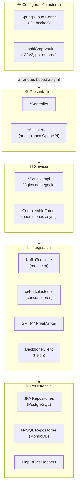
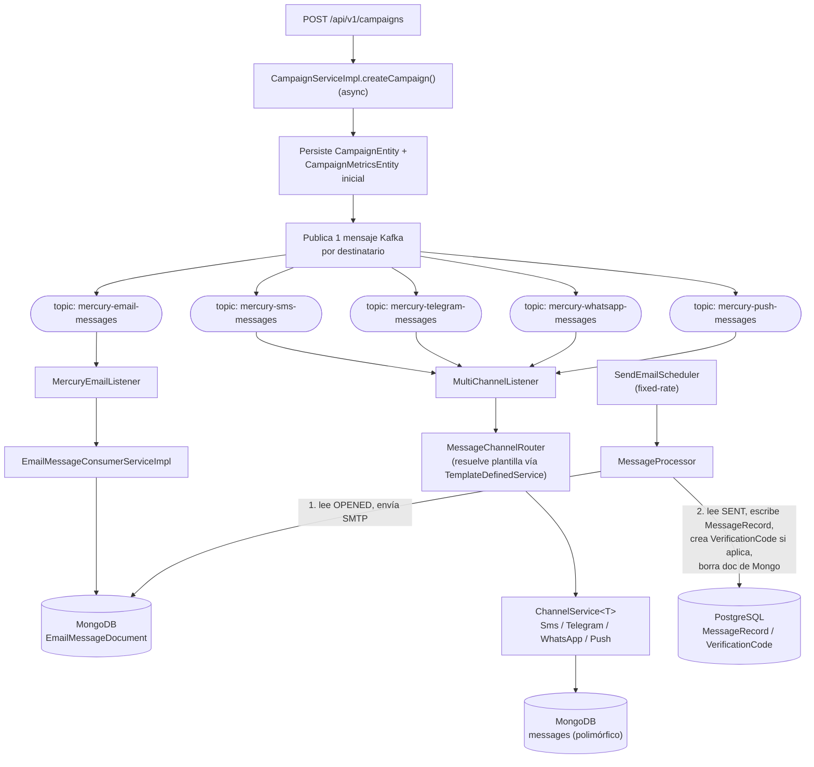
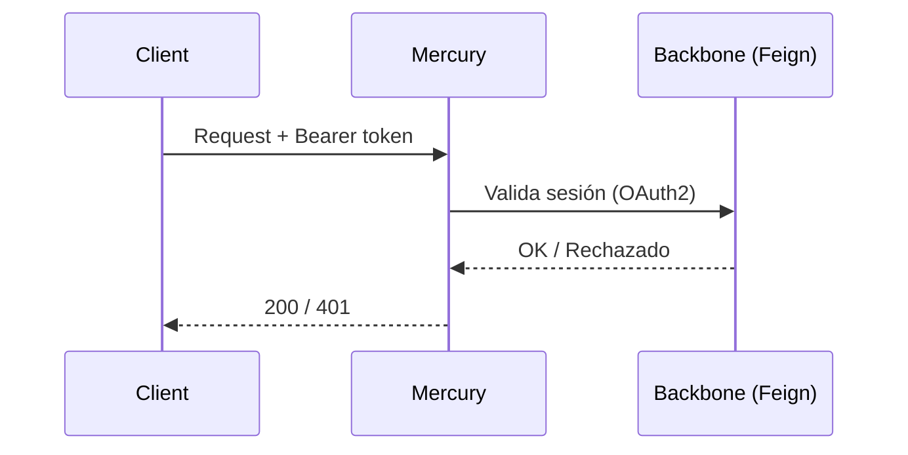

# 🏛️ 02 · Arquitectura

🌐 [Read this in English](../en/02-architecture.md) · ⬅️ [Volver al índice](README.md)

> Mercury es un **microservicio de mensajería multicanal**: expone una API REST, encola mensajes por canal vía Kafka, entrega emails por SMTP con plantillas FreeMarker, y persiste datos en PostgreSQL (durable) y MongoDB (transitorio).

---

## 🧭 Vista de capas

| Capa | Responsabilidad | Ejemplos reales |
|---|---|---|
| 🌐 Presentación | Endpoints delgados; las anotaciones OpenAPI viven en la interfaz `*Api`, no en el controlador | `CampaignController` implementa `CampaignApi` |
| 🧠 Servicio | Reglas de negocio; operaciones async devuelven `CompletableFuture` | `CampaignServiceImpl.createCampaign()` |
| 🔄 Integración | Publicación/consumo Kafka, SMTP, clientes HTTP externos | `MessageChannelRouter`, `EmailMessageConsumerServiceImpl` |
| 🗄️ Persistencia | Acceso a datos, mapeo Entity↔TO | `CampaignRepository`, `CampaignMapper` |
| ☁️ Configuración externa | Todo lo que llega desde Vault/Config Server antes de que arranque el contexto principal | Ver [06 · Configuración de Entornos](06-configuracion-entornos.md) |

---

## 🔀 Flujo de mensajes (el corazón de Mercury)

> [!IMPORTANT]
> Solo **Email** tiene un ciclo de vida completo (Kafka → Mongo → SMTP → PostgreSQL → borrado de Mongo). Los demás canales (SMS/Telegram/WhatsApp/Push) persisten el mensaje en la colección `messages` de Mongo — vía `ChannelService.send()` — pero ningún proceso hoy lo lleva a un estado terminal de entrega ni lo migra a PostgreSQL. Ver [04 · Componentes § Known Gaps](04-componentes.md#-known-gaps).

---

## 🧩 Los dos modelos de persistencia

Ver el detalle completo (todas las tablas, todos los documentos, y por qué están separados así) en [03 · Modelo de Datos](03-modelo-datos.md).

- **PostgreSQL** — durable, relacional: campañas, métricas de campaña, tipos de canal, plantillas, registros de mensaje, códigos de verificación, usuarios, aplicaciones.
- **MongoDB** — transitorio, documental: mensajes en vuelo. Dos familias de documentos independientes:
  - `EmailMessageDocument` — colección propia, ciclo de vida completo con `MessageProcessor`.
  - `MessageDocument` (base polimórfica) con subtipos `Sms/Telegram/WhatsApp/PushNotificationMessageDocument` — todos mapeados a la **misma** colección `messages`, escritos por los `ChannelService` pero sin reconciliación/purga todavía.

---

## 🔐 Seguridad de la API

- Autenticación de clientes vía OAuth2 (registro `mercury-backend-client`, `authorization-grant-type: password`) contra el proveedor `external` (Keycloak-style, `${AUTH_URI}`).
- `BackboneClient` (Feign) valida tokens de sesión contra el servicio Backbone.
- JWT propio (`SessionJwtServiceImpl`) para tokens de sesión de la aplicación — secreto y expiración configurables (`APP_TOKEN_SECRET`, `APP_TOKEN_EXPIRATION`).
- `spring.autoconfigure.exclude: ServletWebSecurityAutoConfiguration` — la seguridad HTTP estándar de Spring Boot está excluida; Mercury implementa su propio esquema.

---

## 🌱 Los dos diseños de mensajería que coexisten

Mercury tiene **dos** caminos de ingestión de mensajes en el código, en distinto grado de madurez:

1. **El camino en producción** (documentado arriba): un topic por canal, un `ChannelService` por canal, `MessageChannelRouter` como despachador.
2. **"Nexus" (experimental)**: `NotificationEventListener` consume un topic unificado (`${umdc.consumer.topics.notification}`) vía `NotificationEventConsumerServiceImpl` — pero **nada** en el flujo de creación de campañas publica ahí todavía, y sus manejadores por canal solo hacen `log`, sin persistencia ni envío real.

> [!NOTE]
> Tratar "Nexus" como experimental/no cableado hasta que se tome una decisión explícita de migrar el lado productor hacia ese diseño.

---

*Generado a partir de una lectura exhaustiva del código fuente real (`kafka/`, `api/v1/service/`, `bootstrap.yml`) — no de documentación previa ni de supuestos.*
