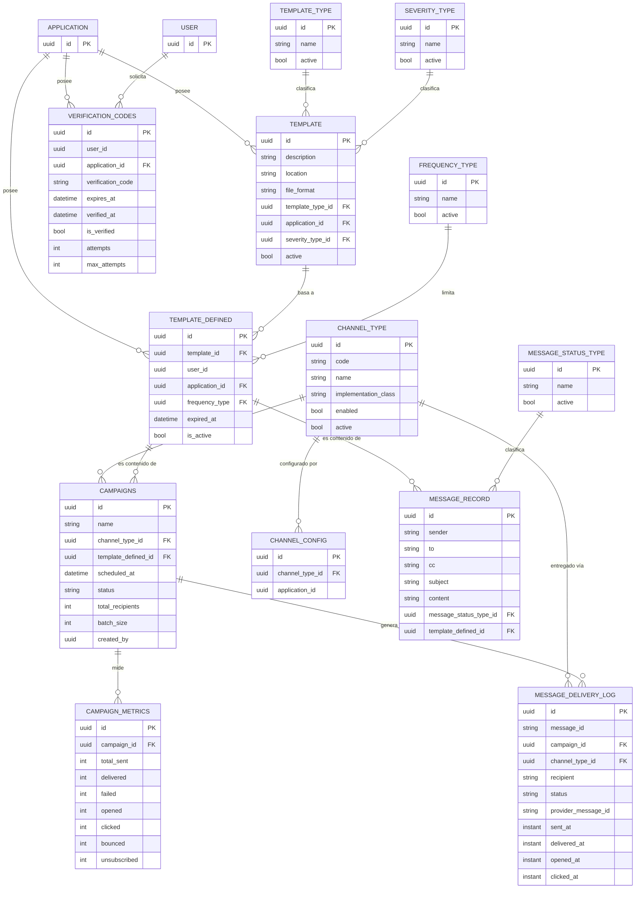
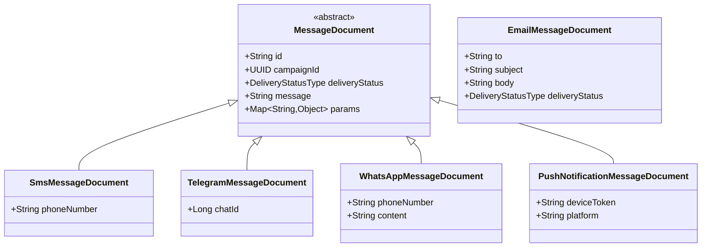

# 🗄️ 03 · Modelo de Datos

🌐 [Read this in English](../en/03-data-model.md) · ⬅️ [Volver al índice](README.md)

> Mercury persiste en **dos** motores con propósitos distintos: PostgreSQL para todo lo durable/relacional, MongoDB para mensajes transitorios en vuelo. `hibernate.ddl-auto: none` — el esquema de PostgreSQL se gestiona fuera de la aplicación; Mercury nunca lo migra por su cuenta.

---

## 🐘 PostgreSQL — 14 tablas, 2 esquemas



| Esquema | Tablas | Propósito |
|---|---|---|
| `mercury` | `campaigns`, `campaign_metrics`, `channel_type`, `channel_config`, `message_delivery_log`, `message_record`, `message_status_type`, `templates`, `template_defined`, `template_types`, `frequency_type`, `severity_type`, `verification_codes` | Todo lo específico del dominio de mensajería |
| `general` | `application`, `user` | Entidades compartidas con otros servicios de la plataforma PRX/UMDC — Mercury solo las **referencia**, no las administra |

> [!TIP]
> `CampaignEntity` y `MessageRecordEntity` apuntan a `TemplateDefinedEntity` — no a `TemplateEntity` directamente. `TemplateDefinedEntity` es la "instancia" de una plantilla para una aplicación concreta (con su propia frecuencia y expiración); `TemplateEntity` es la plantilla genérica reutilizable.

---

## 🍃 MongoDB — dos familias de documentos



| Colección | Documento(s) | Repositorio | Ciclo de vida |
|---|---|---|---|
| `messages` | `MessageDocument` (base polimórfica) + `Sms/Telegram/WhatsApp/PushNotificationMessageDocument` | `MessageNSRepository` | Escrito por `ChannelService.send()` al consumir del topic correspondiente. **Sin reconciliación ni purga todavía** — ver [04 · Componentes](04-componentes.md#-known-gaps). |
| propia (email) | `EmailMessageDocument` | `EmailMessageNSRepository` | Escrito al consumir `mercury-email-messages`; `MessageProcessor` lo lee (`OPENED`), lo envía por SMTP, y **lo borra** tras persistir el `MessageRecord` en PostgreSQL. Único documento con ciclo de vida completo. |

`EmailMessageDocument` es deliberadamente **independiente** de la jerarquía `MessageDocument` — no comparte tipo base ni colección con los demás canales.

### Estados de entrega (`DeliveryStatusType`)

```
OPENED → PENDING → IN_PROGRESS → SENT → DELIVERED
                                      ↘ REJECTED / CANCELED / ABORTED / FAILED
```

---

## 🔑 Convenciones

- **Todas las claves primarias son `UUID`** — generadas por la aplicación o la base, nunca `SERIAL`/autoincrement.
- Timestamps: mezcla de `LocalDateTime` (la mayoría de `mercury`) e `Instant` (`MessageDeliveryLogEntity`, `FrequencyTypeEntity`, `SeverityTypeEntity`) — no homogeneizado todavía.
- `active`/`enabled` como `Boolean` (no `boolean` primitivo) en las tablas de catálogo (`channel_type`, `template_types`, `frequency_type`, `severity_type`, `message_status_type`) — permite `NULL` como "no definido" en lugar de forzar `false`.

---

*Generado a partir de una lectura exhaustiva de `jpa/sql/entity/` y `jpa/nosql/document/` — no de documentación previa ni de supuestos.*
