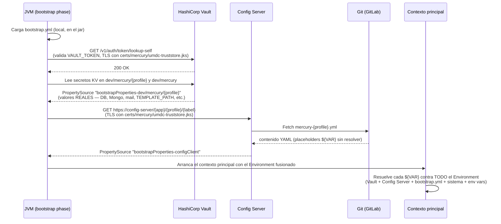
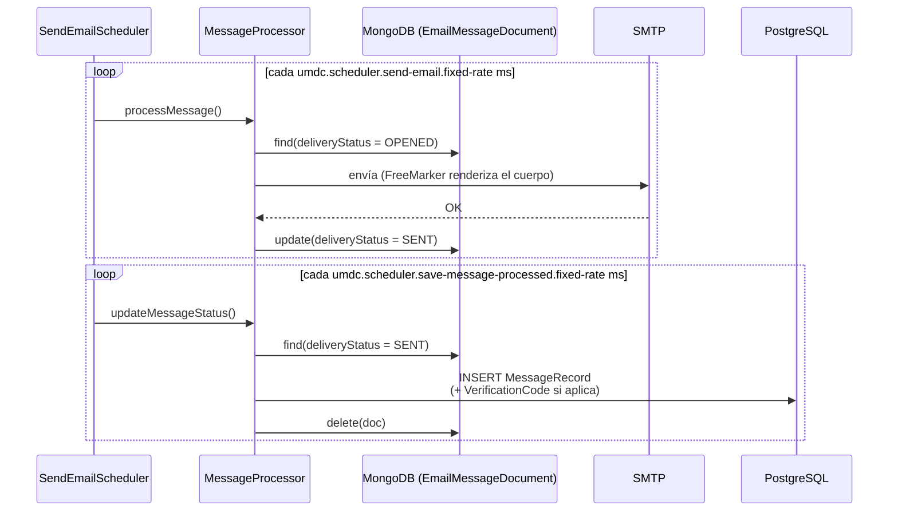
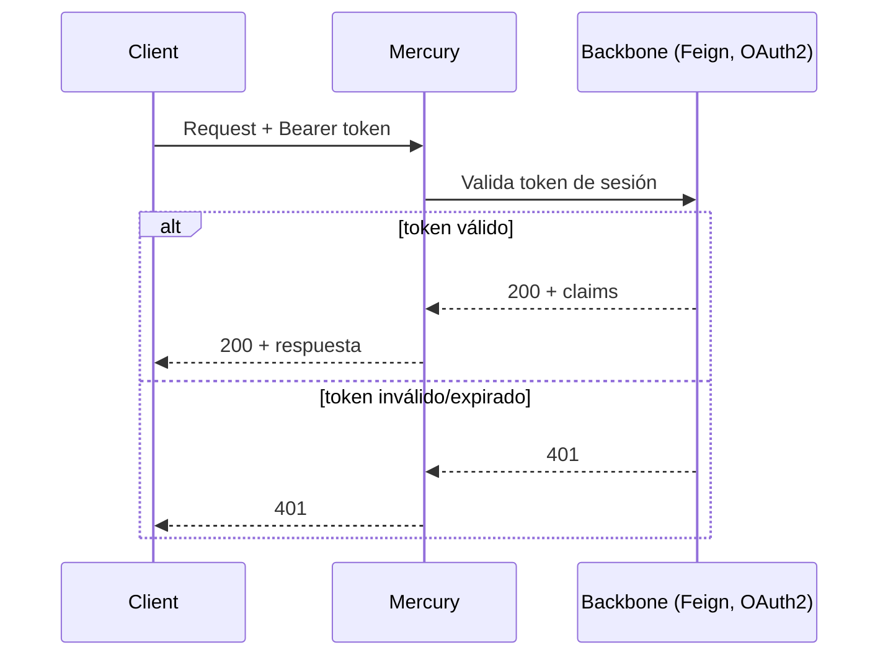

# 🔁 05 · Diagramas de Secuencia

🌐 [Read this in English](../en/05-sequence-diagrams.md) · ⬅️ [Volver al índice](README.md)

> Los flujos más representativos de Mercury, verificados contra el código y — en el caso del arranque — contra ejecuciones reales.

---

## 1️⃣ Arranque de la aplicación (bootstrap: Vault → Config Server)

Este es el flujo que más incidentes ha generado en la práctica — documentado en detalle porque el orden importa.



> [!IMPORTANT]
> **Orden de precedencia (de mayor a menor), tal como implementa `PropertySourceBootstrapConfiguration` en esta versión de Spring Cloud (2025.1.2 / spring-cloud-context 5.0.2):**
> 1. Vault (`spring.cloud.vault.*` — secretos KV)
> 2. Config Server (Git-backed)
> 3. Variables de entorno / propiedades del sistema locales (`default.env`, `-D`)
> 4. `bootstrap.yml` local (esta app)
>
> Esto es **al revés** de lo intuitivo: Vault y el Config Server ganan sobre cualquier variable local, por diseño — así un valor centralizado no puede ser pisado accidentalmente por lo que haya en una máquina concreta. Un valor definido en Vault (p. ej. `TEMPLATE_PATH`) **no se puede sobreescribir** con `default.env` ni con `-D`, sin importar el nombre de variable que se use. Ver [06 · Configuración de Entornos § Troubleshooting](06-configuracion-entornos.md#-troubleshooting-real) para el caso real que motivó esta nota.

---

## 2️⃣ Creación de campaña → despacho por canal

```mermaid
sequenceDiagram
    participant Client
    participant Controller as CampaignController
    participant Service as CampaignServiceImpl
    participant PG as PostgreSQL
    participant Kafka
    participant Listener as MultiChannelListener
    participant Router as MessageChannelRouter
    participant ChSvc as ChannelService&lt;T&gt;
    participant Mongo as MongoDB

    Client->>Controller: POST /api/v1/campaigns
    Controller->>Service: createCampaign() [async]
    Service->>PG: INSERT CampaignEntity + CampaignMetricsEntity
    loop por cada destinatario
        Service->>Kafka: publish(topic-del-canal, mensaje)
    end
    Service-->>Client: 202 / CampaignResponse

    Kafka->>Listener: @KafkaListener consume
    Listener->>Router: route(mensaje)
    Router->>Router: resuelve plantilla vía TemplateDefinedService
    Router->>ChSvc: send(mensaje, plantilla)
    ChSvc->>Mongo: save(MessageDocument)
```

---

## 3️⃣ Ciclo de vida del email (el único completo)



---

## 4️⃣ Validación de sesión (Backbone)



---

*Generado a partir de una lectura exhaustiva del código fuente y de ejecuciones reales verificadas contra Vault/Config Server/PostgreSQL en vivo — no de documentación previa ni de supuestos.*
