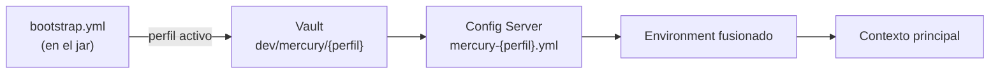
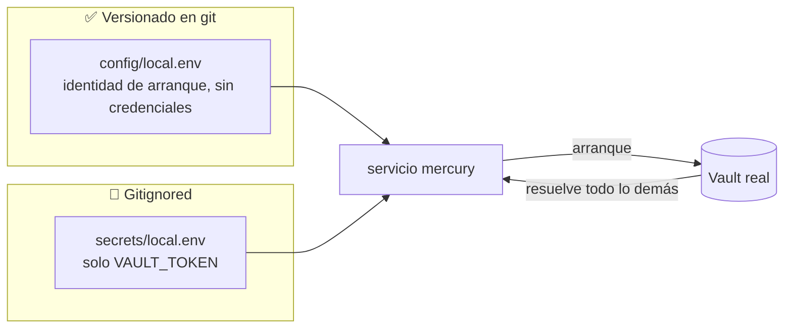
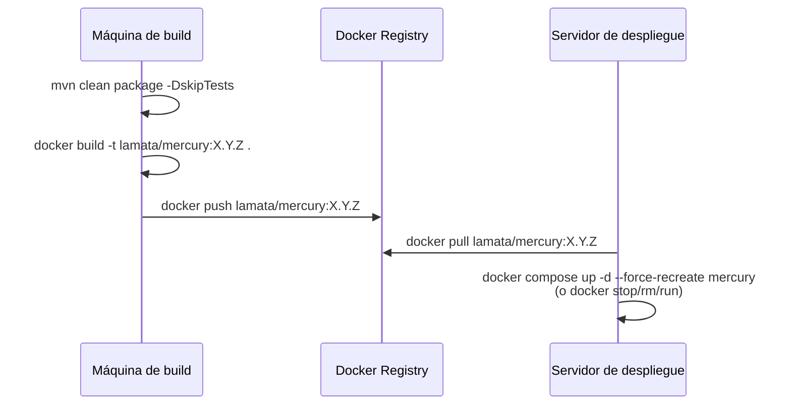

# ☁️ 06 · Configuración de Entornos

🌐 [Read this in English](../en/06-environment-configuration.md) · ⬅️ [Volver al índice](README.md)

> Mercury tiene tres niveles de configuración claramente separados: **desarrollo local** (IDE, sin contenedor), **prueba/QA** (Docker + `docker-compose`, contra servicios reales de QA), y **producción** (imagen construida y desplegada, secretos gestionados centralmente en Vault). Este documento cubre los tres, y el mecanismo de precedencia que los conecta a todos.

---

## 🧭 Resumen

| Nivel | Cómo corre | Config Server / Vault | Certificados |
|---|---|---|---|
| 🧑‍💻 Desarrollo local | `java -jar` o Run desde el IDE | Reales (QA), vía Internet | `certs/mercury/` en el filesystem local |
| 🧪 Prueba / QA | Contenedor Docker (`docker-compose`) | Reales (QA) o instancia local de `config-server`/`vault-server` | Horneados en la imagen (`Dockerfile`) |
| 🚀 Producción | Contenedor Docker desplegado | Reales (prod), Vault poblado por el equipo de plataforma | Horneados en la imagen, rotados por rebuild |

---

## 🔐 El mecanismo que lo une todo: la fase de *bootstrap*

Antes de que exista el contexto principal de Spring, existe un **contexto de bootstrap** (habilitado por `spring-cloud-starter-bootstrap`) que:

1. Lee `src/main/resources/bootstrap.yml` (el único archivo de config local que existe — no hay `application.yml`).
2. Se conecta a **Vault** (`spring.cloud.vault.*`) y trae secretos de `dev/mercury/{perfil}` y `dev/mercury`.
3. Se conecta al **Config Server** (`spring.cloud.config.uri`) y trae `mercury-{perfil}.yml` desde un repositorio Git.
4. Fusiona todo en el `Environment` que usará el contexto principal.



> [!IMPORTANT]
> **Precedencia real (de mayor a menor): Vault → Config Server → variables de entorno locales → `bootstrap.yml` local.**
> Esto significa que **ningún valor local puede sobreescribir un valor que Vault o el Config Server ya definen** — ni con `default.env`, ni con `-D`, ni cambiando `bootstrap.yml`. Ver [05 · Diagramas de Secuencia § 1](05-diagramas-secuencia.md#1️⃣-arranque-de-la-aplicación-bootstrap-vault--config-server) y la sección de Troubleshooting más abajo — este comportamiento causó horas reales de depuración en esta rama.

---

## 🧑‍💻 Desarrollo local (IDE / sin contenedor)

### Requisitos

- Java 21 (JDK, no solo JRE)
- Maven (o el wrapper del IDE)
- Acceso de red a `vault.umdc-qa.tst` y `config-server.umdc-qa.tst` (VPN/DNS interno según el equipo)
- Credenciales en `~/.m2/settings.xml` para `https://repo.repsy.io/mvn/lmata/prx` (dependencias privadas PRX)

### 1. Certificados — `certs/mercury/`

Mercury **no** carga certificados/keystores desde el classpath (ese patrón causó que secretos terminaran commiteados a git — ver el historial de este repo). En su lugar, `bootstrap.yml` los referencia con rutas `file:certs/mercury/<archivo>`, **relativas al *working directory* del proceso** — que es la raíz del proyecto tanto para un run del IDE como (dentro del contenedor) el `WORKDIR` de Docker.

```
certs/mercury/
├── mercury.jks               # keystore de la app (JWT, mercury-security SSL bundle)
├── umdc-truststore.jks       # trust store — incluye la CA interna "PRX Internal CA"
├── aiven-kafka.p12           # keystore Kafka (PKCS12, fallback no-PEM)
├── aiven-kafka-7e59598.cert  # certificado Kafka (PEM, modo por defecto)
├── aiven-kafka-7e59598.key   # llave privada Kafka (PEM)
├── aiven-kafka-7e59598.pem   # CA de Kafka (PEM)
└── prx-internal-ca.crt       # CA interna en PEM puro — la importa docker-entrypoint.sh
```

> [!WARNING]
> **Esta carpeta está en `.gitignore` (`*.jks`, `*.pem`, `*.p12`, `*.cert`, `*.key`, `*.crt`) — nunca debe llegar a git.** Pide estos archivos a otro miembro del equipo o extráelos de Vault; no los recrees a mano sin verificar que coinciden con lo que el entorno realmente espera.

Valores relevantes en `bootstrap.yml` (todos con default `file:certs/mercury/...`, así que **no hace falta configurar nada** si la carpeta existe con esos nombres):

| Propiedad | Default | Verificado con `keytool` |
|---|---|---|
| `SSL_KEYSTORE_LOCATION` / `TYPE` / `PASSWORD` | `file:certs/mercury/mercury.jks` / `JKS` / `changeit` | ✅ |
| `SSL_TRUSTSTORE_LOCATION` / `TYPE` / `PASSWORD` | `file:certs/mercury/umdc-truststore.jks` / `PKCS12` / `changeit` | ✅ |
| `spring.cloud.vault.ssl.trust-store` | mismo `umdc-truststore.jks` | ✅ (handshake real confirmado contra `vault.umdc-qa.tst`) |
| `spring.cloud.config.tls.trust-store` | mismo `umdc-truststore.jks` | ✅ (handshake real confirmado contra `config-server.umdc-qa.tst`) |

### 2. `default.env` — variables locales (nunca en git)

`default.env` (gitignorado) es donde viven las variables de arranque locales: perfil activo, `VAULT_TOKEN`, URLs de Vault/Config Server. Se carga en el run del IDE (vía el plugin EnvFile o equivalente) o manualmente:

```bash
set -a; source default.env; set +a
mvn -o spring-boot:run
# — o —
java -jar target/mercury.jar
```

> [!CAUTION]
> `default.env` contiene **secretos reales** (`VAULT_TOKEN`, contraseñas de base de datos si se sobreescriben localmente). Nunca lo commitees, nunca lo pegues en un chat, nunca lo copies fuera de tu máquina. Si un token se expone accidentalmente, **rótalo en Vault de inmediato**.

### 3. Un caso real de configuración que "no se puede overridear"

Si ves que un valor (p. ej. una ruta de archivo, un timeout) parece estar "cacheado" y no cambia sin importar qué pongas en `default.env` — probablemente **no es caché**, es que Vault o el Config Server ya lo definen, y ganan por precedencia (ver arriba). Verifica consultando Vault directamente antes de seguir adivinando:

```bash
curl -s --cacert certs/mercury/prx-internal-ca.crt \
  -H "X-Vault-Token: $VAULT_TOKEN" \
  https://vault.umdc-qa.tst/v1/dev/data/mercury/{perfil} \
  | python3 -m json.tool
```

---

## 🧪 Entorno de prueba (Docker / `docker-compose`)

### Construir la imagen

```bash
mvn -o clean package -DskipTests          # jar en target/mercury.jar
docker build -t lamata/mercury:0.0.2 .    # el Dockerfile copia certs/mercury/ dentro
```

El `Dockerfile` copia `certs/mercury/` **dentro de la imagen** (decisión explícita — ver [01 · Stack Tecnológico](01-stack-tecnologico.md) y el historial de commits `fix/docker-image-and-compose`): elimina la necesidad de montar un volumen de certificados en cada máquina de despliegue, a cambio de que los certificados queden extraíbles de las capas de la imagen por cualquiera con acceso al registry. `docker-entrypoint.sh` importa cualquier `*.crt` de `certs/mercury/` al truststore de la JVM (`/usr/local/runme/cacerts`) al arrancar el contenedor.

### `docker-compose.yml` — separación config vs. secretos



| Archivo | Contenido | Versionado |
|---|---|---|
| `config/local.env` | `SPRING_BOOT_PROFILE_ACTIVE`, `CNFS_URI`, `VAULT_URI`, `VAULT_KV_BACKEND`, `APP_PORT`, flags — **cero credenciales** | ✅ Sí (excepción explícita en `.gitignore`: `!config/*.env`) |
| `secrets/local.env` | Solo `VAULT_TOKEN` — el único secreto que hace falta *antes* de poder hablar con Vault | ❌ No (`secrets/local.env.example` es la plantilla versionada) |

> [!TIP]
> Todo lo demás — credenciales de base de datos, Mongo, mail, OAuth, SASL de Kafka — **nunca** debe pasar por estos archivos ni por Docker Compose. Ya vienen de Vault en runtime; duplicarlos aquí crea dos fuentes de verdad que divergen con el tiempo.

```bash
cp secrets/local.env.example secrets/local.env   # completar con un VAULT_TOKEN real
docker compose build mercury
docker compose up -d mercury
```

### Stack local completo (opcional)

`docker-compose.yml` también puede levantar `config-server` y `vault-server` locales (imágenes propias de PRX) para pruebas totalmente aisladas, sin depender de la red de QA. Puntos ya resueltos y verificados en este repo:

- `config-server` necesita el perfil **`remotedev,ssl`** — no `remote-supabase` (esa cadena no corresponde a ningún archivo empaquetado en la imagen `lamata/config-server`, y activarlo hace que el bloque SSL nunca se cargue).
- `vault-server` necesita un `healthcheck` propio y que `mercury` dependa de `condition: service_healthy` — si no, la carrera de arranque hace que `mercury` intente conectar antes de que Tomcat de `config-server` esté escuchando.
- El volumen de configuración de `vault-server` debe ser una ruta relativa al repo (`./vault/config`), nunca una ruta absoluta de un host específico.

---

## 🚀 Producción

### Flujo de despliegue actual



> [!WARNING]
> Un `docker pull` con el **mismo tag** solo trae la imagen nueva si el digest cambió en el registry — pero si el contenedor local ya tiene esa imagen cacheada y no se hizo `pull` explícito antes del `up`/`run`, se puede seguir corriendo la versión vieja sin ningún error visible. Siempre `pull` explícito antes de recrear el contenedor.

### Gestión de secretos en producción

El diseño actual asume:

- **Vault es la única fuente de secretos de aplicación** (DB, Mongo, mail, OAuth, Kafka SASL, tokens de terceros) — poblados por entorno bajo `secret/mercury/{perfil}` (o `dev/mercury/{perfil}` según el backend KV configurado).
- El **único secreto que el proceso de despliegue debe inyectar directamente** es `VAULT_TOKEN` — todo lo demás lo resuelve Vault en runtime.

### 🎯 Hacia Kubernetes / Helm

El repositorio ya anticipa un chart de Helm (`Dockerfile`/`docker-compose.yml` referencian `ver k8s/`, aún no creado a la fecha de este documento). Recomendación para cuando se construya:

| Bucket | Dónde vive | Ejemplo |
|---|---|---|
| Config no-sensible por entorno | `values-{env}.yaml` (Helm) o ConfigMap | `SPRING_BOOT_PROFILE_ACTIVE`, `CNFS_URI`, `VAULT_URI` |
| El único secreto de arranque | Kubernetes `Secret`, inyectado vía `secretKeyRef` | `VAULT_TOKEN` |
| Secretos de aplicación | **Vault, nunca Helm** | DB, Mongo, mail, OAuth, Kafka SASL |

> [!TIP]
> La alternativa recomendada a `VAULT_TOKEN` como `Secret` estático es el [método de autenticación de Vault por Kubernetes](https://developer.hashicorp.com/vault/docs/auth/kubernetes): el `ServiceAccount` del pod autentica contra Vault directamente — cero token estático que rotar, provisionar o filtrar.

---

## 🔑 Referencia de variables de entorno (por categoría)

| Categoría | Variables | Fuente esperada |
|---|---|---|
| Identidad de arranque | `SPRING_BOOT_PROFILE_ACTIVE`, `SPRING_CLOUD_CONFIG_LABEL`, `SPRING_BOOT_CLOUD_BOOTSTRAP_ENABLED` | `config/local.env` / Helm values |
| Vault | `VAULT_ENABLED`, `VAULT_URI`, `VAULT_TOKEN`, `VAULT_KV_BACKEND` | `secrets/local.env` (solo el token) / K8s Secret o Vault K8s auth |
| Config Server | `CNFS_URI`, `CNFS_PORT` (⚠️ `CNFS_PORT` no tiene efecto en el cliente — ver [04 · Componentes](04-componentes.md)) | `config/local.env` |
| Certificados | `SSL_KEYSTORE_LOCATION/TYPE/PASSWORD`, `SSL_TRUSTSTORE_LOCATION/TYPE/PASSWORD` | Defaults en `bootstrap.yml` (`certs/mercury/`) — normalmente no hace falta setearlas |
| Kafka | `KAFKA_SECURITY_PROTOCOL`, `KAFKA_SASL_MECHANISM`, `KAFKA_SASL_JAAS_CONFIG`, `KAFKA_SSL_*`, `BOOTSTRAP_SERVER_URI/PORT` | Vault (producción) |
| Base de datos / Mongo / Mail / OAuth / Telegram | `MERCURY_DB_*`, `MONGO_*`, `MAIL_*`, `AUTH_*`, `BACKBONE_*`, `TELEGRAM_*` | **Vault únicamente** — nunca duplicar en archivos locales versionados |
| App | `APP_PORT`, `APP_TOKEN_SECRET`, `APP_TOKEN_EXPIRATION`, `TEMPLATE_PATH`, `TEMPLATE_SUFFIX` | Mezcla — ver caso de `TEMPLATE_PATH` abajo |

---

## 🧯 Troubleshooting real

Casos reales encontrados y resueltos en este repositorio — documentados porque **van a volver a pasar**.

### ❌ `KeyStoreException: KeyStore not exists: class path resource [X.jks]`

**Causa:** una propiedad de keystore/truststore quedó apuntando a `classpath:X.jks` (o a un nombre de archivo sin prefijo, que Spring resuelve como `classpath:` por defecto) — de cuando estos archivos vivían en `src/main/resources`. Ya no están ahí.

**Fix:** usar el prefijo `file:certs/mercury/X.jks` (relativo al *working directory*). Ver `bootstrap.yml`.

### ❌ `PKIX path building failed: unable to find valid certification path to requested target`

**Causa:** el cliente HTTP (Vault, Config Server) no confía en la CA interna. Puede ser: (a) la propiedad `trust-store` del cliente en cuestión no está configurada explícitamente y depende de `-Djavax.net.ssl.trustStore` (que solo se setea en el `CMD` de Docker — un run local del IDE no lo tiene), o (b) el archivo `.crt`/`.jks` correcto no está presente en `certs/mercury/`.

**Fix:** cada cliente (`spring.cloud.vault.ssl.*`, `spring.cloud.config.tls.*`) tiene su **propio** `trust-store` explícito en `bootstrap.yml` — no dependen de la propiedad del sistema. Verifica que `certs/mercury/umdc-truststore.jks` contenga la CA correcta:

```bash
keytool -list -v -keystore certs/mercury/umdc-truststore.jks -storepass changeit | grep -A2 "Owner:"
```

### ❌ Un valor "no se overridea" sin importar qué se ponga en `default.env`

**Causa:** casi seguro que Vault o el Config Server ya definen ese valor, y **ganan por precedencia** sobre cualquier variable local (ver la sección de bootstrap arriba). No es un bug ni un problema de caché.

**Fix:** consultar Vault directamente (ver el snippet de `curl` en la sección de desarrollo local) para confirmar de dónde viene el valor antes de seguir intentando overridearlo localmente. Si el valor realmente necesita ser distinto por entorno, la solución es cambiarlo en Vault (afecta a todos los entornos — coordinar con el equipo) o, si es puramente una diferencia de ruta local-vs-contenedor, replicar la ruta exacta en la máquina local (p. ej. crear `/usr/local/runme/templates` si ese es el valor que trae Vault).

### ❌ `docker exec mercury keytool -list` falla con `Keystore file does not exist: /home/jvapps/.keystore`

**Causa:** ningún error real — `keytool -list` sin `-keystore` usa el default `~/.keystore`, que nunca existe. Faltaron los flags `-keystore /usr/local/runme/cacerts -storepass changeit`.

---

*Generado a partir de una lectura exhaustiva de `bootstrap.yml`, `Dockerfile`, `docker-compose.yml`, `docker-entrypoint.sh`, y de incidentes reales depurados y verificados en este repositorio — no de documentación previa ni de supuestos.*
