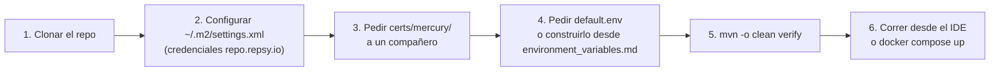
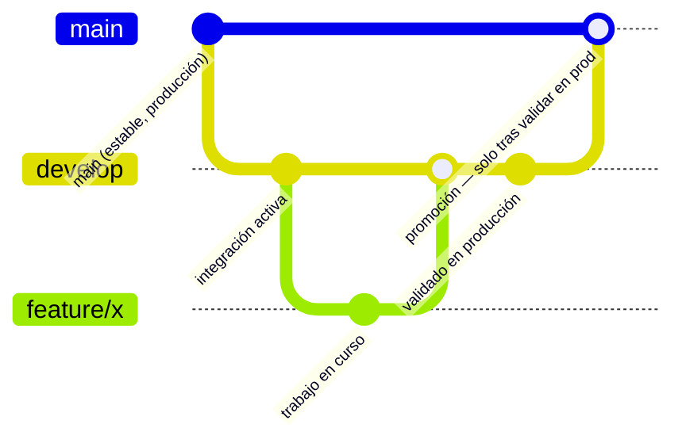

# 🚀 07 · Guía de Desarrollo

🌐 [Read this in English](../en/07-development-guide.md) · ⬅️ [Volver al índice](README.md)

> Cómo ponerte productivo en Mercury: setup, comandos, convenciones de rama, y qué revisar antes de abrir un PR.

---

## 🏁 Setup inicial



1. **Clona el repositorio** y verifica que tienes Java 25 LTS (`java -version`).
2. **Credenciales Maven** — `~/.m2/settings.xml` con el server `repsy` para `https://repo.repsy.io/mvn/lmata/prx` (dependencias privadas `prx-commons`, `commons-services`, `security-oauth`).
3. **Certificados** — pide `certs/mercury/` (gitignorado) a otro miembro del equipo, o extráelos de Vault. Ver [06 · Configuración de Entornos](06-configuracion-entornos.md#1-certificados--certsmercury).
4. **`default.env`** — igual, pídelo o constrúyelo variable por variable con `environment_variables.md` como referencia. **Nunca lo commitees.**
5. **Build de verificación:**
   ```bash
   mvn -o clean verify
   ```
   Si esto pasa (tests + PMD + JaCoCo), tu entorno está bien configurado.
6. **Corre la app** — desde el IDE (ver [06 § Desarrollo local](06-configuracion-entornos.md#-desarrollo-local-ide--sin-contenedor)) o con Docker Compose (ver [06 § Entorno de prueba](06-configuracion-entornos.md#-entorno-de-prueba-docker--docker-compose)).

---

## 🛠️ Comandos de build

| Comando | Qué hace |
|---|---|
| `mvn -U clean package -DskipTests` | Compila sin correr tests — rápido, para armar el jar |
| `mvn clean test` | Corre toda la suite de tests |
| `mvn -Dtest=MiClaseTest surefire:test` | Corre una sola clase de test |
| `mvn -Dtest=MiClaseTest#miMetodo surefire:test` | Corre un solo método de test |
| `mvn -B -V -e clean verify` | Build completo — tests + PMD + gate de cobertura JaCoCo |
| `mvn -Pcoverage clean test` | Genera el XML de cobertura para SonarCloud |
| `mvn -Pbenchmark clean test` | Corre los microbenchmarks JMH |

> [!IMPORTANT]
> **`mvn clean verify` es el comando de referencia antes de dar cualquier trabajo por terminado.** PMD corre en fase `test` (0 violaciones o el build falla); JaCoCo corre en fase `verify` (70 % línea / 50 % rama o el build falla). Ningún cambio se considera completo sin un `verify` en verde.

---

## 🌿 Estrategia de ramas



| Rama | Rol |
|---|---|
| `develop` | Rama de integración activa. Todo el trabajo de features y fixes llega **aquí primero**. |
| `feature/*`, `fix/*` | Rama de trabajo por tarea, siempre creada desde `develop` (nunca desde otra `feature/*` a medio terminar). |
| `main` | Refleja únicamente lo que **ya está validado y estable en producción**. |

> [!IMPORTANT]
> **`main` está congelada hasta tener un MVP completamente estable.** El flujo de promoción real es: `develop` → se publica/despliega → se valida en producción → **solo entonces** se promueve a `main`. Nunca abras ni mergees un PR hacia `main` sin confirmación explícita de que el cambio correspondiente ya está corriendo establemente en producción — incluso para fixes urgentes de seguridad, prepara la rama/PR pero deja el PR hacia `main` sin mergear hasta esa confirmación.

### Convenciones de commit

- Mensajes en inglés, modo imperativo, prefijo de tipo: `fix:`, `feat:`, `refactor:`, `perf:`.
- El cuerpo del commit explica el **por qué**, no solo el qué — especialmente para fixes no obvios (ver el historial de `fix/docker-image-and-compose` como referencia de este nivel de detalle).
- Una rama, una preocupación — no mezclar un fix de infraestructura con una feature nueva en el mismo commit/PR.

---

## 🧩 Cómo agregar un canal de mensajería nuevo

1. Crear el documento Mongo: extender `MessageDocument` (ver [03 · Modelo de Datos](03-modelo-datos.md)).
2. Implementar `ChannelService<TuDocumento>` — los tres métodos: `send`, `updateStatus`, `findByDeliveryStatus`.
3. Agregar el topic correspondiente en `application.yml` (`umdc.consumer.topics.<canal>`).
4. Registrar el canal en `MessageChannelRouter` para que `MultiChannelListener` lo despache correctamente.
5. Agregar el `ChannelType` en la tabla `channel_type` (o vía el endpoint `POST /api/v1/channel-types`).
6. Escribir tests — mínimo: el `ChannelService` (persistencia + filtrado por estado) y el registro en el router.

> [!TIP]
> Antes de conectar un proveedor real (Twilio, WhatsApp Cloud API, FCM/APNs, Telegram Bot API), revisa [04 · Componentes § Known Gaps](04-componentes.md#-known-gaps) — puede que ya exista una dependencia sin usar en `pom.xml` (es el caso de `telegrambots-*`).

---

## 🧪 Convenciones de testing

- **Unitarios primero** (JUnit 5 + Mockito) — la mayoría de la cobertura debería venir de aquí, no de tests de integración pesados.
- Nombrado descriptivo con `@DisplayName` — los nombres de test deben poder leerse como una frase (ver `ChannelServicesTest` como ejemplo del estilo del repo).
- Mockear en el borde del proceso (repositorios, clientes HTTP) — no mockear lógica de dominio propia.
- Si tocas `application.yml`, hay un test de regresión (`ConfigurationPlaceholderTest`) que valida que todo placeholder `${X}` sin default tenga una propiedad real que lo resuelva — no lo rompas, y si agregas un placeholder nuevo, dale un default sensato o documenta por qué no lo tiene.

---

## ✅ Checklist antes de abrir un PR

- [ ] `mvn -o clean verify` en verde (tests + PMD + cobertura)
- [ ] Sin secretos en el diff (`git diff --staged` revisado a mano — `default.env`, `certs/mercury/*`, `secrets/local.env` nunca deben aparecer)
- [ ] El PR apunta a `develop`, no a `main` (salvo confirmación explícita de que ya está validado en producción)
- [ ] Si el cambio toca `application.yml`/Docker/Compose: verificado con una ejecución real (`docker build` + `docker run`, o `docker compose up`), no solo revisión de código
- [ ] Commits con mensajes que explican el *por qué*, no solo el *qué*

---

## 🔍 Herramientas de calidad en CI

| Herramienta | Qué revisa | Bloquea el build |
|---|---|---|
| PMD (`ruleset.xml`) | Estilo, complejidad, code smells | ✅ Sí — 0 violaciones tolerado |
| JaCoCo | Cobertura de línea (70 %) y rama (50 %) | ✅ Sí |
| Qodana / SonarQube | Deprecaciones, CVEs, code smells adicionales | Depende del gate configurado en CI |

---

*Generado a partir de una lectura exhaustiva de `pom.xml`, el historial de commits reales de este repositorio, y la memoria de decisiones de branching del equipo — no de documentación previa ni de supuestos.*
