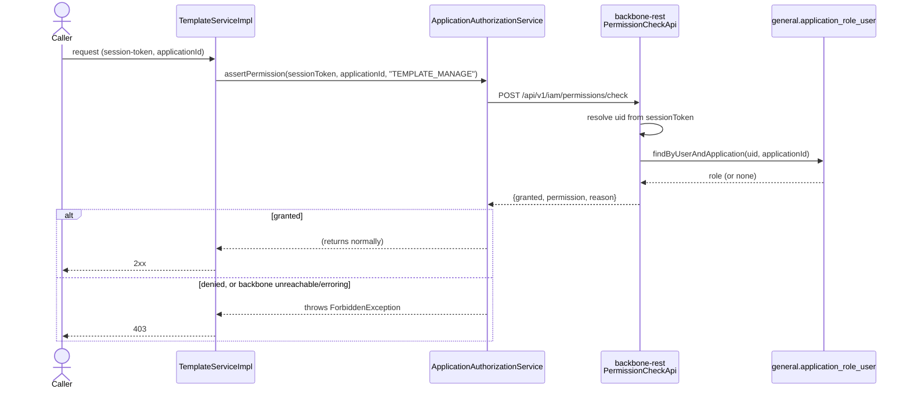
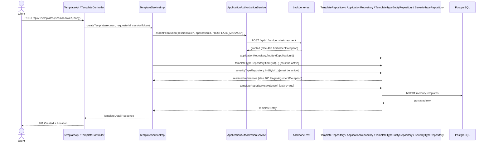
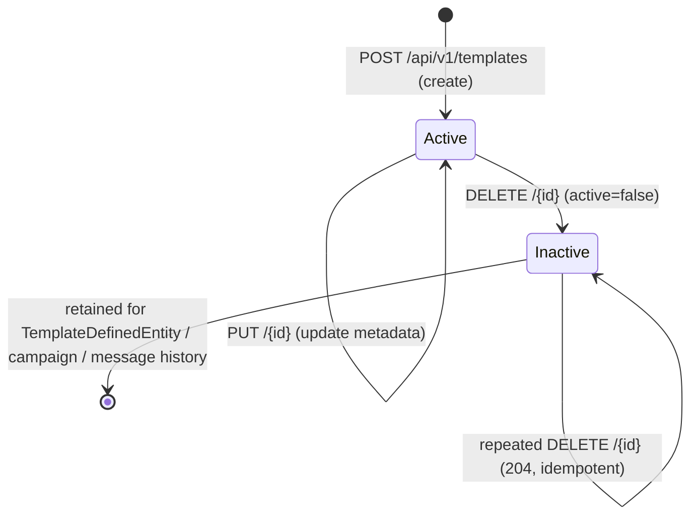

# 🧩 Template Management API

> **Base path:** `/api/v1/templates` · **Auth:** `Authorization: Bearer` (service) + `session-token` header (end user) · **Status:** Implemented (MER-6)

### Modification Log
| Name              | Detail | Date |
|-------------------|--------|------|
| Luis Antonio Mata | Add Template Management API documentation | 2026-09-27 |

---

## 🎯 What this API manages

`TemplateEntity` (`mercury.templates`) is the **reusable base template**: description, metadata-only
`location`, `fileFormat`, classification (`templateType`, `severityType`), owning `application`, and a
soft-delete `active` flag.

This is **not** `TemplateDefinedEntity`. That table represents an application/user-specific *usage* of a
base template and is referenced by campaigns and message records — its lifecycle, and the campaign/message
flows that depend on it, are untouched by this API.

| Entity | Table | Owned by this API? | Referenced by |
|---|---|:---:|---|
| `TemplateEntity` | `mercury.templates` | ✅ | `TemplateDefinedEntity.template` |
| `TemplateDefinedEntity` | `mercury.template_defined` | ❌ (out of scope) | `CampaignEntity`, message records |

Deleting (deactivating) a `TemplateEntity` never touches `TemplateDefinedEntity` rows, campaigns, or message
history — see [Soft-delete & history retention](#-soft-delete--history-retention).

---

## 🔌 Endpoints

| Operation | Method & Path | Success | Errors |
|---|---|---:|---|
| Create | `POST /api/v1/templates` | `201 Created` + `Location` | `400`, `401`, `403`, `500` |
| Update | `PUT /api/v1/templates/{id}` | `200 OK` | `400`, `401`, `403`, `404`, `500` |
| Deactivate | `DELETE /api/v1/templates/{id}` | `204 No Content` | `400`, `401`, `403`, `404`, `500` |
| Get one | `GET /api/v1/templates/{id}` | `200 OK` | `400`, `401`, `403`, `404`, `500` |
| Search | `GET /api/v1/templates` | `200 OK` | `400`, `401`, `403`, `500` |

OpenAPI annotations live on `TemplateApi` only (`src/main/java/com/umdc/mercury/api/v1/controller/TemplateApi.java`);
`TemplateController` is a thin implementation. The machine-readable contract is mirrored in
[`src/main/resources/api/openapi.yaml`](../src/main/resources/api/openapi.yaml).

### 🔐 Auth & application scope

Every operation requires the calling service's `Authorization: Bearer` token (scope `mercury:message:read` for
GET, `mercury:message:write` otherwise, checked by `ManagedClientSecurityConfig`) **and** a `session-token` header
(the end user's backbone-rest session JWT). Missing/invalid tokens are rejected at the MVC dispatch layer
(`SessionJwtInterceptor`) with `401` before a controller method ever runs.

Beyond authentication, every operation is authorized against the **real** `general.application_role_user` ACL — the shared, canonical
user↔application↔role relation that already lives in backbone-rest's persistence layer (`com.umdc:persistence`,
`ApplicationRoleUserEntity`). Mercury does **not** keep its own copy of that table; every authorization
decision is a live call to backbone-rest.

`TemplateServiceImpl` calls `ApplicationAuthorizationService.assertPermission(sessionToken, applicationId,
permission)` before every mutation and before every read, where `applicationId` is either the request's own
field (create, search) or the fetched template's owning application (update, delete, get — the entity is
loaded first so its real `applicationId` is known). That service is a thin wrapper around
`BackbonePermissionClient`, a Feign client (same outbound M2M authentication as the pre-existing, previously
unused `BackboneClient`) calling backbone-rest's **`POST /api/v1/iam/permissions/check`**.



**Trust model.** Mercury and backbone-rest sign/verify session-tokens with the *same* shared
`APP_TOKEN_SECRET` (both use the `security-oauth` library's `SessionJwtService`), so a token minted by either
service is valid to the other — Mercury forwards the `session-token` it received (the end user's backbone-issued token, sent
directly by the client) as-is in the request body.
Backbone-rest resolves the caller's `uid` from that token and looks up their *single* role for the requested
application; `permission` is granted if it matches that role's name or one of the role's active granted
features (case-insensitive).

**Fails closed.** If backbone-rest is unreachable, errors, or returns a non-granted result,
`ApplicationAuthorizationServiceImpl` throws `ForbiddenException` (`403`) — an identity-service outage is
never treated as an implicit grant.

> **⚙️ Operational requirement:** the permission string checked is `umdc.security.permissions.template-manage`
> (defaults to `TEMPLATE_MANAGE`, overridable via the `TEMPLATE_MANAGE_PERMISSION` env var). A role or feature
> named exactly that must be seeded in backbone-rest's `general.role`/`general.feature` tables and granted to
> the relevant users per application (`general.application_role_user`) — this is backbone-rest/ops data, not
> something this API can seed itself.

---

## 📝 Create

```
POST /api/v1/templates
session-token: <token>
```

```json
{
  "description": "Welcome email",
  "location": "s3://mercury-templates/welcome.html",
  "fileFormat": "HTML",
  "templateTypeId": "66666666-6666-6666-6666-666666666666",
  "applicationId": "33333333-3333-3333-3333-333333333333",
  "severityTypeId": "77777777-7777-7777-7777-777777777777"
}
```

- `description`, `location` (≤500 chars), `fileFormat` (≤50 chars) are required and non-blank.
- `templateTypeId`, `applicationId`, `severityTypeId` are required UUIDs; `templateTypeId` and
  `severityTypeId` must reference **existing, active** rows or the request is rejected with `400`.
- The template is always persisted **active**; `id`, `createdAt`, `updatedAt` are server-generated.

**201 Created** — `Location: /api/v1/templates/{id}`, body is a `TemplateDetailResponse`.



See [Authorization: the real `application_role_user` ACL](#-auth--application-scope) for the full
authorization sequence and trust model — the diagram above collapses it to a single `assertPermission` step.

---

## ✏️ Update

```
PUT /api/v1/templates/{id}
session-token: <token>
```

```json
{
  "description": "Updated welcome email",
  "fileFormat": "HTML"
}
```

- All fields are optional; only non-`null` values are applied. Omitted/blank text fields are left unchanged.
- `applicationId` **cannot** be sent — it is intentionally absent from `UpdateTemplateRequest` because it is
  immutable once a template is created.
- `templateTypeId` / `severityTypeId`, when provided, must reference an existing **active** row (`400`
  otherwise) and replace the current classification.
- `id` and `createdAt` are always preserved; `updatedAt` is refreshed only when at least one field actually
  changes (a request with no effective changes is a no-op — `200 OK`, no write).
- An unknown id, **or an id that is already inactive**, both return `404` — reactivating a deactivated
  template is out of scope (see [state diagram](#-lifecycle)).

**200 OK** — updated `TemplateDetailResponse`.

---

## 🗑️ Deactivate (soft-delete)

```
DELETE /api/v1/templates/{id}
session-token: <token>
```

- Sets `active=false` and refreshes `updatedAt`. The row itself, and every `TemplateDefinedEntity` /
  campaign / message record that references it, is left untouched — see
  [Soft-delete & history retention](#-soft-delete--history-retention).
- **Idempotent**: calling it again on an already-inactive template returns `204` without a further write.
- Unknown id → `404`.

**204 No Content**.

---

## 🔎 Get one

```
GET /api/v1/templates/{id}
session-token: <token>
```

Returns the template **only if it is active**. Both an unknown id and an inactive id return the same `404` —
callers cannot distinguish "never existed" from "was deactivated" through this endpoint.

**200 OK** — `TemplateDetailResponse`.

---

## 🔍 Search templates

```
GET /api/v1/templates?applicationId=...&q=welcome&templateTypeId=...&severityTypeId=...&active=true&page=0&size=20&sort=createdAt,desc
session-token: <token>
```

| Param | Required | Notes |
|---|:---:|---|
| `applicationId` | ✅ | Mandatory security/isolation scope. Missing → `400`. |
| `q` | – | Case-insensitive substring match against `description` **or** `location`. |
| `templateTypeId` | – | Exact match. |
| `severityTypeId` | – | Exact match. |
| `active` | – | Exact match. **Omitted defaults to active-only.** |
| `page` | – | Zero-based; default `0`; negative → `400`. |
| `size` | – | Default `20`; bounded `1–100`; out of range → `400`. |
| `sort` | – | `field,direction` (e.g. `createdAt,desc`). Allowed fields: `description`, `location`, `fileFormat`, `createdAt`, `updatedAt`. Unknown field/direction → `400`. A deterministic `id` ascending tie-breaker is **always** appended, so paging never reorders equal-sort-key rows. |

The `applicationId` scope, all filters, and paging/sorting are applied **in the database** via a
`Specification<TemplateEntity>` (`TemplateSpecifications`) + `Pageable` passed to
`TemplateRepository.findAll(spec, pageable)` — never filtered client-side after an unbounded fetch. A result
page never contains rows from another `applicationId`.

**200 OK** — `TemplateSearchResponse`:

```json
{
  "items": [ { "...": "TemplateDetailResponse" } ],
  "page": 0,
  "size": 20,
  "totalElements": 1,
  "totalPages": 1
}
```

---

## 🚦 Errors

All errors use the existing `ApiError` envelope (`GlobalExceptionHandler`):

```json
{
  "timestamp": "2026-09-27T12:00:00.000Z",
  "status": 404,
  "error": "Not Found",
  "message": "Template not found: 8b6a7e2e-...-000000000000",
  "path": "/api/v1/templates/8b6a7e2e-...-000000000000"
}
```

| Status | Cause |
|---|---|
| `400` | Bean-validation failure, malformed UUID, missing `applicationId` on search, out-of-bounds `page`/`size`, unsupported `sort` field/direction, or an unknown/inactive `applicationId`/`templateTypeId`/`severityTypeId` reference on create/update. |
| `401` | Missing/invalid `session-token` (handled upstream by `SessionJwtInterceptor`, before the controller runs). |
| `403` | backbone-rest denied `TEMPLATE_MANAGE` for the caller's `(uid, applicationId)` pair, or the permission check itself failed/backbone was unreachable (fails closed — see [Auth & application scope](#-auth--application-scope)). |
| `404` | Unknown template id, **or** a template id that exists but is inactive (`TemplateNotFoundException`, new in this feature). |
| `500` | Unexpected internal error. |

`TemplateNotFoundException` and the `MissingServletRequestParameterException → 400` mapping were added to
`GlobalExceptionHandler` alongside the existing `CampaignNotFoundException`/`ForbiddenException` handlers.

---

## ♻️ Soft-delete & history retention

- `DELETE` never removes a row — it flips `active` to `false`.
- `TemplateDefinedEntity.template` keeps pointing at the same `TemplateEntity` row after deactivation;
  campaigns and message records that went through a `TemplateDefinedEntity` referencing this template are
  completely unaffected.
- No cascading delete, no rewrite of campaign/message history — this task does not touch
  `TemplateDefinedEntity`, campaign APIs, or message content processing at all.
- Reactivation (`Inactive → Active`) is explicitly **out of scope**; there is no endpoint for it.

## 🔁 Lifecycle



Note: `GET /{id}` and `PUT /{id}` both treat `Inactive` the same as "does not exist" (`404`) — there is no
authorized-inactive-read path in this version.

---

## 🗄️ `location` is metadata only

`location` is a free-text pointer (e.g. an S3 URI, a CMS path) describing *where* template content lives. This
API never uploads, downloads, renders, or validates the referenced content — only the pointer string itself
(`≤500` chars) is persisted and validated.

---

## 🧱 Layers touched

| Layer | File |
|---|---|
| API contract | `api/v1/controller/TemplateApi.java` |
| Controller | `api/v1/controller/TemplateController.java` |
| Service | `api/v1/service/TemplateService.java`, `TemplateServiceImpl.java` |
| Partial-update logic | `api/v1/service/TemplateUpdateApplier.java` |
| Search criteria (internal) | `api/v1/service/TemplateSearchCriteria.java` |
| DTOs | `api/v1/to/CreateTemplateRequest.java`, `UpdateTemplateRequest.java`, `TemplateDetailResponse.java`, `TemplateSearchResponse.java` |
| Exception | `api/v1/exception/TemplateNotFoundException.java` |
| Mapper | `mapper/TemplateMapper.java` (fixed the pre-existing hardcoded-`active`/missing-severity mapping bug; added `toEntity`/`toDetailResponse`) |
| Search predicate | `jpa/sql/repository/TemplateSpecifications.java` |
| New lookup repositories | `jpa/sql/repository/ApplicationRepository.java`, `SeverityTypeRepository.java` |
| Authorization | `api/v1/service/ApplicationAuthorizationService.java`, `ApplicationAuthorizationServiceImpl.java` |
| Backbone client | `client/BackbonePermissionClient.java`, `client/to/PermissionCheckRequest.java`, `PermissionCheckResponse.java` |
| Reused, unchanged | `jpa/sql/entity/TemplateEntity.java`, `jpa/sql/repository/TemplateRepository.java`, `client/interceptor/BackendFeignClientInterceptor.java` (previously dead code, now exercised) |

No Hibernate DDL changes and **no SQL migration** were needed — every column this API reads or writes
(`description`, `location`, `file_format`, `template_type_id`, `application_id`, `severity_type_id`,
`created_at`, `updated_at`, `active`) already existed in `mercury.templates`.

## 📖 OpenAPI

The hand-maintained spec at [`src/main/resources/api/openapi.yaml`](../src/main/resources/api/openapi.yaml)
now includes all five `templates` paths and their request/response schemas
(`CreateTemplateRequest`, `UpdateTemplateRequest`, `TemplateDetailResponse`, `TemplateSearchResponse`);
[`docs/openapi-client/README.md`](openapi-client/README.md) lists the new `operationId → path` mappings for
client generation.
