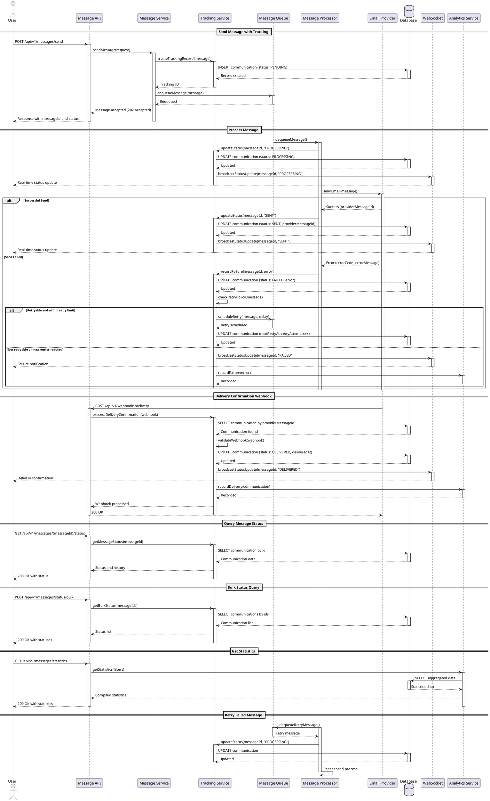

# Communication Tracking

## Description

The Communication Tracking functionality provides a comprehensive system for monitoring and tracking the lifecycle of all communications sent through the Mercury platform. This feature enables real-time visibility into message delivery status, tracks communication states across different channels (email, instant messaging), and maintains a complete audit trail of all sent messages.

### Key Features

- **Message State Tracking**: Track messages through various states (PENDING, SENT, DELIVERED, FAILED, BOUNCED, etc.)
- **Multi-Channel Support**: Track communications across email, Telegram, WhatsApp, SMS, and other channels
- **Delivery Confirmation**: Receive and record delivery confirmations from messaging providers
- **Failure Analysis**: Detailed error tracking and categorization for failed communications
- **Retry Management**: Automatic retry logic for failed messages with configurable retry policies
- **Audit Trail**: Complete history of all state transitions with timestamps
- **Real-time Updates**: WebSocket support for real-time status updates
- **Bulk Status Queries**: Efficiently query status of multiple messages
- **Analytics and Reporting**: Generate reports on delivery rates, failure patterns, and performance metrics
- **Message Correlation**: Link related messages and track conversation threads

## Example Structures and Payloads

### Communication Entity Structure

```json
{
  "id": "msg-550e8400-e29b-41d4-a716-446655440000",
  "correlationId": "corr-123e4567-e89b-12d3-a456-426614174000",
  "templateId": "template-550e8400-e29b-41d4-a716-446655440000",
  "channelType": "EMAIL",
  "sender": {
    "email": "noreply@mercury.com",
    "name": "Mercury Platform"
  },
  "recipients": [
    {
      "type": "TO",
      "email": "user@example.com",
      "name": "John Doe",
      "status": "DELIVERED",
      "deliveredAt": "2025-12-09T10:05:32Z"
    },
    {
      "type": "CC",
      "email": "manager@example.com",
      "name": "Jane Smith",
      "status": "DELIVERED",
      "deliveredAt": "2025-12-09T10:05:35Z"
    }
  ],
  "subject": "Welcome to Mercury Platform",
  "status": "DELIVERED",
  "priority": "NORMAL",
  "createdAt": "2025-12-09T10:00:00Z",
  "sentAt": "2025-12-09T10:00:15Z",
  "deliveredAt": "2025-12-09T10:05:32Z",
  "metadata": {
    "campaignId": "campaign-001",
    "userId": "user-12345",
    "environment": "production"
  },
  "stateHistory": [
    {
      "state": "PENDING",
      "timestamp": "2025-12-09T10:00:00Z",
      "reason": "Message queued for sending"
    },
    {
      "state": "PROCESSING",
      "timestamp": "2025-12-09T10:00:10Z",
      "reason": "Message being processed"
    },
    {
      "state": "SENT",
      "timestamp": "2025-12-09T10:00:15Z",
      "reason": "Message sent to email provider"
    },
    {
      "state": "DELIVERED",
      "timestamp": "2025-12-09T10:05:32Z",
      "reason": "Message delivered to all recipients"
    }
  ],
  "providerResponse": {
    "providerId": "sendgrid-123456",
    "providerMessageId": "sg-msg-789012",
    "providerStatus": "delivered"
  },
  "retryAttempts": 0,
  "maxRetries": 3
}
```

### Failed Communication Structure

```json
{
  "id": "msg-660e8400-e29b-41d4-a716-446655440001",
  "correlationId": "corr-223e4567-e89b-12d3-a456-426614174001",
  "templateId": "template-550e8400-e29b-41d4-a716-446655440000",
  "channelType": "EMAIL",
  "sender": {
    "email": "noreply@mercury.com",
    "name": "Mercury Platform"
  },
  "recipients": [
    {
      "type": "TO",
      "email": "invalid@example.com",
      "name": "Unknown User",
      "status": "FAILED",
      "failedAt": "2025-12-09T10:10:00Z",
      "errorCode": "INVALID_RECIPIENT",
      "errorMessage": "Recipient email address is invalid"
    }
  ],
  "status": "FAILED",
  "priority": "HIGH",
  "createdAt": "2025-12-09T10:00:00Z",
  "failedAt": "2025-12-09T10:10:00Z",
  "stateHistory": [
    {
      "state": "PENDING",
      "timestamp": "2025-12-09T10:00:00Z",
      "reason": "Message queued for sending"
    },
    {
      "state": "PROCESSING",
      "timestamp": "2025-12-09T10:00:10Z",
      "reason": "Message being processed"
    },
    {
      "state": "FAILED",
      "timestamp": "2025-12-09T10:10:00Z",
      "reason": "Invalid recipient email address",
      "errorCode": "INVALID_RECIPIENT"
    }
  ],
  "error": {
    "code": "INVALID_RECIPIENT",
    "message": "The recipient email address 'invalid@example.com' is not valid",
    "category": "VALIDATION_ERROR",
    "retryable": false
  },
  "retryAttempts": 3,
  "maxRetries": 3,
  "nextRetryAt": null
}
```

### Query Communications Request

```json
{
  "filters": {
    "channelTypes": ["EMAIL", "TELEGRAM"],
    "statuses": ["PENDING", "SENT", "DELIVERED"],
    "dateFrom": "2025-12-09T00:00:00Z",
    "dateTo": "2025-12-09T23:59:59Z",
    "templateIds": ["template-550e8400-e29b-41d4-a716-446655440000"],
    "senderEmail": "noreply@mercury.com",
    "recipientEmail": "user@example.com",
    "correlationId": "corr-123e4567-e89b-12d3-a456-426614174000",
    "priority": "HIGH"
  },
  "pagination": {
    "page": 0,
    "size": 50,
    "sort": [
      {
        "field": "createdAt",
        "direction": "DESC"
      }
    ]
  }
}
```

### Bulk Status Request

```json
{
  "messageIds": [
    "msg-550e8400-e29b-41d4-a716-446655440000",
    "msg-550e8400-e29b-41d4-a716-446655440001",
    "msg-550e8400-e29b-41d4-a716-446655440002"
  ]
}
```

### Bulk Status Response

```json
{
  "statuses": [
    {
      "messageId": "msg-550e8400-e29b-41d4-a716-446655440000",
      "status": "DELIVERED",
      "lastUpdated": "2025-12-09T10:05:32Z"
    },
    {
      "messageId": "msg-550e8400-e29b-41d4-a716-446655440001",
      "status": "FAILED",
      "lastUpdated": "2025-12-09T10:10:00Z",
      "errorCode": "INVALID_RECIPIENT"
    },
    {
      "messageId": "msg-550e8400-e29b-41d4-a716-446655440002",
      "status": "PENDING",
      "lastUpdated": "2025-12-09T10:15:00Z"
    }
  ]
}
```

### Delivery Statistics Response

```json
{
  "period": {
    "from": "2025-12-09T00:00:00Z",
    "to": "2025-12-09T23:59:59Z"
  },
  "totalMessages": 1500,
  "byStatus": {
    "DELIVERED": 1380,
    "PENDING": 45,
    "FAILED": 55,
    "BOUNCED": 20
  },
  "byChannel": {
    "EMAIL": 1200,
    "TELEGRAM": 250,
    "SMS": 50
  },
  "deliveryRate": 92.0,
  "averageDeliveryTime": "5.2 seconds",
  "topFailureReasons": [
    {
      "errorCode": "INVALID_RECIPIENT",
      "count": 25,
      "percentage": 45.5
    },
    {
      "errorCode": "PROVIDER_ERROR",
      "count": 18,
      "percentage": 32.7
    },
    {
      "errorCode": "TIMEOUT",
      "count": 12,
      "percentage": 21.8
    }
  ]
}
```

### WebSocket Status Update Event

```json
{
  "eventType": "MESSAGE_STATUS_UPDATE",
  "timestamp": "2025-12-09T10:05:32Z",
  "messageId": "msg-550e8400-e29b-41d4-a716-446655440000",
  "correlationId": "corr-123e4567-e89b-12d3-a456-426614174000",
  "previousStatus": "SENT",
  "newStatus": "DELIVERED",
  "recipientEmail": "user@example.com",
  "channelType": "EMAIL"
}
```

## Flow Diagram (PlantUML)



## Acceptance Criteria

### AC1: Message Tracking Initialization
- **Given** a user sends a message through the platform
- **When** the message is accepted by the system
- **Then** a tracking record should be created with status PENDING
- **And** a unique message ID should be generated and returned
- **And** the initial state should be recorded with timestamp

### AC2: Real-time Status Updates
- **Given** a message status changes
- **When** the status transition occurs
- **Then** all subscribed clients should receive a WebSocket notification within 1 second
- **And** the notification should include message ID, old status, new status, and timestamp
- **And** only authorized users should receive updates for their messages

### AC3: Status History Tracking
- **Given** a message transitions through multiple states
- **When** each state change occurs
- **Then** the system should append the new state to the history
- **And** each history entry should include state, timestamp, and reason
- **And** the complete history should be retrievable via API

### AC4: Failed Message Handling
- **Given** a message fails to send
- **When** the failure is detected
- **Then** the system should record the error code, message, and category
- **And** determine if the error is retryable
- **And** schedule retry if within retry limits and error is retryable
- **And** mark as permanently failed if not retryable or max retries exceeded

### AC5: Automatic Retry Logic
- **Given** a message fails with a retryable error
- **When** the failure is recorded and retry limit not exceeded
- **Then** the system should schedule a retry with exponential backoff
- **And** increment the retry attempt counter
- **And** set the next retry timestamp
- **And** process the retry at the scheduled time

### AC6: Delivery Confirmation Processing
- **Given** a delivery confirmation webhook is received from provider
- **When** the webhook payload is validated
- **Then** the system should locate the message by provider message ID
- **And** update the status to DELIVERED with delivery timestamp
- **And** record recipient-specific delivery status
- **And** trigger real-time notification to interested parties

### AC7: Bulk Status Query
- **Given** a user requests status for multiple messages
- **When** the bulk status request is processed
- **Then** the system should return status for all requested message IDs
- **And** include status, last updated time, and error info if applicable
- **And** handle missing message IDs gracefully
- **And** complete the query within 2 seconds for up to 100 message IDs

### AC8: Message Query with Filters
- **Given** multiple messages exist in the system
- **When** a user queries with filters (date range, status, channel, etc.)
- **Then** the system should return only messages matching all filter criteria
- **And** support pagination with configurable page size
- **And** allow sorting by multiple fields
- **And** return total count along with paginated results

### AC9: Statistics and Analytics
- **Given** messages have been sent over a time period
- **When** a user requests delivery statistics
- **Then** the system should calculate and return aggregate metrics
- **And** include delivery rates, average delivery times, and failure analysis
- **And** break down statistics by channel type
- **And** identify top failure reasons with counts and percentages

### AC10: Multi-recipient Status Tracking
- **Given** a message is sent to multiple recipients
- **When** recipients have different delivery outcomes
- **Then** the system should track individual recipient status
- **And** the overall message status should reflect the worst-case outcome
- **And** individual recipient statuses should be queryable
- **And** delivery timestamps should be tracked per recipient

### AC11: Correlation and Message Linking
- **Given** related messages are sent as part of a conversation or campaign
- **When** messages are created with a correlation ID
- **Then** the system should link related messages
- **And** allow querying all messages by correlation ID
- **And** provide conversation thread tracking
- **And** support campaign-level analytics

### AC12: Performance Under Load
- **Given** the system is processing high message volumes
- **When** concurrent status updates and queries occur
- **Then** status updates should complete within 100ms
- **And** status queries should complete within 200ms
- **And** WebSocket notifications should not be lost
- **And** the system should maintain accuracy under load

## Definition of Done (DoD)

### Code Quality
- [ ] All tracking service methods are implemented with comprehensive error handling
- [ ] State transition logic follows defined state machine rules
- [ ] Repository layer uses efficient queries with proper indexing
- [ ] Code follows project coding standards and patterns
- [ ] All public methods have JavaDoc documentation
- [ ] No PMD violations with severity >= 3
- [ ] Code coverage is at least 85% for tracking services

### Testing
- [ ] Unit tests cover all state transitions and edge cases
- [ ] Integration tests verify end-to-end tracking flow
- [ ] Retry logic is tested with various failure scenarios
- [ ] WebSocket functionality is tested with multiple clients
- [ ] Bulk operations are tested with boundary conditions
- [ ] Webhook processing is tested with valid and invalid payloads
- [ ] Performance tests validate query response times
- [ ] All acceptance criteria have corresponding automated tests
- [ ] All tests pass successfully

### Database
- [ ] Database schema includes communication tracking tables
- [ ] Indexes are created for frequently queried fields (status, createdAt, providerId)
- [ ] Partitioning strategy is implemented for large data volumes
- [ ] Data retention policy is defined and implemented
- [ ] Migration scripts handle existing data correctly
- [ ] Database constraints ensure data integrity

### API Design
- [ ] RESTful endpoints follow consistent naming conventions
- [ ] Request/response DTOs are properly validated
- [ ] API versioning is implemented
- [ ] Rate limiting is configured for bulk endpoints
- [ ] API documentation is complete with examples
- [ ] Error responses follow standard format

### WebSocket Implementation
- [ ] WebSocket connection handling is robust
- [ ] Authentication and authorization for WebSocket connections
- [ ] Reconnection logic is implemented on client side
- [ ] Message queuing for disconnected clients
- [ ] Scalability considerations for multiple server instances
- [ ] WebSocket heartbeat/ping-pong mechanism

### Message Queue Integration
- [ ] Message queue is properly configured
- [ ] Dead letter queue is set up for permanently failed messages
- [ ] Queue monitoring and alerting is implemented
- [ ] Retry delays follow exponential backoff strategy
- [ ] Queue persistence ensures no message loss

### Provider Integration
- [ ] Webhook endpoints are secured with signature verification
- [ ] Provider-specific response codes are mapped correctly
- [ ] Idempotency is handled for duplicate webhooks
- [ ] Multiple provider support is abstracted properly
- [ ] Provider failover logic is implemented

### Security
- [ ] All endpoints require authentication
- [ ] Users can only access their own message tracking data
- [ ] Webhook endpoints validate signatures
- [ ] Sensitive data is not logged in plain text
- [ ] CodeQL security scan shows no critical issues
- [ ] SQL injection prevention is verified

### Performance
- [ ] Database queries are optimized with explain plans
- [ ] Caching is implemented for frequently accessed data
- [ ] Bulk operations use batch processing
- [ ] Pagination prevents memory issues with large result sets
- [ ] Load testing confirms system handles 1000 messages/second
- [ ] WebSocket broadcast scales to 10,000 concurrent connections

### Monitoring and Observability
- [ ] All state transitions are logged with correlation IDs
- [ ] Metrics track message processing rates and durations
- [ ] Alerts configured for high failure rates
- [ ] Dashboards visualize delivery statistics in real-time
- [ ] Distributed tracing is implemented for debugging
- [ ] Error rates and patterns are monitored

### Documentation
- [ ] API documentation includes all tracking endpoints
- [ ] State diagram documents all possible state transitions
- [ ] Retry policy is clearly documented
- [ ] Webhook payload formats are documented for all providers
- [ ] Runbook includes troubleshooting steps for common issues
- [ ] Architecture diagrams show integration points

### Integration
- [ ] Tracking integrates seamlessly with message sending service
- [ ] Analytics service receives tracking events
- [ ] Notification service is triggered for important status changes
- [ ] Existing message sending flows are not disrupted
- [ ] Backward compatibility with existing code is maintained

### Deployment
- [ ] Configuration for all providers is externalized
- [ ] Environment-specific settings are properly configured
- [ ] Database migrations are tested in staging
- [ ] Rollback procedure is documented and tested
- [ ] Health checks include tracking service status
- [ ] Deployment does not cause downtime
