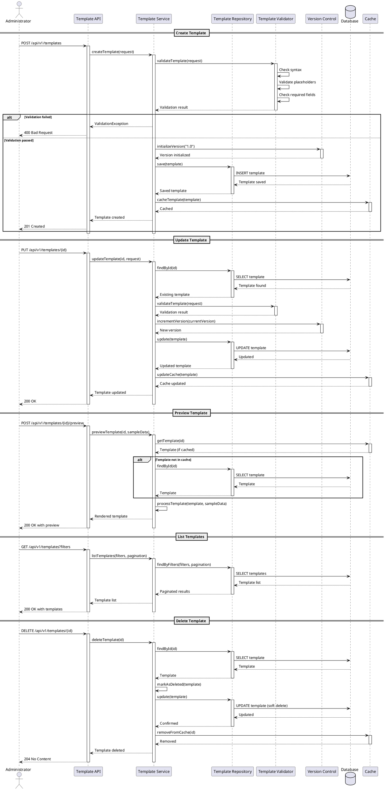

# Dynamic Template Management

## Description

The Dynamic Template Management functionality provides a comprehensive system for creating, managing, and versioning customizable templates for both email and instant messaging communications. This feature allows administrators and authorized users to create reusable message templates with dynamic content placeholders, manage multiple versions of templates, and apply templates across different communication channels.

### Key Features

- **Template Creation & Management**: Create, update, and delete templates with rich content support
- **Multi-Channel Support**: Templates compatible with both email (HTML/Plain text) and instant messaging platforms (Telegram, WhatsApp, etc.)
- **Dynamic Content Placeholders**: Support for variable substitution using FreeMarker syntax
- **Version Control**: Track template versions and maintain history of changes
- **Template Categories**: Organize templates by type, purpose, or department
- **Template Preview**: Preview templates with sample data before deployment
- **Access Control**: Role-based permissions for template management
- **Template Validation**: Validate template syntax and required placeholders

## Example Structures and Payloads

### Template Entity Structure

```json
{
  "id": "550e8400-e29b-41d4-a716-446655440000",
  "name": "Welcome Email Template",
  "description": "Template for welcoming new users to the platform",
  "category": "USER_ONBOARDING",
  "channelType": "EMAIL",
  "contentType": "HTML",
  "subject": "Welcome to ${platformName}, ${userName}!",
  "body": "<!DOCTYPE html><html><body><h1>Welcome ${userName}!</h1><p>Thank you for joining ${platformName}...</p></body></html>",
  "placeholders": [
    {
      "key": "userName",
      "description": "User's full name",
      "required": true,
      "defaultValue": "User"
    },
    {
      "key": "platformName",
      "description": "Name of the platform",
      "required": true,
      "defaultValue": "Mercury"
    }
  ],
  "version": "1.0",
  "status": "ACTIVE",
  "createdBy": "admin@example.com",
  "createdAt": "2025-12-09T10:00:00Z",
  "updatedAt": "2025-12-09T10:00:00Z",
  "metadata": {
    "tags": ["welcome", "onboarding"],
    "department": "Marketing"
  }
}
```

### Create Template Request

```json
{
  "name": "Password Reset Template",
  "description": "Template for password reset emails",
  "category": "SECURITY",
  "channelType": "EMAIL",
  "contentType": "HTML",
  "subject": "Reset your password for ${platformName}",
  "body": "<!DOCTYPE html><html><body><h2>Password Reset Request</h2><p>Hello ${userName},</p><p>Click the link below to reset your password:</p><a href='${resetLink}'>Reset Password</a><p>This link expires in ${expiryMinutes} minutes.</p></body></html>",
  "placeholders": [
    {
      "key": "userName",
      "description": "User's name",
      "required": true
    },
    {
      "key": "resetLink",
      "description": "Password reset URL",
      "required": true
    },
    {
      "key": "expiryMinutes",
      "description": "Link expiry time",
      "required": true,
      "defaultValue": "30"
    },
    {
      "key": "platformName",
      "description": "Platform name",
      "required": true,
      "defaultValue": "Mercury"
    }
  ],
  "metadata": {
    "tags": ["security", "password"],
    "department": "IT"
  }
}
```

### Update Template Request

```json
{
  "id": "550e8400-e29b-41d4-a716-446655440000",
  "name": "Welcome Email Template v2",
  "description": "Updated template with new branding",
  "body": "<!DOCTYPE html><html><body><h1>Welcome ${userName}!</h1><p>We're excited to have you on ${platformName}...</p><footer>Contact us at ${supportEmail}</footer></body></html>",
  "version": "2.0",
  "placeholders": [
    {
      "key": "userName",
      "description": "User's full name",
      "required": true
    },
    {
      "key": "platformName",
      "description": "Platform name",
      "required": true,
      "defaultValue": "Mercury"
    },
    {
      "key": "supportEmail",
      "description": "Support email address",
      "required": true,
      "defaultValue": "support@mercury.com"
    }
  ]
}
```

### Template Preview Request

```json
{
  "templateId": "550e8400-e29b-41d4-a716-446655440000",
  "sampleData": {
    "userName": "John Doe",
    "platformName": "Mercury Messenger",
    "supportEmail": "support@mercury.com"
  }
}
```

### List Templates Query Parameters

```
GET /api/v1/templates?category=USER_ONBOARDING&channelType=EMAIL&status=ACTIVE&page=0&size=20&sort=createdAt,desc
```

## Flow Diagram (PlantUML)



## Acceptance Criteria

### AC1: Template Creation
- **Given** an administrator is authenticated with template management permissions
- **When** they submit a valid template creation request with all required fields
- **Then** the system should create the template with version 1.0 and return a 201 Created response
- **And** the template should be stored in the database with a unique ID
- **And** the template should be cached for quick retrieval

### AC2: Template Validation
- **Given** a template creation or update request is submitted
- **When** the template contains invalid FreeMarker syntax or missing required fields
- **Then** the system should return a 400 Bad Request with detailed validation errors
- **And** no template should be created or updated in the database

### AC3: Multi-Channel Support
- **Given** templates for different channel types (EMAIL, TELEGRAM, SMS)
- **When** templates are created with the appropriate channelType
- **Then** each template should support channel-specific formatting and constraints
- **And** templates should be retrievable filtered by channel type

### AC4: Template Update with Versioning
- **Given** an existing template with version 1.0
- **When** an administrator updates the template
- **Then** the system should increment the version to 2.0
- **And** maintain the previous version in history
- **And** return the updated template with new version number

### AC5: Template Preview
- **Given** a valid template ID and sample data
- **When** a preview request is submitted
- **Then** the system should render the template with the provided sample data
- **And** return the rendered content without sending any actual messages
- **And** validate that all required placeholders are provided in sample data

### AC6: Template Listing with Filters
- **Given** multiple templates exist in the system
- **When** an administrator requests a list with filters (category, channel, status)
- **Then** the system should return only templates matching the filter criteria
- **And** support pagination with configurable page size
- **And** allow sorting by multiple fields

### AC7: Template Deletion (Soft Delete)
- **Given** an existing active template
- **When** an administrator deletes the template
- **Then** the template should be marked as DELETED (soft delete)
- **And** removed from cache
- **And** not appear in default template listings
- **And** historical data referencing the template should remain intact

### AC8: Placeholder Management
- **Given** a template with defined placeholders
- **When** the template is used to send a message
- **Then** the system should validate all required placeholders are provided
- **And** use default values for optional placeholders when not provided
- **And** return an error if required placeholders are missing

### AC9: Template Access Control
- **Given** different user roles (ADMIN, TEMPLATE_MANAGER, VIEWER)
- **When** users attempt to perform template operations
- **Then** only users with appropriate permissions should be able to create, update, or delete templates
- **And** users with viewer role should only be able to list and preview templates

### AC10: Performance and Caching
- **Given** frequently accessed templates
- **When** templates are requested
- **Then** the system should serve templates from cache when available
- **And** cache should be updated or invalidated when templates are modified
- **And** template retrieval should complete within 100ms for cached templates

## Definition of Done (DoD)

### Code Quality
- [ ] All API endpoints are implemented following RESTful conventions
- [ ] Service layer contains business logic with proper error handling
- [ ] Repository layer uses Spring Data JPA for database operations
- [ ] Code follows project coding standards and conventions
- [ ] All methods have appropriate JavaDoc documentation
- [ ] No PMD violations with severity >= 3
- [ ] Code coverage is at least 80% for service and controller layers

### Testing
- [ ] Unit tests cover all service methods with edge cases
- [ ] Integration tests verify API endpoints with various scenarios
- [ ] Template validation logic is thoroughly tested
- [ ] Version control mechanism is tested for edge cases
- [ ] Cache operations are verified in tests
- [ ] All acceptance criteria have corresponding automated tests
- [ ] All tests pass successfully

### Documentation
- [ ] API documentation is generated using SpringDoc/OpenAPI
- [ ] All endpoints have example requests and responses
- [ ] README is updated with template management instructions
- [ ] Migration guide is provided for existing templates
- [ ] Architecture decision records (ADRs) are created for key decisions

### Database
- [ ] Database schema includes all required tables and relationships
- [ ] Migration scripts are created and tested
- [ ] Indexes are added for frequently queried fields
- [ ] Database constraints ensure data integrity
- [ ] Soft delete mechanism is implemented correctly

### Security
- [ ] All endpoints are protected with appropriate authentication
- [ ] Role-based access control is enforced
- [ ] Input validation prevents injection attacks
- [ ] Sensitive data is not logged or exposed
- [ ] CodeQL security scan shows no critical vulnerabilities

### Performance
- [ ] Template caching is implemented and working correctly
- [ ] Database queries are optimized with proper indexing
- [ ] Pagination is implemented for list endpoints
- [ ] Template rendering performs within acceptable limits (< 500ms)
- [ ] Load testing confirms system handles expected concurrent users

### Integration
- [ ] Templates integrate with existing email service
- [ ] FreeMarker configuration is properly set up
- [ ] Templates can be used across different message types
- [ ] Backward compatibility with existing templates is maintained
- [ ] Template changes don't break existing communications

### Deployment
- [ ] Configuration properties are externalized
- [ ] Environment-specific configurations are set up
- [ ] Deployment scripts are updated
- [ ] Rollback procedure is documented
- [ ] Health check endpoints include template service status

### Monitoring and Observability
- [ ] Logging is implemented for all major operations
- [ ] Metrics are exposed for template operations (creation, updates, usage)
- [ ] Alerts are configured for critical failures
- [ ] Template usage statistics are tracked
- [ ] Error rates are monitored and dashboards updated
