# Event Notifications

## Description

The Event Notifications functionality provides a comprehensive event-driven notification system that monitors key events across the Mercury platform and delivers timely notifications to users and administrators. This feature supports multiple notification channels, flexible subscription management, configurable notification rules, and intelligent notification batching to prevent notification fatigue.

### Key Features

- **Event Monitoring**: Track and respond to various system events (delivery confirmations, failures, threshold alerts, etc.)
- **Multi-Channel Delivery**: Send notifications via email, in-app, push notifications, SMS, and webhook
- **Subscription Management**: Users can subscribe/unsubscribe to specific event types
- **Notification Preferences**: Customizable preferences including channel selection, frequency, and quiet hours
- **Event Filtering**: Filter notifications based on severity, category, and custom criteria
- **Notification Batching**: Group related notifications to reduce noise
- **Priority Routing**: High-priority notifications bypass batching and quiet hours
- **Template-Based Notifications**: Use configurable templates for consistent formatting
- **Delivery Confirmation**: Track whether notifications were successfully delivered
- **Notification History**: Complete audit trail of all sent notifications
- **Webhook Support**: Allow external systems to receive event notifications
- **Retry Logic**: Automatic retry for failed notification deliveries

## Example Structures and Payloads

### Event Definition Structure

```json
{
  "eventType": "MESSAGE_DELIVERY_FAILED",
  "category": "COMMUNICATION",
  "severity": "HIGH",
  "description": "Triggered when a message fails to deliver after all retry attempts",
  "defaultEnabled": true,
  "availableChannels": ["EMAIL", "IN_APP", "WEBHOOK"],
  "defaultChannels": ["EMAIL", "IN_APP"],
  "retryable": true,
  "batchable": false,
  "metadata": {
    "requiresImmediate": true,
    "canBypassQuietHours": true
  }
}
```

### Notification Event Structure

```json
{
  "id": "notif-550e8400-e29b-41d4-a716-446655440000",
  "eventType": "MESSAGE_DELIVERY_FAILED",
  "eventId": "event-123e4567-e89b-12d3-a456-426614174000",
  "timestamp": "2025-12-09T10:15:00Z",
  "severity": "HIGH",
  "category": "COMMUNICATION",
  "title": "Message Delivery Failed",
  "message": "Failed to deliver message to user@example.com after 3 attempts",
  "details": {
    "messageId": "msg-660e8400-e29b-41d4-a716-446655440001",
    "recipientEmail": "user@example.com",
    "errorCode": "INVALID_RECIPIENT",
    "errorMessage": "The recipient email address is invalid",
    "retryAttempts": 3,
    "failedAt": "2025-12-09T10:15:00Z"
  },
  "affectedUsers": ["user-12345", "admin-67890"],
  "actionRequired": true,
  "actionUrl": "/messages/msg-660e8400-e29b-41d4-a716-446655440001",
  "actionLabel": "View Message Details",
  "expiresAt": "2025-12-10T10:15:00Z",
  "priority": "HIGH",
  "tags": ["delivery", "failure", "email"]
}
```

### User Notification Subscription

```json
{
  "userId": "user-12345",
  "subscriptions": [
    {
      "eventType": "MESSAGE_DELIVERY_FAILED",
      "enabled": true,
      "channels": ["EMAIL", "IN_APP"],
      "filters": {
        "minSeverity": "MEDIUM",
        "categories": ["COMMUNICATION", "SECURITY"]
      }
    },
    {
      "eventType": "TEMPLATE_UPDATED",
      "enabled": true,
      "channels": ["IN_APP"],
      "filters": {
        "templateCategories": ["USER_ONBOARDING", "SECURITY"]
      }
    },
    {
      "eventType": "DAILY_SUMMARY",
      "enabled": true,
      "channels": ["EMAIL"],
      "schedule": {
        "time": "09:00",
        "timezone": "America/New_York",
        "daysOfWeek": ["MON", "TUE", "WED", "THU", "FRI"]
      }
    }
  ],
  "preferences": {
    "quietHours": {
      "enabled": true,
      "start": "22:00",
      "end": "08:00",
      "timezone": "America/New_York",
      "allowUrgent": true
    },
    "batchingEnabled": true,
    "batchInterval": "15m",
    "maxBatchSize": 10,
    "language": "en",
    "emailDigestEnabled": true,
    "emailDigestFrequency": "DAILY"
  }
}
```

### Webhook Subscription

```json
{
  "id": "webhook-550e8400-e29b-41d4-a716-446655440000",
  "name": "Slack Integration Webhook",
  "url": "https://hooks.slack.com/services/T00000000/B00000000/XXXXXXXXXXXX",
  "secret": "whsec_XXXXXXXXXXXX",
  "enabled": true,
  "eventTypes": [
    "MESSAGE_DELIVERY_FAILED",
    "SYSTEM_ALERT",
    "TEMPLATE_UPDATED"
  ],
  "filters": {
    "minSeverity": "MEDIUM",
    "categories": ["COMMUNICATION", "SYSTEM"]
  },
  "headers": {
    "X-Custom-Header": "value"
  },
  "retryPolicy": {
    "maxRetries": 3,
    "retryDelay": "5s",
    "backoffMultiplier": 2.0
  },
  "timeoutSeconds": 30,
  "createdAt": "2025-12-09T10:00:00Z",
  "lastTriggered": "2025-12-09T10:15:00Z",
  "successCount": 45,
  "failureCount": 2
}
```

### Notification Delivery Record

```json
{
  "id": "delivery-550e8400-e29b-41d4-a716-446655440000",
  "notificationId": "notif-550e8400-e29b-41d4-a716-446655440000",
  "userId": "user-12345",
  "channel": "EMAIL",
  "status": "DELIVERED",
  "sentAt": "2025-12-09T10:15:05Z",
  "deliveredAt": "2025-12-09T10:15:12Z",
  "recipient": "user@example.com",
  "subject": "Message Delivery Failed",
  "body": "Failed to deliver message to user@example.com after 3 attempts...",
  "metadata": {
    "emailProvider": "sendgrid",
    "providerMessageId": "sg-notif-789012"
  },
  "readAt": null,
  "clickedAt": null,
  "retryAttempts": 0
}
```

### Batch Notification

```json
{
  "id": "batch-550e8400-e29b-41d4-a716-446655440000",
  "userId": "user-12345",
  "channel": "EMAIL",
  "batchSize": 5,
  "notifications": [
    {
      "eventType": "MESSAGE_SENT",
      "title": "Message sent successfully",
      "timestamp": "2025-12-09T10:00:00Z"
    },
    {
      "eventType": "MESSAGE_SENT",
      "title": "Message sent successfully",
      "timestamp": "2025-12-09T10:05:00Z"
    },
    {
      "eventType": "MESSAGE_DELIVERED",
      "title": "Message delivered",
      "timestamp": "2025-12-09T10:08:00Z"
    },
    {
      "eventType": "MESSAGE_DELIVERED",
      "title": "Message delivered",
      "timestamp": "2025-12-09T10:10:00Z"
    },
    {
      "eventType": "MESSAGE_SENT",
      "title": "Message sent successfully",
      "timestamp": "2025-12-09T10:12:00Z"
    }
  ],
  "createdAt": "2025-12-09T10:00:00Z",
  "sentAt": "2025-12-09T10:15:00Z",
  "summary": "5 communication events in the last 15 minutes"
}
```

### System Alert Event

```json
{
  "id": "alert-550e8400-e29b-41d4-a716-446655440000",
  "eventType": "HIGH_FAILURE_RATE_ALERT",
  "severity": "CRITICAL",
  "category": "SYSTEM",
  "timestamp": "2025-12-09T10:30:00Z",
  "title": "High Message Failure Rate Detected",
  "message": "Message failure rate has exceeded 20% in the last 15 minutes",
  "details": {
    "failureRate": 23.5,
    "threshold": 20.0,
    "totalMessages": 500,
    "failedMessages": 118,
    "timeWindow": "15m",
    "topErrorCodes": [
      {
        "code": "PROVIDER_ERROR",
        "count": 75
      },
      {
        "code": "TIMEOUT",
        "count": 43
      }
    ]
  },
  "priority": "CRITICAL",
  "affectedUsers": ["admin-67890", "ops-team"],
  "actionRequired": true,
  "actionUrl": "/admin/alerts/alert-550e8400-e29b-41d4-a716-446655440000",
  "actionLabel": "Investigate Alert"
}
```

### Daily Summary Notification

```json
{
  "id": "summary-2025-12-09",
  "eventType": "DAILY_SUMMARY",
  "userId": "user-12345",
  "date": "2025-12-09",
  "timestamp": "2025-12-09T09:00:00Z",
  "summary": {
    "totalMessages": 150,
    "successful": 142,
    "failed": 8,
    "deliveryRate": 94.7,
    "topTemplates": [
      {
        "templateName": "Welcome Email",
        "count": 50
      },
      {
        "templateName": "Password Reset",
        "count": 35
      }
    ],
    "notifications": 12,
    "unreadNotifications": 3
  },
  "highlights": [
    "142 messages delivered successfully",
    "8 messages failed delivery",
    "3 new templates created"
  ]
}
```

## Flow Diagram (PlantUML)

```plantuml
@startuml Event Notifications Flow

actor User
participant "Event Publisher" as Publisher
participant "Event Service" as EventService
participant "Subscription Service" as SubService
participant "Notification Service" as NotifService
participant "Notification Queue" as Queue
participant "Notification Processor" as Processor
participant "Channel Router" as Router
participant "Email Channel" as Email
participant "In-App Channel" as InApp
participant "Webhook Channel" as Webhook
database "Database" as DB
participant "WebSocket" as WS

== Event Generation ==
Publisher -> EventService: publishEvent(event)
activate EventService
EventService -> DB: Store event
activate DB
DB --> EventService: Event stored
deactivate DB
EventService -> SubService: getSubscribers(eventType)
activate SubService
SubService -> DB: Query active subscriptions
activate DB
DB --> SubService: Subscriber list
deactivate DB
SubService --> EventService: Subscribers
deactivate SubService

loop For each subscriber
    EventService -> NotifService: createNotification(subscriber, event)
    activate NotifService
    NotifService -> NotifService: checkUserPreferences(subscriber)
    NotifService -> NotifService: applyFilters(event, preferences)
    
    alt Notification should be sent
        NotifService -> NotifService: checkQuietHours(subscriber)
        NotifService -> NotifService: checkBatching(subscriber, event)
        
        alt Immediate send required (high priority or not batchable)
            NotifService -> Queue: enqueueNotification(notification)
            activate Queue
            Queue --> NotifService: Enqueued
            deactivate Queue
        else Batching enabled
            NotifService -> DB: Add to batch
            activate DB
            DB --> NotifService: Added to batch
            deactivate DB
        end
        
        NotifService -> DB: Store notification record
        activate DB
        DB --> NotifService: Stored
        deactivate DB
    end
    deactivate NotifService
end

EventService --> Publisher: Event published
deactivate EventService

== Process Immediate Notification ==
Queue -> Processor: dequeueNotification()
activate Processor
Processor -> SubService: getUserChannelPreferences(userId)
activate SubService
SubService -> DB: Query preferences
activate DB
DB --> SubService: Preferences
deactivate DB
SubService --> Processor: Channel list
deactivate SubService

Processor -> Router: routeNotification(notification, channels)
activate Router

loop For each channel
    alt Email Channel
        Router -> Email: sendEmail(notification)
        activate Email
        Email -> Email: Format email content
        Email -> Email: Send via email provider
        Email --> Router: Delivery status
        deactivate Email
        
    else In-App Channel
        Router -> InApp: createInAppNotification(notification)
        activate InApp
        InApp -> DB: Insert in-app notification
        activate DB
        DB --> InApp: Stored
        deactivate DB
        InApp -> WS: broadcastToUser(userId, notification)
        activate WS
        WS --> User: Real-time notification
        deactivate WS
        InApp --> Router: Delivered
        deactivate InApp
        
    else Webhook Channel
        Router -> Webhook: callWebhook(notification)
        activate Webhook
        Webhook -> Webhook: Sign payload
        Webhook -> Webhook: HTTP POST to webhook URL
        Webhook --> Router: Response status
        deactivate Webhook
    end
    
    Router -> DB: recordDelivery(channel, status)
    activate DB
    DB --> Router: Recorded
    deactivate DB
end

Router --> Processor: All channels processed
deactivate Router
deactivate Processor

== Process Batch Notifications ==
NotifService -> NotifService: scheduledBatchProcessor()
activate NotifService
NotifService -> DB: Query ready batches
activate DB
DB --> NotifService: Batches to send
deactivate DB

loop For each batch
    NotifService -> NotifService: aggregateNotifications(batch)
    NotifService -> Queue: enqueueBatchNotification(batch)
    activate Queue
    Queue --> NotifService: Enqueued
    deactivate Queue
    NotifService -> DB: Mark batch as sent
    activate DB
    DB --> NotifService: Updated
    deactivate DB
end
deactivate NotifService

== User Subscription Management ==
User -> SubService: POST /api/v1/subscriptions
activate SubService
SubService -> SubService: validateSubscription(request)
SubService -> DB: Update user subscriptions
activate DB
DB --> SubService: Updated
deactivate DB
SubService --> User: 200 OK
deactivate SubService

== User Preferences Update ==
User -> SubService: PUT /api/v1/preferences
activate SubService
SubService -> SubService: validatePreferences(request)
SubService -> DB: Update user preferences
activate DB
DB --> SubService: Updated
deactivate DB
SubService --> User: 200 OK
deactivate SubService

== Webhook Registration ==
User -> SubService: POST /api/v1/webhooks
activate SubService
SubService -> SubService: validateWebhook(request)
SubService -> SubService: generateSecret()
SubService -> DB: Store webhook configuration
activate DB
DB --> SubService: Stored
deactivate DB
SubService -> Webhook: testWebhook(url)
activate Webhook
Webhook --> SubService: Test result
deactivate Webhook
SubService --> User: 201 Created with webhook details
deactivate SubService

== Get User Notifications ==
User -> NotifService: GET /api/v1/notifications
activate NotifService
NotifService -> DB: Query user notifications
activate DB
DB --> NotifService: Notification list
deactivate DB
NotifService --> User: 200 OK with notifications
deactivate NotifService

== Mark Notification as Read ==
User -> NotifService: PATCH /api/v1/notifications/{id}/read
activate NotifService
NotifService -> DB: Update notification
activate DB
DB --> NotifService: Updated
deactivate DB
NotifService -> WS: updateUnreadCount(userId)
activate WS
WS --> User: Updated count
deactivate WS
NotifService --> User: 200 OK
deactivate NotifService

== Notification Failure and Retry ==
Processor -> Router: routeNotification(notification, channels)
activate Processor
activate Router
Router -> Email: sendEmail(notification)
activate Email
Email --> Router: Delivery failed
deactivate Email

Router -> Router: checkRetryPolicy(notification)
alt Retry allowed
    Router -> Queue: scheduleRetry(notification, delay)
    activate Queue
    Queue --> Router: Retry scheduled
    deactivate Queue
    Router -> DB: Update delivery record (retry scheduled)
    activate DB
    DB --> Router: Updated
    deactivate DB
else Max retries exceeded
    Router -> DB: Update delivery record (failed)
    activate DB
    DB --> Router: Updated
    deactivate DB
    Router -> EventService: publishEvent(NOTIFICATION_DELIVERY_FAILED)
    activate EventService
    EventService --> Router: Event published
    deactivate EventService
end
Router --> Processor: Processed
deactivate Router
deactivate Processor

@enduml
```



## Acceptance Criteria

### AC1: Event Publication and Subscription
- **Given** an event occurs in the system
- **When** the event is published to the event service
- **Then** all users subscribed to that event type should be identified
- **And** notifications should be created for eligible subscribers
- **And** user preferences and filters should be applied

### AC2: Multi-Channel Notification Delivery
- **Given** a notification is created for a user
- **When** the user has multiple channels enabled (EMAIL, IN_APP, WEBHOOK)
- **Then** the notification should be delivered through all enabled channels
- **And** each channel delivery should be tracked independently
- **And** failure in one channel should not affect others

### AC3: Notification Preferences Enforcement
- **Given** a user has configured notification preferences
- **When** a notification is about to be sent
- **Then** the system should respect quiet hours settings
- **And** high-priority notifications should bypass quiet hours if configured
- **And** batching preferences should be applied to batchable events
- **And** minimum severity filters should be enforced

### AC4: Notification Batching
- **Given** a user has batching enabled for non-urgent notifications
- **When** multiple batchable events occur within the batch interval
- **Then** the system should aggregate notifications into a single batch
- **And** send the batch at the end of the interval or when max batch size is reached
- **And** each notification in the batch should be individually tracked

### AC5: Real-time In-App Notifications
- **Given** a user is connected via WebSocket
- **When** an in-app notification is created for that user
- **Then** the notification should be delivered in real-time via WebSocket
- **And** the notification should be stored in the database
- **And** the unread count should be updated immediately
- **And** the notification should appear in the user's notification center

### AC6: Webhook Delivery
- **Given** a webhook subscription is configured
- **When** a matching event occurs
- **Then** the webhook endpoint should be called with signed payload
- **And** the request should include configured custom headers
- **And** the system should respect timeout settings
- **And** response status should be recorded
- **And** failed deliveries should trigger retry logic

### AC7: Subscription Management
- **Given** a user wants to manage their notification subscriptions
- **When** they update their subscription settings
- **Then** the new settings should take effect immediately
- **And** future notifications should respect the updated preferences
- **And** the user should be able to enable/disable specific event types
- **And** the user should be able to configure channel preferences per event type

### AC8: Notification History and Read Status
- **Given** notifications have been sent to a user
- **When** the user views their notification history
- **Then** all notifications should be listed with pagination support
- **And** unread notifications should be clearly marked
- **And** users should be able to mark notifications as read
- **And** read status should update the unread count in real-time

### AC9: Webhook Signature Verification
- **Given** a webhook endpoint is registered with a secret
- **When** a notification is sent to the webhook
- **Then** the payload should be signed with HMAC-SHA256
- **And** the signature should be included in request headers
- **And** the receiving endpoint can verify the signature authenticity
- **And** webhook deliveries without valid signature should be rejected

### AC10: Notification Retry Logic
- **Given** a notification delivery fails
- **When** the error is retryable and retry limit not exceeded
- **Then** the system should schedule a retry with exponential backoff
- **And** track the number of retry attempts
- **And** mark as permanently failed after max retries
- **And** trigger a failure event for admin notification

### AC11: Daily Summary Notifications
- **Given** a user has enabled daily summary notifications
- **When** the scheduled time arrives
- **Then** the system should generate a summary of the day's activities
- **And** include key metrics and highlights
- **And** send via the user's preferred channel
- **And** respect timezone settings for scheduling

### AC12: System Alert Notifications
- **Given** a critical system event is detected (high failure rate, system down, etc.)
- **When** the alert threshold is exceeded
- **Then** critical notifications should be sent to all administrators immediately
- **And** bypass quiet hours and batching settings
- **And** use all configured urgent notification channels
- **And** include actionable details and links

### AC13: Notification Expiration
- **Given** a notification has an expiration time
- **When** the expiration time is reached
- **Then** the notification should be automatically marked as expired
- **And** expired notifications should be hidden from the active notification list
- **And** users should still be able to view expired notifications in history

### AC14: Notification Filtering and Search
- **Given** a user has many notifications
- **When** they search or filter their notifications
- **Then** the system should support filtering by read/unread status, event type, severity, date range
- **And** search should work on notification titles and messages
- **And** filtered results should maintain pagination
- **And** unread count should reflect filtered view

### AC15: Performance Under Load
- **Given** the system experiences high event volumes
- **When** multiple events are published simultaneously
- **Then** event processing should not block event publishers
- **And** notifications should be queued for asynchronous processing
- **And** WebSocket connections should remain stable
- **And** notification delivery should complete within 5 seconds for 95% of cases

## Definition of Done (DoD)

### Code Quality
- [ ] Event publishing and subscription logic is implemented
- [ ] Multi-channel notification delivery is working
- [ ] Notification batching and aggregation is implemented
- [ ] Webhook signing and verification is secure
- [ ] Code follows project patterns and conventions
- [ ] All public APIs have comprehensive JavaDoc
- [ ] No PMD violations with severity >= 3
- [ ] Code coverage is at least 85% for notification services

### Testing
- [ ] Unit tests cover all notification scenarios
- [ ] Integration tests verify end-to-end notification flow
- [ ] WebSocket functionality is tested with multiple clients
- [ ] Webhook delivery and retry logic is tested
- [ ] Batching logic is tested with various scenarios
- [ ] Quiet hours and preferences are tested
- [ ] Performance tests validate throughput requirements
- [ ] All acceptance criteria have automated tests
- [ ] All tests pass successfully

### Database
- [ ] Database schema includes notification tables
- [ ] Indexes optimize notification queries (userId, readAt, createdAt)
- [ ] Subscription and preference tables are properly designed
- [ ] Webhook configuration storage is secure
- [ ] Notification history retention policy is implemented
- [ ] Database constraints ensure data integrity
- [ ] Migration scripts are tested

### Event System
- [ ] Event publishing mechanism is reliable
- [ ] Event types are clearly defined and documented
- [ ] Event payload schemas are validated
- [ ] Event versioning strategy is in place
- [ ] Dead letter queue for failed event processing
- [ ] Event ordering is maintained where necessary

### WebSocket Implementation
- [ ] WebSocket connections are stable and efficient
- [ ] Authentication for WebSocket connections
- [ ] Automatic reconnection on client side
- [ ] Message queuing for temporarily disconnected clients
- [ ] Scalability for multiple server instances
- [ ] Heartbeat mechanism prevents connection timeouts

### Notification Channels
- [ ] Email channel uses existing email service
- [ ] In-app notifications stored and retrievable
- [ ] Webhook channel handles various response codes
- [ ] Channel-specific formatting is implemented
- [ ] Channel failover is handled gracefully
- [ ] Channel-specific rate limiting

### User Interface
- [ ] Notification center UI displays notifications
- [ ] Real-time updates reflect in UI
- [ ] Unread badge updates automatically
- [ ] Mark as read functionality works
- [ ] Notification filtering and search UI
- [ ] Subscription management UI is intuitive
- [ ] Preference settings UI is user-friendly

### Security
- [ ] All notification endpoints require authentication
- [ ] Users can only access their own notifications
- [ ] Webhook signatures prevent payload tampering
- [ ] Sensitive data not exposed in notifications
- [ ] XSS prevention in notification content
- [ ] CodeQL security scan passes
- [ ] Rate limiting prevents abuse

### Performance
- [ ] Event processing is asynchronous
- [ ] Notification queries use efficient indexes
- [ ] Batching reduces database writes
- [ ] Caching minimizes repeated queries
- [ ] Load testing confirms 10,000 events/minute throughput
- [ ] WebSocket scales to 5,000 concurrent connections
- [ ] No memory leaks under sustained load

### Monitoring and Observability
- [ ] All notification deliveries are logged
- [ ] Metrics track notification rates per channel
- [ ] Alerts configured for high failure rates
- [ ] Dashboards show delivery statistics
- [ ] Webhook success/failure rates monitored
- [ ] Event processing lag is monitored
- [ ] User notification activity is tracked

### Documentation
- [ ] API documentation includes all endpoints
- [ ] Event types and payloads are documented
- [ ] Webhook integration guide is complete
- [ ] Notification flow diagrams are created
- [ ] User guide for managing subscriptions
- [ ] Admin guide for monitoring notifications
- [ ] Troubleshooting guide for common issues

### Integration
- [ ] Integrates with existing authentication system
- [ ] Uses existing template management for notification templates
- [ ] Connects to communication tracking system
- [ ] Works with user management service
- [ ] Compatible with existing email service
- [ ] Does not disrupt existing functionality

### Configuration
- [ ] Notification channels are configurable
- [ ] Batch intervals and sizes are configurable
- [ ] Retry policies are configurable
- [ ] Quiet hours can be customized
- [ ] Event severity levels are configurable
- [ ] Webhook timeout and retry settings

### Deployment
- [ ] Environment-specific configurations
- [ ] Database migrations tested
- [ ] Deployment runbook is complete
- [ ] Rollback procedure is tested
- [ ] Health checks include notification service
- [ ] Zero-downtime deployment verified
- [ ] Monitoring dashboards deployed
